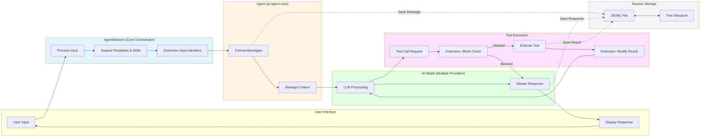

# Project Overview

## Table of Contents

- [Introduction](#introduction)
- [Purpose and Mission](#purpose-and-mission)
- [Key Differentiators](#key-differentiators)
- [Platform Support](#platform-support)
- [Core Features](#core-features)
- [Quick Start](#quick-start)
- [Project History and Maintenance](#project-history-and-maintenance)
- [Related Projects](#related-projects)
- [Philosophy](#philosophy)

## Introduction

**pi-coding-agent** (also known simply as "pi") is a terminal-based coding agent CLI tool that provides AI-powered assistance for software development tasks. Built by Mario Zechner, pi combines the power of multiple AI models with a sophisticated terminal user interface to create an interactive development environment that runs entirely in your terminal.

The project is part of the pi-mono monorepo and is published as `@mariozechner/pi-coding-agent` on npm at version 0.49.2.

### End-to-End Workflow

The following diagram shows the complete flow from user input to response:



**Key components:**
- **AgentSession**: Orchestrates the entire workflow, handles extensions, and manages state
- **Agent**: Core conversation management from `pi-agent-core` package
- **AI Model**: Multiple provider support (Anthropic, OpenAI, Google, etc.)
- **Tools**: File operations (read, write, edit), bash execution, and search tools
- **Persistence**: Tree-structured JSONL storage for branching conversations

### Purpose and Mission

Pi exists to provide developers with a powerful, flexible AI coding assistant that:

- **Operates entirely in the terminal** - No browser required, works where you work
- **Supports multiple AI providers** - Not locked into a single vendor or model
- **Preserves full conversation history** - All interactions are saved in a tree-based session format
- **Provides multiple operating modes** - Interactive TUI, headless print mode, and RPC for programmatic control
- **Remains highly customizable** - Extensions, skills, themes, and prompt templates allow deep customization

### Key Differentiators

What makes pi unique compared to other AI coding assistants:

- **True multi-model support** - Switch between different AI providers and models mid-session (Anthropic, OpenAI, Google, Mistral, xAI, Groq, and many more)
- **Tree-based session branching** - Navigate conversation history like a git repository, with in-place branch switching
- **Terminal-first design** - Full keyboard control with the Kitty keyboard protocol for reliable modifier key detection
- **Extensible architecture** - TypeScript-based extension system for custom tools, commands, and UI
- **Skills system** - Load specialized capabilities on-demand using the Agent Skills standard
- **No vendor lock-in** - OAuth support for subscription services and API key support for direct access

## Platform Support

Pi works on the following platforms:

- **Linux** - x64 and ARM64 architectures
- **macOS** - Apple Silicon (ARM64) and Intel (x64)
- **Windows** - x64 (requires bash shell; see Windows Setup below)
- **Android/Termux** - Via a separately maintained port

### System Requirements

- **Node.js** version 20.0.0 or higher (for npm installation)
- **Bash shell** - Required on all platforms for command execution
  - Linux/macOS: Built-in
  - Windows: Git Bash, Cygwin, MSYS2, or WSL
- **Terminal with Kitty keyboard protocol support** (recommended) - Kitty, iTerm2, Ghostty, WezTerm, Windows Terminal, VS Code Terminal

### Windows-Specific Requirements

Pi requires a bash shell on Windows. The tool automatically checks these locations in order:

1. Custom path from `~/.pi/agent/settings.json` (`shellPath` setting)
2. Git Bash at `C:\Program Files\Git\bin\bash.exe`
3. `bash.exe` on PATH (Cygwin, MSYS2, WSL)

For most users, installing [Git for Windows](https://git-scm.com/download/win) is sufficient.

## Core Features

### 1. File System Operations

Pi provides a complete set of file manipulation tools:

- **read** - Read file contents (first 2000 lines, with offset/limit for large files)
- **write** - Create or overwrite files with automatic parent directory creation
- **edit** - Replace exact text in files with validation
- **bash** - Execute shell commands with timeout support
- **grep** - Search file contents with regex support (respects .gitignore)
- **find** - Search for files by glob pattern (respects .gitignore)
- **ls** - List directory contents including dotfiles

### 2. Multi-Model AI Support

Pi supports numerous AI providers out of the box:

**API Key-based Providers:**
- Anthropic (Claude models)
- OpenAI (GPT models)
- Google (Gemini models via API key)
- Mistral AI
- xAI (Grok)
- Groq
- Cerebras
- OpenRouter
- Vercel AI Gateway
- ZAI
- OpenCode Zen
- MiniMax (Global and China)
- Amazon Bedrock

**OAuth-based Providers:**
- Anthropic Claude Pro/Max (subscription models)
- GitHub Copilot (GPT-4o, Claude, Gemini via Copilot subscription)
- Google Gemini CLI (free with Google account)
- Google Antigravity (Gemini 3, Claude, GPT-OSS - free with Google account)
- OpenAI Codex (ChatGPT Plus/Pro subscription)

### 3. Session Management

Sessions are stored as JSONL (JSON Lines) files with a tree structure:

- **Auto-save** - Sessions automatically save to `~/.pi/agent/sessions/` organized by working directory
- **Resume capability** - Continue from the most recent session or browse all past sessions
- **Tree-based branching** - Each entry has an `id` and `parentId` for creating conversation branches
- **In-place navigation** - Use `/tree` to navigate between branches without creating new files
- **Session forking** - Create new session files from any previous point with `/fork`

### 4. Context Compaction

When conversations grow long and approach context window limits, pi can compact older messages:

- **Manual compaction** - Use `/compact` or `/compact [instructions]` to trigger
- **Automatic compaction** - Enable via `/settings` to trigger on overflow or threshold
- **AI-powered summarization** - Uses the current model to generate intelligent summaries
- **Preserves recent context** - Keeps recent messages untouched while summarizing older ones
- **Configurable** - Adjust `reserveTokens` and `keepRecentTokens` in settings

### 5. Three Operating Modes

#### Interactive Mode (Default)

Full terminal UI with:
- Real-time streaming responses
- Syntax highlighting for code blocks
- Interactive component rendering
- Keyboard shortcuts for all operations
- File reference autocomplete with `@`
- Path completion with Tab
- Drag-and-drop file support
- Multi-line paste with collapse preview

#### Print Mode (`--print` or `-p`)

Headless mode for scripting:
- Process prompt and exit
- Text or JSON output modes
- No interactive UI
- Suitable for piped input/output
- Useful for automation and CI/CD

#### RPC Mode (`--mode rpc`)

Programmatic control via JSON protocol:
- Communicate over stdin/stdout
- Full session control (prompt, abort, model switching)
- Event streaming as JSON
- Embeddable in other applications
- Language-agnostic integration

### 6. Interactive Features

#### Slash Commands

Pi provides numerous commands accessible via `/`:

| Command | Purpose |
|---------|---------|
| `/settings` | Configure thinking level, theme, message delivery modes |
| `/model` | Switch AI models mid-session |
| `/scoped-models` | Enable/disable models for Ctrl+P cycling |
| `/export [file]` | Export session to standalone HTML |
| `/share` | Upload session as GitHub gist (requires `gh` CLI) |
| `/session` | Show session info, token usage, cost estimates |
| `/name <name>` | Set display name for session |
| `/hotkeys` | Display all keyboard shortcuts |
| `/changelog` | Show version history |
| `/tree` | Navigate session tree, search, filter, label entries |
| `/fork` | Create new conversation fork from previous message |
| `/resume` | Switch to different session |
| `/login` | OAuth authentication for subscription models |
| `/logout` | Clear OAuth tokens |
| `/new` | Start fresh session |
| `/copy` | Copy last agent message to clipboard |
| `/compact` | Manually compact conversation context |

#### Keyboard Shortcuts

**Navigation:**
- Arrow keys for cursor movement and history browsing
- Option/Alt + Left/Right for word-level movement
- Ctrl+A / Home / Cmd+Left for line start
- Ctrl+E / End / Cmd+Right for line end

**Editing:**
- Enter to send message
- Shift+Enter for new line (Ctrl+Enter on Windows Terminal)
- Ctrl+W / Option+Backspace to delete word backwards
- Alt+D to delete word forwards
- Ctrl+U to delete to start of line
- Ctrl+K to delete to end of line
- Ctrl+Y to paste recently deleted text (yank)
- Alt+Y to cycle through deleted text (yank-pop)
- Ctrl+- for undo

**Model and Session Control:**
- Shift+Tab to cycle thinking level
- Ctrl+P / Shift+Ctrl+P to cycle models forward/backward
- Ctrl+L to open model selector
- Ctrl+O to toggle tool output expansion
- Ctrl+T to toggle thinking block visibility
- Ctrl+G to edit message in external editor
- Ctrl+V to paste image from clipboard
- Alt+Up to restore queued messages

**Other:**
- Tab for path completion / autocomplete
- Escape to cancel autocomplete or abort streaming
- Ctrl+C to clear editor (first press) or exit (second press)
- Ctrl+D to exit when editor is empty
- Ctrl+Z to suspend to background

#### Thinking Levels

Pi supports extended thinking modes for compatible models:

- **off** - No extended thinking
- **minimal** - Minimal thinking
- **low** - Low thinking
- **medium** - Medium thinking (default for some models)
- **high** - High thinking
- **xhigh** - Extra high thinking (Claude Opus/Sonnet 4.5 extended thinking)

Thinking levels affect how much the model reasons before responding, with higher levels producing more thorough but slower responses.

### 7. Image Support

Pi supports multiple ways to work with images:

**Pasting Images:**
- Press `Ctrl+V` to paste images from clipboard
- Supported formats: JPEG, PNG, GIF, WebP
- Note: On macOS, use Preview to copy actual image data (Finder copies file path)

**Dragging Images:**
- Drag image files onto terminal to insert path
- On macOS, drag screenshot thumbnails (after Cmd+Shift+4) directly

**Auto-resize:**
- Images larger than 2000x2000 pixels automatically resize
- Original dimensions noted in context for coordinate mapping
- Disable via `images.autoResize: false` in settings

**Inline Rendering:**
- On supported terminals (Kitty, Ghostty, WezTerm, iTerm2), images render inline
- Unsupported terminals show text placeholder
- Toggle via `/settings` or `terminal.showImages` setting

**Block Images:**
- Set `images.blockImages: true` to prevent images from being sent to LLM
- Useful for privacy or cost concerns

### 8. Customization

#### Extensions

TypeScript modules that extend pi's behavior:

- **Custom tools** - Add new LLM-callable functions
- **Custom commands** - New `/commands` for users
- **Event interception** - Block or modify tool calls
- **State persistence** - Store data that survives reload and branching
- **Custom UI** - Full TUI control

Extensions load from:
- Global: `~/.pi/agent/extensions/*.ts`
- Project: `.pi/extensions/*.ts`
- CLI: `--extension <path>`

#### Skills

Self-contained capability packages following the [Agent Skills standard](https://agentskills.io/specification):

- Loaded on-demand when agent determines task matches
- Can be invoked explicitly via `/skill:name` commands
- Provide setup instructions, helper scripts, documentation
- Common use cases: web search, browser automation, API integrations, document processing

Skills load from:
- Pi user: `~/.pi/agent/skills/**/SKILL.md`
- Pi project: `.pi/skills/**/SKILL.md`
- Claude Code: `~/.claude/skills/*/SKILL.md`
- Codex CLI: `~/.codex/skills/**/SKILL.md`

#### Themes

Built-in themes: `dark` (default) and `light`, with auto-detection on first run.

Custom themes:
- Create `~/.pi/agent/themes/*.json`
- Live reload support - edit while running
- Full control over colors, syntax highlighting, UI elements
- Based on included theme schema

#### Prompt Templates

Reusable prompt definitions:
- Global: `~/.pi/agent/prompts/*.md`
- Project: `.pi/prompts/*.md`
- Support arguments (`$1`, `$@`, `${@:N}`, etc.)
- Subdirectories create namespaces
- Autocomplete in editor

### 9. Configuration

#### Project Context Files

Pi automatically loads context from:
1. Global: `~/.pi/agent/AGENTS.md` (or `CLAUDE.md`)
2. Parent directories walking up from current directory
3. Current directory: `./AGENTS.md`

Use for project instructions, conventions, workflows, architecture docs.

#### Custom System Prompt

Replace default system prompt entirely:
- Project-local: `.pi/SYSTEM.md` (takes precedence)
- Global: `~/.pi/agent/SYSTEM.md`

Or append to default system prompt:
- Project-local: `.pi/APPEND_SYSTEM.md`
- Global: `~/.pi/agent/APPEND_SYSTEM.md`

#### Settings File

Two-level settings system:
- Global: `~/.pi/agent/settings.json` - user preferences
- Project: `<cwd>/.pi/settings.json` - project overrides

Project settings override global settings. TUI changes save to global only.

#### Custom Models

Add custom models via `~/.pi/agent/models.json`:
- Support for Ollama, vLLM, LM Studio, etc.
- OpenAI-compatible, Anthropic, and Google APIs
- Custom headers and authentication
- API key resolution via commands or environment variables
- Live reload when opening `/model`

## Quick Start

### Installation

```bash
# Via npm (recommended)
npm install -g @mariozechner/pi-coding-agent

# Standalone binary
# Download from GitHub Releases, extract, and run
```

### First Run

```bash
# Set API key
export ANTHROPIC_API_KEY=sk-ant-...

# Start pi
pi

# Chat with the agent
You: Create a simple Express server in src/server.ts
```

The agent will use its tools to read, write, edit files, and execute commands as needed.

### Common Usage Patterns

```bash
# Interactive mode with initial prompt
pi "List all .ts files in src/"

# Non-interactive (headless) mode
pi -p "Review the code structure"

# Continue most recent session
pi -c "What did we discuss?"

# Resume from session picker
pi -r

# With file attachments
pi @code.ts "Review this code"

# Specific model
pi --provider openai --model gpt-4o

# Read-only mode
pi --tools read,grep,find,ls "Analyze the architecture"

# Export session to HTML
pi --export session.jsonl output.html
```

## Project History and Maintenance

**Author:** Mario Zechner

**Repository:** https://github.com/badlogic/pi-mono (monorepo)

**Package:** `@mariozechner/pi-coding-agent`

**License:** MIT

**Current Version:** 0.49.2 (as of January 19, 2026)

Pi is actively maintained with frequent updates. Recent development has focused on:
- Enhanced extension API capabilities
- Improved OAuth authentication flows
- Better AWS credential detection
- UI/UX refinements
- Bug fixes and stability improvements

The project has an active community on Discord and welcomes contributions through GitHub issues and pull requests.

## Related Projects

Pi is built on top of other packages in the pi-mono monorepo:

- **@mariozechner/pi-ai** - Core LLM toolkit for multiple AI providers
- **@mariozechner/pi-agent-core** - Agent framework with tool support
- **@mariozechner/pi-tui** - Terminal UI component library

These packages are also published separately and can be used independently for building other AI-powered applications.

## Philosophy

Pi is intentionally opinionated about certain design decisions:

- **No MCP** - Build CLI tools with READMEs instead (Skills system)
- **No sub-agents** - Spawn pi instances via tmux for observability
- **No permission popups** - Security theater; use containers or extensions
- **No plan mode** - Write plans to files, start fresh for implementation
- **No built-in to-dos** - Use TODO.md files or build custom extensions
- **No background bash** - Use tmux for full observability

These decisions minimize context bloat and avoid anti-patterns that complicate AI agent behavior.
