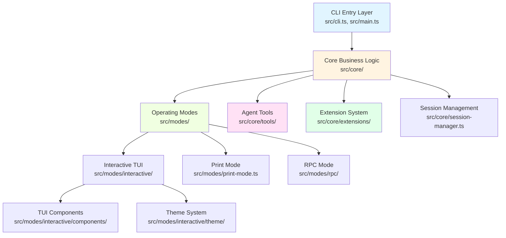

# Technical Stack

## Table of Contents

- [Programming Language and Runtime](#programming-language-and-runtime)
- [Core Dependencies](#core-dependencies)
- [Architecture](#architecture)
- [Design Patterns](#design-patterns)
- [Key Technical Decisions](#key-technical-decisions)

## Programming Language and Runtime

### TypeScript

Pi-coding-agent is built with **TypeScript 5.7.3**, leveraging its strong typing system for reliability and developer experience.

**Key TypeScript features used:**
- Strict mode enabled for maximum type safety
- ES modules (ESM) throughout the codebase
- Comprehensive type definitions for all public APIs
- Discriminated unions for event handling
- Mapped types and conditional types for flexible APIs
- Interface-based design for extensibility

### Node.js Runtime

**Minimum Version:** Node.js 20.0.0 or higher

The project uses modern Node.js features including:
- Native ES modules support
- File system APIs with promises
- Worker threads for parallel operations
- Child process spawning for bash execution
- Crypto module for session ID generation

### Build Configuration

The project uses **tsconfig** with two configurations:

**tsconfig.build.json** (Production build):
- Extends base configuration from monorepo
- Output directory: `./dist`
- Source directory: `./src`
- Includes all TypeScript files in `src/**/*.ts`
- Excludes `node_modules`, `dist`, and type definition files

The build process uses `tsgo` (TypeScript compiler wrapper) to compile TypeScript to JavaScript ES modules.

### Module System

**Type:** ES Modules (ESM)

**Entry Points:**
- **CLI:** `dist/cli.js` - Command-line interface entry point
- **Library:** `dist/index.js` - Main programmatic API export
- **Hooks:** `dist/core/hooks/index.js` - Sub-path export for hooks

**Package Configuration:**
```json
{
  "type": "module",
  "bin": { "pi": "dist/cli.js" },
  "main": "./dist/index.js",
  "types": "./dist/index.d.ts",
  "exports": {
    ".": { "types": "./dist/index.d.ts", "import": "./dist/index.js" },
    "./hooks": { "types": "./dist/core/hooks/index.d.ts", "import": "./dist/core/hooks/index.js" }
  }
}
```

## Core Dependencies

### Foundation Packages (@mariozechner/pi-*)

These are the three foundational packages from the pi-mono monorepo:

#### @mariozechner/pi-agent-core (^0.49.2)

Provides the core agent framework:
- **Agent class** - Main orchestration of LLM interactions
- **AgentTool types** - Tool definition and execution interfaces
- **AgentMessage types** - Message structure for conversations
- **ThinkingLevel** - Extended thinking mode support
- **Event system** - Agent lifecycle events

#### @mariozechner/pi-ai (^0.49.2)

Multi-provider LLM integration layer:
- **Model types** - Unified model abstraction across providers
- **Message types** - Standardized message format
- **API completions** - Streaming and non-streaming completions
- **OAuth providers** - Authentication for subscription services
- **Provider implementations** - Anthropic, OpenAI, Google, Mistral, xAI, Groq, Cerebras, and more
- **Context window management** - Overflow detection and handling

#### @mariozechner/pi-tui (^0.49.2)

Terminal user interface framework:
- **TUI class** - Terminal management and rendering engine
- **Components** - Container, Text, Markdown, Editor, Loader, ProcessTerminal
- **Theming system** - Color schemes and style definitions
- **Keyboard handling** - Kitty keyboard protocol support
- **Layout system** - Flexbox-style component positioning
- **Editor component** - Full-featured text editor with autocomplete

### Runtime Dependencies

#### Schema Validation and Type Safety

**@sinclair/typebox** (via pi-agent-core, pi-ai, pi-tui)
- Runtime schema validation for tool parameters
- Type-safe API definitions
- JSON Schema generation
- Used extensively in tool definitions, model registry, theme schema, and extension types

#### Dynamic TypeScript Loading

**@mariozechner/jiti (^2.6.2)**
- Just-in-time TypeScript compilation
- Enables loading TypeScript extensions dynamically
- Supports ES modules and CommonJS
- Allows extensions to have their own dependencies

#### Terminal and System Integration

**@mariozechner/clipboard (^0.3.0)**
- Cross-platform clipboard access
- Image reading from clipboard
- Text copy operations
- Supports macOS, Linux (X11/Wayland), and Windows

**chalk (^5.5.0)**
- Terminal string styling
- ANSI color codes
- Used for colored console output in print mode

**cli-highlight (^2.1.11)**
- Syntax highlighting for code in terminal
- Language detection
- Theme support for different color schemes

#### File Operations

**glob (^11.0.3)**
- File pattern matching for find tool
- Recursive directory traversal
- .gitignore support

**minimatch (^10.1.1)**
- Glob pattern matching
- Used for skill filtering and model resolution
- Efficient pattern compilation

**proper-lockfile (^4.1.2)**
- File locking for concurrent access
- Used for auth storage to prevent race conditions
- Stale lock detection and cleanup

#### Text Processing

**diff (^8.0.2)**
- Text diffing for edit tool
- Shows before/after changes
- Unified diff format
- Used for edit operation validation

**yaml (^2.8.2)**
- YAML parsing and stringification
- Frontmatter extraction in skills
- Configuration file support

**marked (^15.0.12)**
- Markdown parsing
- HTML generation for exports
- CommonMark compliance

#### File Type Detection

**file-type (^21.1.1)**
- Binary file type detection
- MIME type identification
- Magic number analysis
- Used for image format detection

#### Image Processing

**@silvia-odwyer/photon-node (^0.3.4)**
- WebAssembly-based image processing
- Image resizing and format conversion
- High-performance native operations
- Used for auto-resizing images to 2000x2000 limit

### Development Dependencies

**typescript (^5.7.3)** - TypeScript compiler

**vitest (^3.2.4)** - Testing framework for unit and integration tests

**shx (^0.4.0)** - Cross-platform shell commands for npm scripts

**@types/*** - Type definitions for:
- `@types/node` (^24.3.0) - Node.js APIs
- `@types/diff` (^7.0.2) - diff package
- `@types/ms` (^2.1.0) - ms package
- `@types/proper-lockfile` (^4.1.4) - proper-lockfile package

## Architecture

### High-Level Architecture

Pi follows a layered architecture with clear separation of concerns:



### Layer Breakdown

#### 1. Entry Layer (CLI)

**Location:** `src/cli.ts`, `src/main.ts`, `src/cli/`

**Purpose:** Command-line argument parsing, initialization, and mode selection

**Key Components:**
- `src/cli/args.ts` - Argument parsing with extension flag support
- `src/cli/file-processor.ts` - File argument processing (@files)
- `src/cli/list-models.ts` - Model listing functionality
- `src/cli/session-picker.ts` - Session selection UI

**Flow:**
1. Parse CLI arguments (first pass)
2. Discover auth storage and models
3. Load extensions (discover or explicit paths)
4. Parse arguments again (second pass with extension flags)
5. Handle special commands (help, version, list-models, export)
6. Initialize theme
7. Resolve model scope
8. Create session manager
9. Create agent session via SDK
10. Run selected mode

#### 2. Core Layer

**Location:** `src/core/`

**Purpose:** Core business logic, session lifecycle, and agent orchestration

**Key Components:**

**AgentSession (src/core/agent-session.ts)**
- Main session lifecycle management
- Event subscription with automatic persistence
- Model and thinking level management
- Compaction (manual and auto)
- Bash execution wrapper
- Session switching and branching
- Provides: `prompt()`, `steer()`, `followUp()`, `abort()`, `compact()`, `fork()`, `navigateTree()`, `newSession()`, `setModel()`, `cycleModel()`, `setThinkingLevel()`, `subscribe()`

**SessionManager (src/core/session-manager.ts)**
- JSONL file persistence
- Tree-based session structure with `id` and `parentId`
- Branch navigation and forking
- Entry types: message, header, model-change, thinking-level-change, compaction, custom
- Provides: `create()`, `open()`, `continueRecent()`, `forkFrom()`, `appendMessage()`, `buildSessionContext()`

**SettingsManager (src/core/settings-manager.ts)**
- Two-level settings (global + project)
- Compaction, retry, skills configuration
- Theme and UI preferences
- Shell configuration
- Model defaults

**ModelRegistry (src/core/model-registry.ts)**
- Model discovery from built-in providers
- Custom model loading from models.json
- API key resolution
- Model metadata (context window, cost, capabilities)

**AuthStorage (src/core/auth-storage.ts)**
- API key and OAuth credential storage
- File locking for concurrent access
- Runtime key overrides
- Fallback resolver support

**SDK (src/core/sdk.ts)**
- Programmatic API for embedding pi
- Unified entry point: `createAgentSession()`
- Discovery functions: `discoverAuthStorage()`, `discoverModels()`, `discoverExtensions()`, `discoverSkills()`
- System prompt building
- Tool creation and wrapping

**Compaction (src/core/compaction/)**
- Context token calculation
- Token estimation
- Cut point finding
- AI-powered summarization
- Branch summary generation

**Extensions (src/core/extensions/)**
- Extension loading and lifecycle
- Event system (observer pattern)
- Tool registration and wrapping
- UI context for extensions
- Custom command handling

**Tools (src/core/tools/)**
- File system operations: read, write, edit
- Command execution: bash
- Search operations: grep, find, ls
- Tool result truncation
- Factory functions for tool creation

#### 3. Modes Layer

**Location:** `src/modes/`

**Purpose:** Different operating modes for various use cases

**Interactive Mode (src/modes/interactive/)**
- Full TUI with streaming responses
- Component-based rendering
- Keyboard event handling
- State management for UI
- 32+ reusable TUI components in `components/`
- Theme system in `theme/`

**Print Mode (src/modes/print-mode.ts)**
- Headless execution
- Text or JSON output
- Sequential message processing
- No user interaction

**RPC Mode (src/modes/rpc/)**
- JSON protocol over stdin/stdout
- Command handling: prompt, abort, set_model, get_state, etc.
- Event streaming
- RpcClient for easy integration

#### 4. Utilities Layer

**Location:** `src/utils/`

**Purpose:** Cross-cutting concerns and helper functions

- `clipboard.ts` - Clipboard operations
- `clipboard-image.ts` - Image reading from clipboard
- `image-resize.ts` - Image processing with photon
- `shell.ts` - Shell configuration detection
- `frontmatter.ts` - YAML frontmatter parsing
- `tools-manager.ts` - Tool availability checking
- `changelog.ts` - Changelog parsing for update notifications

### Directory Structure

```
src/
├── cli.ts                    # CLI entry point
├── main.ts                   # Main initialization logic
├── index.ts                  # Library export entry point
├── config.ts                 # Path resolution and configuration
├── paths.ts                  # Asset path resolution
├── migrations.ts             # Data migration utilities
├── cli/                      # CLI-specific modules
│   ├── args.ts              # Argument parsing
│   ├── file-processor.ts    # File argument handling
│   ├── list-models.ts       # Model listing
│   └── session-picker.ts    # Session selection
├── core/                     # Core business logic
│   ├── agent-session.ts     # Main session class
│   ├── session-manager.ts   # Persistence layer
│   ├── settings-manager.ts  # Configuration management
│   ├── model-registry.ts    # Model discovery
│   ├── auth-storage.ts      # Credential management
│   ├── sdk.ts               # Programmatic API
│   ├── event-bus.ts         # Event communication
│   ├── system-prompt.ts     # System prompt building
│   ├── skills.ts            # Skills discovery and loading
│   ├── prompt-templates.ts  # Prompt template expansion
│   ├── bash-executor.ts     # Bash command execution
│   ├── messages.ts          # Message type conversions
│   ├── keybindings.ts       # Keyboard configuration
│   ├── model-resolver.ts    # Model scope resolution
│   ├── footer-data-provider.ts  # Footer state provider
│   ├── timings.ts           # Performance timing
│   ├── compaction/          # Context compaction
│   │   ├── index.ts
│   │   ├── compaction.ts    # Main compaction logic
│   │   ├── branch-summarization.ts
│   │   └── utils.ts
│   ├── extensions/          # Extension system
│   │   ├── index.ts
│   │   ├── types.ts         # Extension API types
│   │   ├── runner.ts        # Extension lifecycle
│   │   ├── loader.ts        # Dynamic loading
│   │   └── wrapper.ts       # Tool wrapping
│   ├── tools/               # Agent tools
│   │   ├── index.ts         # Tool factories
│   │   ├── bash.ts          # Bash execution tool
│   │   ├── read.ts          # File reading tool
│   │   ├── write.ts         # File writing tool
│   │   ├── edit.ts          # File editing tool
│   │   ├── grep.ts          # Content search tool
│   │   ├── find.ts          # File finding tool
│   │   ├── ls.ts            # Directory listing tool
│   │   ├── truncate.ts      # Content truncation
│   │   └── edit-diff.ts     # Edit diffing
│   ├── export-html/         # HTML export
│   │   ├── index.ts
│   │   ├── ansi-to-html.ts
│   │   ├── tool-renderer.ts
│   │   ├── template.html
│   │   ├── template.css
│   │   └── template.js
│   └── hooks/               # React-style hooks API
│       └── index.ts
├── modes/                    # Operating modes
│   ├── index.ts
│   ├── print-mode.ts        # Headless mode
│   ├── interactive/         # TUI mode
│   │   ├── interactive-mode.ts  # Main interactive mode
│   │   ├── components/      # 32+ TUI components
│   │   │   ├── index.ts
│   │   │   ├── armin.ts     # Armin character component
│   │   │   ├── assistant-message.ts
│   │   │   ├── bash-execution.ts
│   │   │   ├── footer.ts
│   │   │   ├── model-selector.ts
│   │   │   ├── session-selector.ts
│   │   │   ├── settings-selector.ts
│   │   │   ├── tool-execution.ts
│   │   │   ├── tree-selector.ts
│   │   │   ├── login-dialog.ts
│   │   │   ├── custom-editor.ts
│   │   │   └── ...
│   │   └── theme/           # Theme system
│   │       ├── theme.ts     # Theme management
│   │       ├── theme-schema.json
│   │       ├── dark.json    # Dark theme
│   │       └── light.json   # Light theme
│   └── rpc/                 # RPC mode
│       ├── rpc-mode.ts      # RPC server
│       ├── rpc-client.ts    # RPC client
│       └── rpc-types.ts     # RPC protocol types
└── utils/                    # Utility functions
    ├── clipboard.ts
    ├── clipboard-image.ts
    ├── image-resize.ts
    ├── shell.ts
    ├── frontmatter.ts
    ├── tools-manager.ts
    ├── changelog.ts
    └── photon.ts
```

## Design Patterns

Pi employs several well-established design patterns:

### 1. Facade Pattern
**Location:** `src/core/sdk.ts`

The SDK module provides a unified, simplified interface to the complex subsystems (auth, models, sessions, extensions, skills). The `createAgentSession()` function is the main facade.

### 2. Factory Pattern
**Location:** `src/core/tools/index.ts`

Tool creation uses factory functions:
- `createCodingTools()` - Creates read, bash, edit, write tools
- `createReadOnlyTools()` - Creates read, grep, find, ls tools
- `createAllTools()` - Creates complete tool set

### 3. Observer Pattern
**Location:** `src/core/extensions/runner.ts`, `src/core/event-bus.ts`

The extension system and event bus use observers:
- Extensions subscribe to lifecycle events
- AgentSession emits events to listeners
- ExtensionRunner coordinates event distribution

### 4. Strategy Pattern
**Location:** `src/modes/`, `src/core/compaction/`

Different strategies for:
- Operating modes (Interactive, Print, RPC)
- Compaction strategies (threshold-based, overflow recovery)
- Message delivery modes (one-at-a-time, all)

### 5. Decorator Pattern
**Location:** `src/core/extensions/wrapper.ts`

Tools are wrapped with extension hooks, allowing extensions to intercept and modify tool behavior without changing tool implementations.

### 6. Builder Pattern
**Location:** `src/core/system-prompt.ts`, `src/core/export-html/`

Complex object construction:
- System prompt building with skills, context files, tools
- HTML export with templates and theming

### 7. Singleton Pattern
**Location:** `src/modes/interactive/theme/theme.ts`

Theme system maintains singleton instance with global state for current theme.

### 8. Manager Pattern
**Location:** `src/core/session-manager.ts`, `src/core/settings-manager.ts`

Manager classes encapsulate lifecycle and access patterns for:
- Session persistence and retrieval
- Settings loading and merging
- Keybindings configuration

### 9. Command Pattern
**Location:** `src/core/tools/`, `src/modes/rpc/`

Tools and RPC commands follow command pattern:
- Encapsulated execution logic
- Uniform interface for invocation
- Support for queuing and history

### 10. Composite Pattern
**Location:** `src/modes/interactive/components/`

TUI components form tree structures:
- Container components hold child components
- Recursive rendering and layout
- Uniform component interface

## Key Technical Decisions

### ES Modules Throughout

Pi uses ES modules exclusively:
- Modern JavaScript standard
- Better tree-shaking for smaller bundles
- Native browser compatibility (for future web integrations)
- Improved static analysis

### TypeScript Strict Mode

Strict type checking provides:
- Catch errors at compile time
- Better IDE support and autocomplete
- Self-documenting code through types
- Refactoring safety

### Monorepo Structure

Pi is part of pi-mono monorepo:
- Shared TypeScript configuration
- Coordinated releases across packages
- Code sharing between packages
- Unified testing and CI/CD

### Component-Based TUI

The terminal UI uses a component architecture similar to React:
- Reusable components with props
- Declarative rendering
- Separation of concerns
- Easy to test and maintain

### Event-Driven Extensions

Extensions use event-driven architecture:
- Loose coupling between core and extensions
- Extensions can't break core functionality
- Multiple extensions can respond to same events
- Easy to add new event types

### JSONL Session Format

Sessions use JSON Lines format:
- Human-readable
- Streamable (append-only)
- Easy to parse and process
- Supports tree structure via id/parentId
- Version control friendly

### Dynamic Extension Loading

Using jiti for TypeScript extensions:
- No build step required for extensions
- Extensions can have own dependencies
- Developer-friendly (write TypeScript, run immediately)
- Sandboxed execution context
