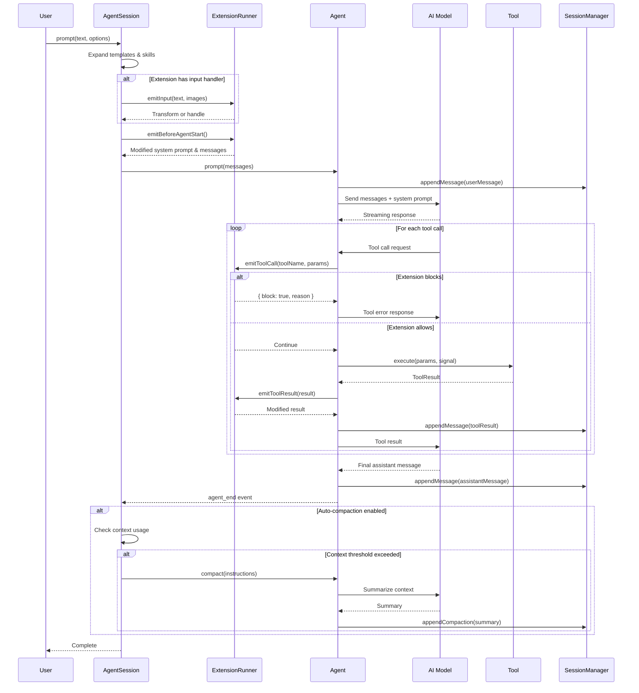

# API Reference

This document provides a comprehensive reference for the pi-coding-agent APIs. It covers the main entry points, core classes, tool implementations, extension system, and RPC protocol.

---

## Table of Contents

1. [Main Entry Points](#main-entry-points)
2. [AgentSession Class](#agentsession-class)
3. [SessionManager](#sessionmanager)
4. [SettingsManager](#settingsmanager)
5. [ModelRegistry](#modelregistry)
6. [AuthStorage](#authstorage)
7. [Tool APIs](#tool-apis)
8. [Extension API](#extension-api)
9. [RPC API](#rpc-api)
10. [Type Exports](#type-exports)

---

## Main Entry Points

### createAgentSession()

The primary entry point for programmatic usage of the coding agent. Creates a fully configured `AgentSession` with all necessary components.

**Signature:**

```typescript
function createAgentSession(
  options?: CreateAgentSessionOptions
): Promise<CreateAgentSessionResult>;
```

**Options Interface:**

```typescript
interface CreateAgentSessionOptions {
  // Working directory (defaults to process.cwd())
  cwd?: string;

  // Agent configuration directory (defaults to ~/.pi)
  agentDir?: string;

  // Pre-configured authentication storage
  authStorage?: AuthStorage;

  // Pre-configured model registry
  modelRegistry?: ModelRegistry;

  // Initial model to use
  model?: Model<any>;

  // Initial thinking level
  thinkingLevel?: ThinkingLevel; // "off" | "minimal" | "low" | "medium" | "high" | "xhigh"

  // Scoped models for model cycling
  scopedModels?: Array<{
    model: Model<any>;
    thinkingLevel: ThinkingLevel;
  }>;

  // Custom system prompt or modifier function
  systemPrompt?: string | ((defaultPrompt: string) => string);

  // Override default tools
  tools?: Tool[];

  // Additional custom tool definitions
  customTools?: ToolDefinition[];

  // Extension factory functions
  extensions?: ExtensionFactory[];

  // Additional extension paths to load
  additionalExtensionPaths?: string[];

  // Pre-loaded extensions result
  preloadedExtensions?: LoadExtensionsResult;

  // Event bus for extension communication
  eventBus?: EventBus;

  // Pre-loaded skills
  skills?: Skill[];

  // Context files to include in system prompt
  contextFiles?: Array<{ path: string; content: string }>;

  // Prompt templates for expansion
  promptTemplates?: PromptTemplate[];

  // Pre-configured session manager
  sessionManager?: SessionManager;

  // Pre-configured settings manager
  settingsManager?: SettingsManager;
}
```

**Return Value:**

```typescript
interface CreateAgentSessionResult {
  session: AgentSession;
  extensionsResult: LoadExtensionsResult;
  modelFallbackMessage?: string;
}
```

**Example Usage:**

```typescript
import {
  createAgentSession,
  discoverAuthStorage,
  discoverModels,
} from "@mariozechner/pi-coding-agent";

// Basic usage with defaults
const { session } = await createAgentSession();
await session.prompt("Hello, can you help me with my code?");

// Advanced usage with custom configuration
const authStorage = discoverAuthStorage();
const modelRegistry = discoverModels(authStorage);

const { session, extensionsResult, modelFallbackMessage } = await createAgentSession({
  cwd: "/path/to/project",
  authStorage,
  modelRegistry,
  thinkingLevel: "medium",
  systemPrompt: (defaultPrompt) => defaultPrompt + "\n\nAlways be concise.",
  extensions: [
    (pi) => {
      pi.on("tool_call", async (event, ctx) => {
        console.log(`Tool called: ${event.toolName}`);
      });
    },
  ],
});

if (modelFallbackMessage) {
  console.warn(modelFallbackMessage);
}

// Listen to session events
const unsubscribe = session.subscribe((event) => {
  console.log(`Event: ${event.type}`);
});

// Send a prompt
await session.prompt("Analyze this codebase");

// Clean up
unsubscribe();
session.dispose();
```

### createCodingTools()

Creates the standard set of coding tools for a given working directory.

**Signature:**

```typescript
function createCodingTools(cwd: string, options?: ToolsOptions): Tool[];
```

**Options:**

```typescript
interface ToolsOptions {
  read?: ReadToolOptions;
  bash?: BashToolOptions;
}

interface ReadToolOptions {
  autoResizeImages?: boolean;  // Default: true
  operations?: ReadOperations; // Custom file operations
}

interface BashToolOptions {
  operations?: BashOperations;  // Custom bash operations
  commandPrefix?: string;       // Prefix for all commands
}
```

**Returns:** Array of four tools: `read`, `bash`, `edit`, `write`

**Example:**

```typescript
import { createCodingTools } from "@mariozechner/pi-coding-agent";

const tools = createCodingTools("/path/to/project", {
  read: { autoResizeImages: false },
  bash: { commandPrefix: "source ~/.bashrc" },
});
```

### createReadOnlyTools()

Creates a set of read-only tools for safe exploration.

**Signature:**

```typescript
function createReadOnlyTools(cwd: string, options?: ToolsOptions): Tool[];
```

**Returns:** Array of four tools: `read`, `grep`, `find`, `ls`

### Discovery Functions

```typescript
// Discover authentication storage
function discoverAuthStorage(agentDir?: string): AuthStorage;

// Discover available models
function discoverModels(authStorage: AuthStorage, agentDir?: string): ModelRegistry;

// Discover and load extensions
async function discoverExtensions(
  eventBus: EventBus,
  cwd?: string,
  agentDir?: string
): Promise<LoadExtensionsResult>;

// Discover skills from standard locations
function discoverSkills(
  cwd?: string,
  agentDir?: string,
  settings?: SkillsSettings
): { skills: Skill[]; warnings: SkillWarning[] };

// Discover context files
function discoverContextFiles(
  cwd?: string,
  agentDir?: string
): Array<{ path: string; content: string }>;

// Discover prompt templates
function discoverPromptTemplates(cwd?: string, agentDir?: string): PromptTemplate[];

// Load settings from disk
function loadSettings(cwd?: string, agentDir?: string): Settings;
```

### buildSystemPrompt()

Builds the system prompt from components.

**Signature:**

```typescript
function buildSystemPrompt(options?: BuildSystemPromptOptions): string;

interface BuildSystemPromptOptions {
  tools?: Tool[];
  skills?: Skill[];
  contextFiles?: Array<{ path: string; content: string }>;
  cwd?: string;
  appendPrompt?: string;
}
```

---

## AgentSession Class

The `AgentSession` class is the central orchestrator for agent interactions. It manages the conversation state, model configuration, tool execution, and session persistence.

### Constructor

The constructor is not called directly. Use `createAgentSession()` instead.

**Configuration Interface:**

```typescript
interface AgentSessionConfig {
  agent: Agent;
  sessionManager: SessionManager;
  settingsManager: SettingsManager;
  scopedModels?: Array<{ model: Model<any>; thinkingLevel: ThinkingLevel }>;
  promptTemplates?: PromptTemplate[];
  extensionRunner?: ExtensionRunner;
  skills?: Skill[];
  skillWarnings?: SkillWarning[];
  skillsSettings?: Required<SkillsSettings>;
  modelRegistry: ModelRegistry;
  toolRegistry?: Map<string, AgentTool>;
  rebuildSystemPrompt?: (toolNames: string[]) => string;
}
```

### Properties

```typescript
class AgentSession {
  // Read-only properties
  readonly agent: Agent;
  readonly sessionManager: SessionManager;
  readonly settingsManager: SettingsManager;

  // Current state getters
  get state(): AgentState;
  get model(): Model<any> | undefined;
  get thinkingLevel(): ThinkingLevel;
  get isStreaming(): boolean;
  get isCompacting(): boolean;
  get messages(): AgentMessage[];
  get steeringMode(): "all" | "one-at-a-time";
  get followUpMode(): "all" | "one-at-a-time";
  get sessionFile(): string | undefined;
  get sessionId(): string;
  get retryAttempt(): number;
  get pendingMessageCount(): number;

  // Scoped models
  get scopedModels(): ReadonlyArray<{ model: Model<any>; thinkingLevel: ThinkingLevel }>;
  get promptTemplates(): ReadonlyArray<PromptTemplate>;

  // Skills
  get skills(): readonly Skill[];
  get skillWarnings(): readonly SkillWarning[];
  get skillsSettings(): Required<SkillsSettings> | undefined;

  // Model registry access
  get modelRegistry(): ModelRegistry;
}
```

### Core Methods

#### prompt()

Send a message to the agent and start processing.

```typescript
async prompt(text: string, options?: PromptOptions): Promise<void>;

interface PromptOptions {
  expandPromptTemplates?: boolean;  // Default: true
  images?: ImageContent[];
  streamingBehavior?: "steer" | "followUp";
  source?: InputSource;  // "interactive" | "rpc" | "extension"
}
```

**Example:**

```typescript
// Simple prompt
await session.prompt("Explain this function");

// With images
await session.prompt("What's in this screenshot?", {
  images: [{
    type: "image",
    data: base64ImageData,
    mimeType: "image/png"
  }]
});

// Queue during streaming
await session.prompt("Also check for bugs", {
  streamingBehavior: "followUp"
});
```

#### steer()

Interrupt the current response with a steering message.

```typescript
async steer(text: string): Promise<void>;
```

**Example:**

```typescript
// While agent is streaming...
await session.steer("Focus on the error handling instead");
```

#### followUp()

Queue a follow-up message to be processed after current turn.

```typescript
async followUp(text: string): Promise<void>;
```

#### abort()

Abort the current operation and wait for idle state.

```typescript
async abort(): Promise<void>;
```

#### subscribe()

Subscribe to session events. Returns an unsubscribe function.

```typescript
subscribe(listener: AgentSessionEventListener): () => void;

type AgentSessionEventListener = (event: AgentSessionEvent) => void;

type AgentSessionEvent =
  | AgentEvent  // From pi-agent-core
  | { type: "auto_compaction_start"; reason: "threshold" | "overflow" }
  | { type: "auto_compaction_end"; result: CompactionResult | undefined; aborted: boolean; willRetry: boolean; errorMessage?: string }
  | { type: "auto_retry_start"; attempt: number; maxAttempts: number; delayMs: number; errorMessage: string }
  | { type: "auto_retry_end"; success: boolean; attempt: number; finalError?: string };
```

**Example:**

```typescript
const unsubscribe = session.subscribe((event) => {
  switch (event.type) {
    case "message_start":
      console.log(`Message from ${event.message.role}`);
      break;
    case "content_delta":
      process.stdout.write(event.delta);
      break;
    case "agent_end":
      console.log("Agent finished");
      break;
    case "auto_compaction_start":
      console.log(`Starting compaction: ${event.reason}`);
      break;
  }
});

// Later...
unsubscribe();
```

### Model Management

```typescript
// Set a specific model
async setModel(model: Model<any>): Promise<void>;

// Cycle through available models
async cycleModel(direction?: "forward" | "backward"): Promise<ModelCycleResult | undefined>;

interface ModelCycleResult {
  model: Model<any>;
  thinkingLevel: ThinkingLevel;
  isScoped: boolean;
}

// Get all available models
async getAvailableModels(): Promise<Model<any>[]>;

// Scoped models for cycling
setScopedModels(scopedModels: Array<{ model: Model<any>; thinkingLevel: ThinkingLevel }>): void;
```

### Thinking Level

```typescript
// Set thinking level
setThinkingLevel(level: ThinkingLevel): void;

// Cycle through levels
cycleThinkingLevel(): ThinkingLevel | undefined;

// Get available levels for current model
getAvailableThinkingLevels(): ThinkingLevel[];

// Check model capabilities
supportsThinking(): boolean;
supportsXhighThinking(): boolean;
```

### Message Queue Management

```typescript
// Clear all queued messages
clearQueue(): { steering: string[]; followUp: string[] };

// Get queued messages
getSteeringMessages(): readonly string[];
getFollowUpMessages(): readonly string[];
```

### Session Management

```typescript
// Create a new session
async newSession(options?: NewSessionOptions): Promise<boolean>;

interface NewSessionOptions {
  parentSession?: string;
}

// Fork from a specific entry
async fork(entryId: string): Promise<{ text: string; cancelled: boolean }>;

// Navigate to a different branch
async navigateTree(
  targetId: string,
  options?: {
    summarize?: boolean;
    customInstructions?: string;
    replaceInstructions?: boolean;
    label?: string;
  }
): Promise<{ cancelled: boolean }>;
```

### Compaction

```typescript
// Manually trigger compaction
async compact(customInstructions?: string): Promise<CompactionResult>;

interface CompactionResult {
  summary: string;
  firstKeptEntryId: string;
  tokensBefore: number;
  details?: unknown;
}

// Abort ongoing compaction
abortCompaction(): void;

// Auto-compaction settings
get autoCompactionEnabled(): boolean;
setAutoCompactionEnabled(enabled: boolean): void;
```

### Tool Management

```typescript
// Get active tool names
getActiveToolNames(): string[];

// Get all registered tools
getAllTools(): Array<{ name: string; description: string }>;

// Set which tools are active
setActiveToolsByName(toolNames: string[]): void;
```

### Custom Messages

```typescript
// Send a custom message
async sendCustomMessage<T = unknown>(
  message: Pick<CustomMessage<T>, "customType" | "content" | "display" | "details">,
  options?: {
    triggerTurn?: boolean;
    deliverAs?: "steer" | "followUp" | "nextTurn";
  }
): Promise<void>;

// Send a user message programmatically
async sendUserMessage(
  content: string | (TextContent | ImageContent)[],
  options?: { deliverAs?: "steer" | "followUp" }
): Promise<void>;
```

### Session Statistics

```typescript
getSessionStats(): SessionStats;

interface SessionStats {
  sessionFile: string | undefined;
  sessionId: string;
  userMessages: number;
  assistantMessages: number;
  toolCalls: number;
  toolResults: number;
  totalMessages: number;
  tokens: {
    input: number;
    output: number;
    cacheRead: number;
    cacheWrite: number;
    total: number;
  };
  cost: number;
}
```

### Retry Management

```typescript
// Abort retry sequence
abortRetry(): void;

// Wait for any pending retry
async waitForRetry(): Promise<void>;
```

### Lifecycle

```typescript
// Clean up resources
dispose(): void;
```

---

## SessionManager

The `SessionManager` handles session persistence using JSONL (JSON Lines) format. Each session is stored as a single file with one JSON object per line.

### Creation

```typescript
// Create with file persistence
static create(cwd: string, sessionDir?: string): SessionManager;

// Create without persistence (memory only)
static inMemory(cwd: string): SessionManager;
```

### Session File Format

Session files use JSONL format with a header followed by entries:

```jsonl
{"type":"session","version":3,"id":"abc12345","timestamp":"2024-01-15T10:30:00.000Z","cwd":"/path/to/project"}
{"type":"message","id":"def67890","parentId":null,"timestamp":"2024-01-15T10:30:01.000Z","message":{...}}
{"type":"thinking_level_change","id":"ghi11111","parentId":"def67890","timestamp":"...","thinkingLevel":"medium"}
```

### Entry Types

```typescript
type SessionEntry =
  | SessionMessageEntry      // User/assistant messages
  | ThinkingLevelChangeEntry // Thinking level changes
  | ModelChangeEntry         // Model switches
  | CompactionEntry          // Compaction summaries
  | BranchSummaryEntry       // Branch navigation summaries
  | CustomEntry              // Extension custom data
  | CustomMessageEntry       // Extension custom messages
  | LabelEntry               // Branch labels
  | SessionInfoEntry;        // Session metadata (name)
```

### Core Properties

```typescript
class SessionManager {
  getCwd(): string;
  getSessionDir(): string;
  getSessionId(): string;
  getSessionFile(): string | undefined;
  isPersisted(): boolean;
}
```

### Session Operations

```typescript
// Start a new session
newSession(options?: NewSessionOptions): string | undefined;

// Load an existing session file
setSessionFile(sessionFile: string): void;

// Get session name
getSessionName(): string | undefined;
```

### Entry Management

```typescript
// Append different entry types
appendMessage(message: Message | CustomMessage): string;
appendThinkingLevelChange(thinkingLevel: string): string;
appendModelChange(provider: string, modelId: string): string;
appendCompaction<T = unknown>(
  summary: string,
  firstKeptEntryId: string,
  tokensBefore: number,
  details?: T,
  fromHook?: boolean
): string;
appendCustomEntry(customType: string, data?: unknown): string;
appendCustomMessageEntry<T = unknown>(
  customType: string,
  content: string | (TextContent | ImageContent)[],
  display: boolean,
  details?: T
): string;
appendSessionInfo(name: string): string;
appendLabelChange(targetId: string, label: string | undefined): string;
```

### Tree Navigation

```typescript
// Get current leaf entry
getLeafId(): string | null;
getLeafEntry(): SessionEntry | undefined;

// Get any entry by ID
getEntry(id: string): SessionEntry | undefined;

// Get children of an entry
getChildren(parentId: string): SessionEntry[];

// Get label for an entry
getLabel(id: string): string | undefined;

// Get path from root to leaf (or specified ID)
getBranch(fromId?: string): SessionEntry[];

// Navigate to a different entry
branch(branchFromId: string): void;
resetLeaf(): void;
branchWithSummary(
  branchFromId: string | null,
  summary: string,
  details?: unknown,
  fromHook?: boolean
): string;

// Get full tree structure
getTree(): SessionTreeNode[];

interface SessionTreeNode {
  entry: SessionEntry;
  children: SessionTreeNode[];
  label?: string;
}
```

### Context Building

```typescript
// Build conversation context from current branch
buildSessionContext(): SessionContext;

interface SessionContext {
  messages: AgentMessage[];
  thinkingLevel: string;
  model: { provider: string; modelId: string } | null;
}

// Get all entries
getEntries(): SessionEntry[];

// Get session header
getHeader(): SessionHeader | null;
```

### Session Listing

```typescript
// List all sessions in a directory
static async listSessions(
  cwd: string,
  agentDir?: string,
  onProgress?: SessionListProgress
): Promise<SessionInfo[]>;

interface SessionInfo {
  path: string;
  id: string;
  cwd: string;
  name?: string;
  created: Date;
  modified: Date;
  messageCount: number;
  firstMessage: string;
  allMessagesText: string;
}
```

### Utility Functions

```typescript
// Parse session file content
function parseSessionEntries(content: string): FileEntry[];

// Build context from entries
function buildSessionContext(
  entries: SessionEntry[],
  leafId?: string | null,
  byId?: Map<string, SessionEntry>
): SessionContext;

// Migrate old session formats
function migrateSessionEntries(entries: FileEntry[]): void;

// Get latest compaction entry
function getLatestCompactionEntry(entries: SessionEntry[]): CompactionEntry | null;
```

---

## SettingsManager

The `SettingsManager` handles two-level settings: global (`~/.pi/settings.json`) and project-local (`.pi/settings.json`). Project settings override global settings.

### Creation

```typescript
// Create with file persistence
static create(cwd?: string, agentDir?: string): SettingsManager;

// Create in-memory only
static inMemory(settings?: Partial<Settings>): SettingsManager;
```

### Settings Interface

```typescript
interface Settings {
  lastChangelogVersion?: string;
  defaultProvider?: string;
  defaultModel?: string;
  defaultThinkingLevel?: "off" | "minimal" | "low" | "medium" | "high" | "xhigh";
  steeringMode?: "all" | "one-at-a-time";
  followUpMode?: "all" | "one-at-a-time";
  theme?: string;
  compaction?: CompactionSettings;
  branchSummary?: BranchSummarySettings;
  retry?: RetrySettings;
  hideThinkingBlock?: boolean;
  shellPath?: string;
  quietStartup?: boolean;
  shellCommandPrefix?: string;
  collapseChangelog?: boolean;
  extensions?: string[];
  skills?: SkillsSettings;
  terminal?: TerminalSettings;
  images?: ImageSettings;
  enabledModels?: string[];
  doubleEscapeAction?: "fork" | "tree";
  thinkingBudgets?: ThinkingBudgetsSettings;
  editorPaddingX?: number;
  showHardwareCursor?: boolean;
  markdown?: MarkdownSettings;
}

interface CompactionSettings {
  enabled?: boolean;
  reserveTokens?: number;
  keepRecentTokens?: number;
}

interface RetrySettings {
  enabled?: boolean;
  maxRetries?: number;
  baseDelayMs?: number;
}

interface SkillsSettings {
  enabled?: boolean;
  enableCodexUser?: boolean;
  enableClaudeUser?: boolean;
  enableClaudeProject?: boolean;
  enablePiUser?: boolean;
  enablePiProject?: boolean;
  enableSkillCommands?: boolean;
  customDirectories?: string[];
  ignoredSkills?: string[];
  includeSkills?: string[];
}

interface ImageSettings {
  autoResize?: boolean;
  blockImages?: boolean;
}
```

### Getter Methods

```typescript
class SettingsManager {
  // Model defaults
  getDefaultProvider(): string | undefined;
  getDefaultModel(): string | undefined;
  getDefaultThinkingLevel(): ThinkingLevel | undefined;

  // Message modes
  getSteeringMode(): "all" | "one-at-a-time";
  getFollowUpMode(): "all" | "one-at-a-time";

  // Theme
  getTheme(): string | undefined;

  // Compaction
  getCompactionEnabled(): boolean;
  getCompactionReserveTokens(): number;
  getCompactionKeepRecentTokens(): number;
  getCompactionSettings(): { enabled: boolean; reserveTokens: number; keepRecentTokens: number };
  getBranchSummarySettings(): { reserveTokens: number };

  // Retry
  getRetryEnabled(): boolean;
  getRetrySettings(): { enabled: boolean; maxRetries: number; baseDelayMs: number };

  // Display
  getHideThinkingBlock(): boolean;
  getQuietStartup(): boolean;
  getCollapseChangelog(): boolean;

  // Shell
  getShellPath(): string | undefined;
  getShellCommandPrefix(): string | undefined;

  // Extensions
  getExtensionPaths(): string[];

  // Skills
  getSkillsEnabled(): boolean;
  getSkillsSettings(): Required<SkillsSettings>;
  getEnableSkillCommands(): boolean;

  // Terminal/Images
  getShowImages(): boolean;
  getImageAutoResize(): boolean;
  getBlockImages(): boolean;
}
```

### Setter Methods

```typescript
class SettingsManager {
  setDefaultProvider(provider: string): void;
  setDefaultModel(modelId: string): void;
  setDefaultModelAndProvider(provider: string, modelId: string): void;
  setDefaultThinkingLevel(level: ThinkingLevel): void;
  setSteeringMode(mode: "all" | "one-at-a-time"): void;
  setFollowUpMode(mode: "all" | "one-at-a-time"): void;
  setTheme(theme: string): void;
  setCompactionEnabled(enabled: boolean): void;
  setRetryEnabled(enabled: boolean): void;
  setHideThinkingBlock(hide: boolean): void;
  setShellPath(path: string | undefined): void;
  setQuietStartup(quiet: boolean): void;
  setShellCommandPrefix(prefix: string | undefined): void;
  setCollapseChangelog(collapse: boolean): void;
  setExtensionPaths(paths: string[]): void;
  setSkillsEnabled(enabled: boolean): void;
  setEnableSkillCommands(enabled: boolean): void;
  setShowImages(show: boolean): void;
  setImageAutoResize(autoResize: boolean): void;
  setBlockImages(block: boolean): void;

  // Apply runtime overrides without persisting
  applyOverrides(overrides: Partial<Settings>): void;
}
```

---

## ModelRegistry

The `ModelRegistry` discovers and manages available AI models, including built-in models and custom models defined in `models.json`.

### Constructor

```typescript
constructor(authStorage: AuthStorage, modelsJsonPath?: string);
```

### Methods

```typescript
class ModelRegistry {
  // Refresh models (reload from disk)
  refresh(): void;

  // Get loading errors
  getError(): string | undefined;

  // Get all registered models
  getAll(): Model<Api>[];

  // Get models with valid authentication
  getAvailable(): Model<Api>[];

  // Find a specific model
  find(provider: string, modelId: string): Model<Api> | undefined;

  // Get API key for a model
  async getApiKey(model: Model<Api>): Promise<string | undefined>;
  async getApiKeyForProvider(provider: string): Promise<string | undefined>;

  // Check if using OAuth
  isUsingOAuth(model: Model<Api>): boolean;
}
```

### Custom Models Configuration

Create `~/.pi/models.json` to define custom models:

```json
{
  "providers": {
    "my-provider": {
      "baseUrl": "https://api.example.com/v1",
      "apiKey": "MY_API_KEY_ENV_VAR",
      "api": "openai-completions",
      "models": [
        {
          "id": "my-model",
          "name": "My Custom Model",
          "api": "openai-completions",
          "reasoning": false,
          "input": ["text", "image"],
          "cost": {
            "input": 0.001,
            "output": 0.002,
            "cacheRead": 0.0005,
            "cacheWrite": 0.001
          },
          "contextWindow": 128000,
          "maxTokens": 4096
        }
      ]
    }
  }
}
```

**API Key Resolution:**

- Direct value: `"apiKey": "sk-..."`
- Environment variable: `"apiKey": "MY_ENV_VAR"` (resolves to `process.env.MY_ENV_VAR`)
- Command execution: `"apiKey": "!security find-generic-password -s mykey -w"` (prefix with `!`)

---

## AuthStorage

The `AuthStorage` class manages API keys and OAuth credentials, storing them securely in `~/.pi/auth.json`.

### Constructor

```typescript
constructor(authPath: string);
```

### Credential Types

```typescript
type ApiKeyCredential = {
  type: "api_key";
  key: string;
};

type OAuthCredential = {
  type: "oauth";
  access: string;      // Access token
  refresh?: string;    // Refresh token
  expires: number;     // Expiration timestamp
  projectId?: string;  // For Google providers
  enterpriseUrl?: string; // For GitHub Copilot
};

type AuthCredential = ApiKeyCredential | OAuthCredential;
```

### Methods

```typescript
class AuthStorage {
  // Reload credentials from disk
  reload(): void;

  // Get credential for provider
  get(provider: string): AuthCredential | undefined;

  // Set credential for provider
  set(provider: string, credential: AuthCredential): void;

  // Remove credential
  remove(provider: string): void;

  // List all providers with credentials
  list(): string[];

  // Check if provider has any credential
  has(provider: string): boolean;

  // Check if provider has valid auth (including env vars)
  hasAuth(provider: string): boolean;

  // Get all credentials
  getAll(): AuthStorageData;

  // Get API key (handles OAuth token refresh)
  async getApiKey(provider: string): Promise<string | undefined>;

  // Runtime overrides (not persisted)
  setRuntimeApiKey(provider: string, apiKey: string): void;
  removeRuntimeApiKey(provider: string): void;

  // Fallback resolver for custom providers
  setFallbackResolver(resolver: (provider: string) => string | undefined): void;

  // OAuth login flow
  async login(
    provider: OAuthProvider,
    callbacks: {
      onAuth: (info: { url: string; instructions?: string }) => void;
      onPrompt: (prompt: { message: string; placeholder?: string }) => Promise<string>;
      onProgress?: (message: string) => void;
      onManualCodeInput?: () => Promise<string>;
      signal?: AbortSignal;
    }
  ): Promise<void>;

  // OAuth logout
  logout(provider: string): void;
}

type OAuthProvider =
  | "anthropic"
  | "github-copilot"
  | "google-gemini-cli"
  | "google-antigravity"
  | "openai-codex";
```

**Example:**

```typescript
const authStorage = new AuthStorage("/path/to/.pi/auth.json");

// Set API key
authStorage.set("anthropic", {
  type: "api_key",
  key: "sk-ant-..."
});

// OAuth login
await authStorage.login("github-copilot", {
  onAuth: ({ url, instructions }) => {
    console.log(`Open: ${url}`);
    if (instructions) console.log(instructions);
  },
  onPrompt: async ({ message }) => {
    return await prompt(message);
  },
  onProgress: (msg) => console.log(msg),
});

// Get API key (auto-refreshes OAuth if needed)
const apiKey = await authStorage.getApiKey("anthropic");
```

---

## Tool APIs

Pi provides seven core tools accessible to the AI agent. Each tool can be created independently or used via the factory functions.

### Tool Execution Flow

The following diagram illustrates how tools are executed from the user's prompt through to the AI's response:



This flow demonstrates:
- **Input transformation**: Extensions can intercept and modify user input
- **Tool call interception**: Extensions can block or allow tool execution
- **Result modification**: Extensions can transform tool results before they reach the AI
- **Automatic compaction**: Context is monitored and compacted when thresholds are exceeded

### Read Tool

Reads file contents. Supports text files and images (jpg, png, gif, webp).

**Schema:**

```typescript
interface ReadParams {
  path: string;           // Path to the file (relative or absolute)
  offset?: number;        // Line number to start reading from (1-indexed)
  limit?: number;         // Maximum number of lines to read
}
```

**Options:**

```typescript
interface ReadToolOptions {
  autoResizeImages?: boolean;  // Default: true - resize large images
  operations?: ReadOperations; // Custom file operations for testing
}

interface ReadOperations {
  readFile: (absolutePath: string) => Promise<Buffer>;
  access: (absolutePath: string) => Promise<void>;
  detectImageMimeType?: (absolutePath: string) => Promise<string | null | undefined>;
}
```

**Output Details:**

```typescript
interface ReadToolDetails {
  truncation?: TruncationResult;
}
```

**Behavior:**

- Text files: Truncated to 2000 lines or 64KB (whichever is hit first)
- Images: Converted to base64 and optionally resized
- Returns line numbers for navigation
- Suggests `offset` parameter for continuation

**Example:**

```typescript
import { createReadTool } from "@mariozechner/pi-coding-agent";

const readTool = createReadTool("/path/to/project", {
  autoResizeImages: true,
});

// Tool execution returns:
// { content: [{ type: "text", text: "file contents..." }], details: { truncation?: ... } }
```

### Bash Tool

Executes bash commands in the working directory.

**Schema:**

```typescript
interface BashParams {
  command: string;   // Bash command to execute
  timeout?: number;  // Timeout in seconds (optional)
}
```

**Options:**

```typescript
interface BashToolOptions {
  operations?: BashOperations;  // Custom execution for testing
  commandPrefix?: string;       // Prefix for all commands (e.g., "source ~/.bashrc")
}

interface BashOperations {
  exec: (
    command: string,
    cwd: string,
    options: {
      onData: (data: Buffer) => void;
      signal?: AbortSignal;
      timeout?: number;
    }
  ) => Promise<{ exitCode: number | null }>;
}
```

**Output Details:**

```typescript
interface BashToolDetails {
  truncation?: TruncationResult;
  fullOutputPath?: string;  // Path to full output if truncated
}
```

**Behavior:**

- Output truncated to last 2000 lines or 64KB
- Full output saved to temp file if truncated
- Supports streaming updates during execution
- Process tree killed on abort or timeout
- Exit code included in output

**Example:**

```typescript
import { createBashTool } from "@mariozechner/pi-coding-agent";

const bashTool = createBashTool("/path/to/project", {
  commandPrefix: "export PATH=$PATH:/custom/bin",
});
```

### Edit Tool

Replaces exact text in files. Requires the text to be unique and match exactly.

**Schema:**

```typescript
interface EditParams {
  path: string;     // Path to the file to edit
  oldText: string;  // Exact text to find and replace
  newText: string;  // New text to replace with
}
```

**Options:**

```typescript
interface EditToolOptions {
  operations?: EditOperations;  // Custom file operations for testing
}

interface EditOperations {
  readFile: (absolutePath: string) => Promise<Buffer>;
  writeFile: (absolutePath: string, content: string) => Promise<void>;
  access: (absolutePath: string) => Promise<void>;
}
```

**Output Details:**

```typescript
interface EditToolDetails {
  diff: string;              // Unified diff of changes
  firstChangedLine?: number; // First line number that changed
}
```

**Behavior:**

- Requires exact match (including whitespace)
- Uses fuzzy matching with whitespace normalization for finding
- Fails if text appears multiple times (must be unique)
- Preserves original line endings (CRLF/LF)
- Preserves BOM if present
- Returns unified diff of changes

**Example:**

```typescript
import { createEditTool } from "@mariozechner/pi-coding-agent";

const editTool = createEditTool("/path/to/project");

// AI would call:
// edit({ path: "src/index.ts", oldText: "const x = 1;", newText: "const x = 2;" })
```

### Write Tool

Writes content to a file. Creates the file if it doesn't exist, overwrites if it does.

**Schema:**

```typescript
interface WriteParams {
  path: string;    // Path to the file to write
  content: string; // Content to write
}
```

**Options:**

```typescript
interface WriteToolOptions {
  operations?: WriteOperations;  // Custom file operations for testing
}

interface WriteOperations {
  writeFile: (absolutePath: string, content: string) => Promise<void>;
  mkdir: (dir: string) => Promise<void>;
}
```

**Behavior:**

- Automatically creates parent directories
- Overwrites existing files without warning
- Returns byte count written

### Grep Tool

Searches file contents using ripgrep. Respects `.gitignore`.

**Schema:**

```typescript
interface GrepParams {
  pattern: string;       // Search pattern (regex or literal)
  path?: string;         // Directory or file to search (default: cwd)
  glob?: string;         // Filter files by glob pattern (e.g., "*.ts")
  ignoreCase?: boolean;  // Case-insensitive search
  literal?: boolean;     // Treat pattern as literal string
  context?: number;      // Lines of context around matches
  limit?: number;        // Maximum matches (default: 100)
}
```

**Options:**

```typescript
interface GrepToolOptions {
  operations?: GrepOperations;  // Custom operations for testing
}

interface GrepOperations {
  isDirectory: (absolutePath: string) => Promise<boolean> | boolean;
  readFile: (absolutePath: string) => Promise<string> | string;
}
```

**Output Details:**

```typescript
interface GrepToolDetails {
  truncation?: TruncationResult;
  matchLimitReached?: number;
  linesTruncated?: boolean;
}
```

**Behavior:**

- Uses ripgrep (auto-downloaded if not present)
- Respects `.gitignore` patterns
- Output format: `filepath:linenum:content`
- Long lines truncated to 500 characters
- Maximum 100 matches by default

### Find Tool

Finds files by glob pattern. Respects `.gitignore`.

**Schema:**

```typescript
interface FindParams {
  pattern: string;  // Glob pattern (e.g., "*.ts", "**/*.spec.ts")
  path?: string;    // Directory to search (default: cwd)
  limit?: number;   // Maximum results (default: 1000)
}
```

**Options:**

```typescript
interface FindToolOptions {
  operations?: FindOperations;  // Custom operations for testing
}

interface FindOperations {
  exists: (absolutePath: string) => Promise<boolean> | boolean;
  glob: (pattern: string, cwd: string, options: { ignore: string[]; limit: number }) => Promise<string[]> | string[];
}
```

**Output Details:**

```typescript
interface FindToolDetails {
  truncation?: TruncationResult;
  resultLimitReached?: number;
}
```

**Behavior:**

- Uses `fd` command (auto-downloaded if not present)
- Respects `.gitignore` patterns
- Returns relative paths
- Maximum 1000 results by default

### Ls Tool

Lists directory contents with type indicators.

**Schema:**

```typescript
interface LsParams {
  path?: string;   // Directory to list (default: cwd)
  limit?: number;  // Maximum entries (default: 500)
}
```

**Options:**

```typescript
interface LsToolOptions {
  operations?: LsOperations;  // Custom operations for testing
}

interface LsOperations {
  exists: (absolutePath: string) => Promise<boolean> | boolean;
  stat: (absolutePath: string) => Promise<{ isDirectory: () => boolean }> | { isDirectory: () => boolean };
  readdir: (absolutePath: string) => Promise<string[]> | string[];
}
```

**Output Details:**

```typescript
interface LsToolDetails {
  truncation?: TruncationResult;
  entryLimitReached?: number;
}
```

**Behavior:**

- Includes hidden files (dotfiles)
- Directories have `/` suffix
- Sorted alphabetically (case-insensitive)
- Maximum 500 entries by default

### Truncation Utilities

All tools share truncation utilities:

```typescript
const DEFAULT_MAX_LINES = 2000;
const DEFAULT_MAX_BYTES = 64 * 1024; // 64KB

interface TruncationResult {
  content: string;
  truncated: boolean;
  truncatedBy?: "lines" | "bytes";
  outputLines: number;
  outputBytes: number;
  totalLines: number;
  firstLineExceedsLimit?: boolean;
  lastLinePartial?: boolean;
}

// Truncate from the beginning (keep end)
function truncateTail(text: string, options?: TruncationOptions): TruncationResult;

// Truncate from the end (keep beginning)
function truncateHead(text: string, options?: TruncationOptions): TruncationResult;

// Truncate a single line
function truncateLine(text: string, maxLength?: number): { text: string; wasTruncated: boolean };

// Format bytes as human-readable
function formatSize(bytes: number): string;
```

---

## Extension API

Extensions are TypeScript modules that extend pi's behavior by registering event handlers, custom tools, commands, and shortcuts.

### Extension Factory

Extensions export a default function that receives the `ExtensionAPI`:

```typescript
import type { ExtensionAPI } from "@mariozechner/pi-coding-agent";

export default function (pi: ExtensionAPI): void | Promise<void> {
  // Register handlers, tools, commands...
}
```

### ExtensionAPI Interface

```typescript
interface ExtensionAPI {
  // Event handlers
  on(event: EventType, handler: ExtensionHandler): void;

  // Tool registration
  registerTool<TParams extends TSchema, TDetails = unknown>(
    tool: ToolDefinition<TParams, TDetails>
  ): void;

  // Command registration
  registerCommand(name: string, options: {
    description?: string;
    getArgumentCompletions?: (argumentPrefix: string) => AutocompleteItem[] | null;
    handler: (args: string, ctx: ExtensionCommandContext) => Promise<void>;
  }): void;

  // Shortcut registration
  registerShortcut(shortcut: KeyId, options: {
    description?: string;
    handler: (ctx: ExtensionContext) => Promise<void> | void;
  }): void;

  // Flag registration
  registerFlag(name: string, options: {
    description?: string;
    type: "boolean" | "string";
    default?: boolean | string;
  }): void;
  getFlag(name: string): boolean | string | undefined;

  // Message rendering
  registerMessageRenderer<T = unknown>(
    customType: string,
    renderer: MessageRenderer<T>
  ): void;

  // Session actions
  sendMessage<T = unknown>(
    message: { customType: string; content: string | Content[]; display: boolean; details?: T },
    options?: { triggerTurn?: boolean; deliverAs?: "steer" | "followUp" | "nextTurn" }
  ): void;
  sendUserMessage(
    content: string | Content[],
    options?: { deliverAs?: "steer" | "followUp" }
  ): void;
  appendEntry<T = unknown>(customType: string, data?: T): void;
  setSessionName(name: string): void;
  getSessionName(): string | undefined;
  setLabel(entryId: string, label: string | undefined): void;

  // Tool management
  getActiveTools(): string[];
  getAllTools(): ToolInfo[];
  setActiveTools(toolNames: string[]): void;

  // Model management
  setModel(model: Model<any>): Promise<boolean>;
  getThinkingLevel(): ThinkingLevel;
  setThinkingLevel(level: ThinkingLevel): void;

  // Shell execution
  exec(command: string, args: string[], options?: ExecOptions): Promise<ExecResult>;

  // Event bus access
  events: EventBus;
}
```

### Event Types

Extensions can listen to the following events:

**Session Events:**

```typescript
// Session lifecycle
"session_start"         // Session started
"session_before_switch" // Before switching sessions (can cancel)
"session_switch"        // Session switched
"session_before_fork"   // Before forking (can cancel)
"session_fork"          // Session forked
"session_before_compact"// Before compaction (can cancel, provide custom)
"session_compact"       // Compaction completed
"session_shutdown"      // Session shutting down
"session_before_tree"   // Before tree navigation (can cancel, provide custom)
"session_tree"          // Tree navigation completed
```

**Agent Events:**

```typescript
"context"               // Context messages available
"before_agent_start"    // Before agent processes prompt (can modify)
"agent_start"           // Agent started processing
"agent_end"             // Agent finished processing
"turn_start"            // Turn started
"turn_end"              // Turn ended with results
```

**Interaction Events:**

```typescript
"model_select"          // Model changed
"input"                 // User input received (can transform/handle)
"tool_call"             // Tool about to be called (can block)
"tool_result"           // Tool returned result (can modify)
"user_bash"             // User ran bash command directly
```

### Event Handler Signatures

```typescript
// Basic handler
type ExtensionHandler<E, R = undefined> = (
  event: E,
  ctx: ExtensionContext
) => Promise<R | void> | R | void;

// Example handlers
pi.on("tool_call", async (event, ctx) => {
  console.log(`Tool called: ${event.toolName}`);
  // Can return { block: true, reason: "..." } to prevent execution
});

pi.on("input", async (event, ctx) => {
  if (event.text.startsWith("!")) {
    return { action: "handled" };  // Stop processing
  }
  return { action: "transform", text: event.text.toUpperCase() };
});

pi.on("session_before_compact", async (event, ctx) => {
  // Can return { cancel: true } or { compaction: { ... } }
  return { compaction: { summary: "Custom summary", ... } };
});
```

### ExtensionContext

Available in all event handlers:

```typescript
interface ExtensionContext {
  ui: ExtensionUIContext;
  hasUI: boolean;
  cwd: string;
  sessionManager: ReadonlySessionManager;
  modelRegistry: ModelRegistry;
  model: Model<any> | undefined;

  isIdle(): boolean;
  abort(): void;
  hasPendingMessages(): boolean;
  shutdown(): void;
  getContextUsage(): ContextUsage | undefined;
  compact(options?: CompactOptions): void;
}
```

### ExtensionCommandContext

Extended context for command handlers:

```typescript
interface ExtensionCommandContext extends ExtensionContext {
  waitForIdle(): Promise<void>;

  newSession(options?: {
    parentSession?: string;
    setup?: (sessionManager: SessionManager) => Promise<void>;
  }): Promise<{ cancelled: boolean }>;

  fork(entryId: string): Promise<{ cancelled: boolean }>;

  navigateTree(targetId: string, options?: {
    summarize?: boolean;
    customInstructions?: string;
    replaceInstructions?: boolean;
    label?: string;
  }): Promise<{ cancelled: boolean }>;
}
```

### ExtensionUIContext

UI operations for interactive mode:

```typescript
interface ExtensionUIContext {
  // Dialogs
  select(title: string, options: string[], opts?: ExtensionUIDialogOptions): Promise<string | undefined>;
  confirm(title: string, message: string, opts?: ExtensionUIDialogOptions): Promise<boolean>;
  input(title: string, placeholder?: string, opts?: ExtensionUIDialogOptions): Promise<string | undefined>;
  editor(title: string, prefill?: string): Promise<string | undefined>;

  // Notifications
  notify(message: string, type?: "info" | "warning" | "error"): void;

  // Status bar
  setStatus(key: string, text: string | undefined): void;
  setWorkingMessage(message?: string): void;

  // Widgets
  setWidget(key: string, content: string[] | undefined, options?: ExtensionWidgetOptions): void;
  setWidget(key: string, factory: ((tui, theme) => Component) | undefined, options?: ExtensionWidgetOptions): void;

  // Header/Footer
  setHeader(factory: ((tui, theme) => Component) | undefined): void;
  setFooter(factory: ((tui, theme, footerData) => Component) | undefined): void;

  // Title
  setTitle(title: string): void;

  // Editor
  setEditorText(text: string): void;
  getEditorText(): string;
  setEditorComponent(factory: ((tui, theme, keybindings) => EditorComponent) | undefined): void;

  // Custom components
  custom<T>(factory: (tui, theme, keybindings, done) => Component, options?: {
    overlay?: boolean;
    overlayOptions?: OverlayOptions;
    onHandle?: (handle: OverlayHandle) => void;
  }): Promise<T>;

  // Theme access
  readonly theme: Theme;
  getAllThemes(): { name: string; path: string | undefined }[];
  getTheme(name: string): Theme | undefined;
  setTheme(theme: string | Theme): { success: boolean; error?: string };
}
```

### ToolDefinition

Define custom tools for the AI:

```typescript
interface ToolDefinition<TParams extends TSchema = TSchema, TDetails = unknown> {
  name: string;
  label: string;
  description: string;
  parameters: TParams;  // TypeBox schema

  execute(
    toolCallId: string,
    params: Static<TParams>,
    onUpdate: AgentToolUpdateCallback<TDetails> | undefined,
    ctx: ExtensionContext,
    signal?: AbortSignal
  ): Promise<AgentToolResult<TDetails>>;

  renderCall?: (args: Static<TParams>, theme: Theme) => Component;
  renderResult?: (result: AgentToolResult<TDetails>, options: ToolRenderResultOptions, theme: Theme) => Component;
}
```

**Example Custom Tool:**

```typescript
import { Type } from "@sinclair/typebox";

pi.registerTool({
  name: "weather",
  label: "Weather",
  description: "Get current weather for a location",
  parameters: Type.Object({
    location: Type.String({ description: "City name" }),
    units: Type.Optional(Type.Union([
      Type.Literal("metric"),
      Type.Literal("imperial")
    ]))
  }),

  async execute(toolCallId, { location, units = "metric" }, onUpdate, ctx, signal) {
    const response = await fetch(`https://api.weather.com/...`);
    const data = await response.json();

    return {
      content: [{ type: "text", text: `Weather in ${location}: ${data.temp}°` }],
      details: { temperature: data.temp, conditions: data.conditions }
    };
  }
});
```

### Tool Result Type Guards

```typescript
function isBashToolResult(e: ToolResultEvent): e is BashToolResultEvent;
function isReadToolResult(e: ToolResultEvent): e is ReadToolResultEvent;
function isEditToolResult(e: ToolResultEvent): e is EditToolResultEvent;
function isWriteToolResult(e: ToolResultEvent): e is WriteToolResultEvent;
function isGrepToolResult(e: ToolResultEvent): e is GrepToolResultEvent;
function isFindToolResult(e: ToolResultEvent): e is FindToolResultEvent;
function isLsToolResult(e: ToolResultEvent): e is LsToolResultEvent;
```

---

## RPC API

The RPC API enables programmatic control of pi through a JSON-based protocol over stdin/stdout.

### Starting RPC Mode

```bash
pi --mode rpc [options]
```

### RpcClient Class

For TypeScript/JavaScript integration, use the `RpcClient` class:

```typescript
import { RpcClient } from "@mariozechner/pi-coding-agent/modes/rpc";

const client = new RpcClient({
  cliPath: "path/to/pi",
  cwd: "/path/to/project",
  env: { ANTHROPIC_API_KEY: "..." },
  provider: "anthropic",
  model: "claude-3-opus",
  args: ["--no-session"],
});

await client.start();

// Send prompts
await client.prompt("Hello!");
const events = await client.collectEvents();

// Or prompt and wait
const events = await client.promptAndWait("Analyze this code");

// Subscribe to events
const unsubscribe = client.onEvent((event) => {
  console.log(event.type);
});

// Clean up
await client.stop();
```

### RpcClient Methods

```typescript
class RpcClient {
  // Lifecycle
  start(): Promise<void>;
  stop(): Promise<void>;

  // Event handling
  onEvent(listener: RpcEventListener): () => void;

  // Prompting
  prompt(message: string, images?: ImageContent[]): Promise<void>;
  steer(message: string): Promise<void>;
  followUp(message: string): Promise<void>;
  abort(): Promise<void>;

  // Session management
  newSession(parentSession?: string): Promise<{ cancelled: boolean }>;
  switchSession(sessionPath: string): Promise<{ cancelled: boolean }>;
  fork(entryId: string): Promise<{ text: string; cancelled: boolean }>;

  // State
  getState(): Promise<RpcSessionState>;
  getMessages(): Promise<AgentMessage[]>;
  getLastAssistantText(): Promise<string | null>;
  getForkMessages(): Promise<Array<{ entryId: string; text: string }>>;
  getSessionStats(): Promise<SessionStats>;

  // Model management
  setModel(provider: string, modelId: string): Promise<{ provider: string; id: string }>;
  cycleModel(): Promise<{ model: ModelInfo; thinkingLevel: ThinkingLevel; isScoped: boolean } | null>;
  getAvailableModels(): Promise<ModelInfo[]>;

  // Thinking level
  setThinkingLevel(level: ThinkingLevel): Promise<void>;
  cycleThinkingLevel(): Promise<{ level: ThinkingLevel } | null>;

  // Modes
  setSteeringMode(mode: "all" | "one-at-a-time"): Promise<void>;
  setFollowUpMode(mode: "all" | "one-at-a-time"): Promise<void>;

  // Compaction
  compact(customInstructions?: string): Promise<CompactionResult>;
  setAutoCompaction(enabled: boolean): Promise<void>;

  // Retry
  setAutoRetry(enabled: boolean): Promise<void>;
  abortRetry(): Promise<void>;

  // Bash
  bash(command: string): Promise<BashResult>;
  abortBash(): Promise<void>;

  // Export
  exportHtml(outputPath?: string): Promise<{ path: string }>;

  // Utilities
  waitForIdle(timeout?: number): Promise<void>;
  collectEvents(timeout?: number): Promise<AgentEvent[]>;
  promptAndWait(message: string, images?: ImageContent[], timeout?: number): Promise<AgentEvent[]>;
  getStderr(): string;
}
```

### RPC Commands

All commands use JSON format with an optional `id` field for request correlation:

```typescript
type RpcCommand =
  | { id?: string; type: "prompt"; message: string; images?: ImageContent[]; streamingBehavior?: "steer" | "followUp" }
  | { id?: string; type: "steer"; message: string }
  | { id?: string; type: "follow_up"; message: string }
  | { id?: string; type: "abort" }
  | { id?: string; type: "new_session"; parentSession?: string }
  | { id?: string; type: "get_state" }
  | { id?: string; type: "set_model"; provider: string; modelId: string }
  | { id?: string; type: "cycle_model" }
  | { id?: string; type: "get_available_models" }
  | { id?: string; type: "set_thinking_level"; level: ThinkingLevel }
  | { id?: string; type: "cycle_thinking_level" }
  | { id?: string; type: "set_steering_mode"; mode: "all" | "one-at-a-time" }
  | { id?: string; type: "set_follow_up_mode"; mode: "all" | "one-at-a-time" }
  | { id?: string; type: "compact"; customInstructions?: string }
  | { id?: string; type: "set_auto_compaction"; enabled: boolean }
  | { id?: string; type: "set_auto_retry"; enabled: boolean }
  | { id?: string; type: "abort_retry" }
  | { id?: string; type: "bash"; command: string }
  | { id?: string; type: "abort_bash" }
  | { id?: string; type: "get_session_stats" }
  | { id?: string; type: "export_html"; outputPath?: string }
  | { id?: string; type: "switch_session"; sessionPath: string }
  | { id?: string; type: "fork"; entryId: string }
  | { id?: string; type: "get_fork_messages" }
  | { id?: string; type: "get_last_assistant_text" }
  | { id?: string; type: "get_messages" };
```

### RPC Responses

```typescript
interface RpcSessionState {
  model?: Model<any>;
  thinkingLevel: ThinkingLevel;
  isStreaming: boolean;
  isCompacting: boolean;
  steeringMode: "all" | "one-at-a-time";
  followUpMode: "all" | "one-at-a-time";
  sessionFile?: string;
  sessionId: string;
  autoCompactionEnabled: boolean;
  messageCount: number;
  pendingMessageCount: number;
}

// Success response
{ id?: string; type: "response"; command: string; success: true; data?: any }

// Error response
{ id?: string; type: "response"; command: string; success: false; error: string }
```

### RPC Events

Agent events are streamed as JSON lines. The same events from `AgentSession.subscribe()` are emitted:

```jsonl
{"type":"message_start","message":{"role":"assistant"}}
{"type":"content_delta","delta":"Hello"}
{"type":"tool_call","toolName":"read","input":{"path":"src/index.ts"}}
{"type":"tool_result","content":[{"type":"text","text":"..."}]}
{"type":"message_end","message":{...}}
{"type":"agent_end"}
```

### Extension UI Requests

Extensions can request UI interactions through RPC:

```typescript
type RpcExtensionUIRequest =
  | { type: "extension_ui_request"; id: string; method: "select"; title: string; options: string[] }
  | { type: "extension_ui_request"; id: string; method: "confirm"; title: string; message: string }
  | { type: "extension_ui_request"; id: string; method: "input"; title: string; placeholder?: string }
  | { type: "extension_ui_request"; id: string; method: "editor"; title: string; prefill?: string }
  | { type: "extension_ui_request"; id: string; method: "notify"; message: string; notifyType?: "info" | "warning" | "error" }
  | { type: "extension_ui_request"; id: string; method: "setStatus"; statusKey: string; statusText?: string }
  | { type: "extension_ui_request"; id: string; method: "setWidget"; widgetKey: string; widgetLines?: string[] }
  | { type: "extension_ui_request"; id: string; method: "setTitle"; title: string };

type RpcExtensionUIResponse =
  | { type: "extension_ui_response"; id: string; value: string }
  | { type: "extension_ui_response"; id: string; confirmed: boolean }
  | { type: "extension_ui_response"; id: string; cancelled: true };
```

---

## Type Exports

The package exports numerous types for TypeScript integration:

### Core Types

```typescript
// Session
export type {
  AgentSessionConfig,
  AgentSessionEvent,
  AgentSessionEventListener,
  ModelCycleResult,
  PromptOptions,
  SessionStats,
} from "./core/agent-session.js";

// Session Manager
export type {
  BranchSummaryEntry,
  CompactionEntry,
  CustomEntry,
  CustomMessageEntry,
  FileEntry,
  ModelChangeEntry,
  NewSessionOptions,
  SessionContext,
  SessionEntry,
  SessionEntryBase,
  SessionHeader,
  SessionInfo,
  SessionInfoEntry,
  SessionMessageEntry,
  SessionTreeNode,
  ThinkingLevelChangeEntry,
} from "./core/session-manager.js";

// Settings
export type {
  CompactionSettings,
  ImageSettings,
  RetrySettings,
  Settings,
  SkillsSettings,
} from "./core/settings-manager.js";

// Auth
export type {
  ApiKeyCredential,
  AuthCredential,
  OAuthCredential,
} from "./core/auth-storage.js";
```

### Tool Types

```typescript
export type {
  BashOperations,
  BashToolDetails,
  BashToolOptions,
  EditOperations,
  EditToolDetails,
  EditToolOptions,
  FindOperations,
  FindToolDetails,
  FindToolOptions,
  GrepOperations,
  GrepToolDetails,
  GrepToolOptions,
  LsOperations,
  LsToolDetails,
  LsToolOptions,
  ReadOperations,
  ReadToolDetails,
  ReadToolOptions,
  ToolsOptions,
  TruncationOptions,
  TruncationResult,
  WriteOperations,
  WriteToolOptions,
} from "./core/tools/index.js";
```

### Extension Types

```typescript
export type {
  AgentEndEvent,
  AgentStartEvent,
  AgentToolResult,
  AgentToolUpdateCallback,
  AppAction,
  BeforeAgentStartEvent,
  CompactOptions,
  ContextEvent,
  ContextUsage,
  ExecOptions,
  ExecResult,
  Extension,
  ExtensionActions,
  ExtensionAPI,
  ExtensionCommandContext,
  ExtensionCommandContextActions,
  ExtensionContext,
  ExtensionContextActions,
  ExtensionError,
  ExtensionEvent,
  ExtensionFactory,
  ExtensionFlag,
  ExtensionHandler,
  ExtensionRuntime,
  ExtensionShortcut,
  ExtensionUIContext,
  ExtensionUIDialogOptions,
  ExtensionWidgetOptions,
  InputEvent,
  InputEventResult,
  InputSource,
  KeybindingsManager,
  LoadExtensionsResult,
  MessageRenderer,
  MessageRenderOptions,
  RegisteredCommand,
  RegisteredTool,
  SessionBeforeCompactEvent,
  SessionBeforeForkEvent,
  SessionBeforeSwitchEvent,
  SessionBeforeTreeEvent,
  SessionCompactEvent,
  SessionForkEvent,
  SessionShutdownEvent,
  SessionStartEvent,
  SessionSwitchEvent,
  SessionTreeEvent,
  ToolCallEvent,
  ToolDefinition,
  ToolInfo,
  ToolRenderResultOptions,
  ToolResultEvent,
  TurnEndEvent,
  TurnStartEvent,
  UserBashEvent,
  UserBashEventResult,
  WidgetPlacement,
} from "./core/extensions/index.js";
```

### Compaction Types

```typescript
export type {
  BranchPreparation,
  BranchSummaryResult,
  CollectEntriesResult,
  CompactionResult,
  CutPointResult,
  FileOperations,
  GenerateBranchSummaryOptions,
} from "./core/compaction/index.js";
```

### Utility Types

```typescript
export type { PromptTemplate } from "./core/prompt-templates.js";
export type { Skill, SkillFrontmatter, SkillWarning } from "./core/skills.js";
export type { EventBus, EventBusController } from "./core/event-bus.js";
```

---

## Constants

```typescript
// Tool defaults
const DEFAULT_MAX_LINES = 2000;
const DEFAULT_MAX_BYTES = 64 * 1024; // 64KB
const GREP_MAX_LINE_LENGTH = 500;

// Session version
const CURRENT_SESSION_VERSION = 3;
```

---

---

## End-to-End SDK Usage Example

This section demonstrates a complete working example that showcases the full SDK workflow from initialization to handling responses.

### Complete Example: Code Analysis Assistant

This example creates an agent that analyzes code, executes tools, handles streaming responses, and manages the session lifecycle.

```typescript
import {
  createAgentSession,
  discoverAuthStorage,
  discoverModels,
  SessionManager,
  type AgentSessionEvent,
} from "@mariozechner/pi-coding-agent";

/**
 * Complete example: Create an agent that analyzes a codebase,
 * responds to prompts, handles tool execution, and streams results.
 */
async function codeAnalysisExample() {
  // Step 1: Set up authentication and models
  console.log("Initializing agent...");
  const authStorage = discoverAuthStorage();
  const modelRegistry = discoverModels(authStorage);

  // Check if we have any available models
  const availableModels = modelRegistry.getAvailable();
  if (availableModels.length === 0) {
    console.error("No models available. Please set up authentication:");
    console.error("  export ANTHROPIC_API_KEY=sk-ant-...");
    console.error("  Or run: pi and use /login");
    process.exit(1);
  }

  // Step 2: Create the agent session with custom configuration
  const { session, extensionsResult, modelFallbackMessage } = await createAgentSession({
    cwd: process.cwd(),
    authStorage,
    modelRegistry,

    // Use in-memory session (no persistence)
    sessionManager: SessionManager.inMemory(process.cwd()),

    // Configure the model
    thinkingLevel: "medium",

    // Add custom system prompt
    systemPrompt: (defaultPrompt) => {
      return defaultPrompt + "\n\n" +
        "You are a code analysis assistant. When analyzing code:\n" +
        "1. Read relevant files first\n" +
        "2. Identify patterns and potential issues\n" +
        "3. Provide actionable recommendations\n" +
        "4. Use grep/find to search across the codebase";
    },

    // Register a custom extension
    extensions: [
      (pi) => {
        // Log all tool calls
        pi.on("tool_call", async (event, ctx) => {
          console.log(`\n[TOOL] Calling ${event.toolName}`);
          console.log(`[TOOL] Args:`, JSON.stringify(event.input, null, 2));
        });

        // Log tool results
        pi.on("tool_result", async (event, ctx) => {
          console.log(`[TOOL] ${event.toolName} completed`);
        });

        // Handle agent errors
        pi.on("agent_end", async (event, ctx) => {
          if (event.error) {
            console.error("\n[ERROR]", event.error.message);
          }
        });
      },
    ],
  });

  // Display warnings if model fallback occurred
  if (modelFallbackMessage) {
    console.warn(`Warning: ${modelFallbackMessage}`);
  }

  // Display loaded extensions
  if (extensionsResult.errors.length > 0) {
    console.warn("Extension errors:", extensionsResult.errors);
  }

  console.log(`Model: ${session.model?.name || "Unknown"}`);
  console.log(`Thinking level: ${session.thinkingLevel}`);
  console.log(`Session ID: ${session.sessionId}\n`);

  // Step 3: Subscribe to session events for real-time updates
  let currentMessageText = "";

  const unsubscribe = session.subscribe((event: AgentSessionEvent) => {
    switch (event.type) {
      case "message_start":
        if (event.message.role === "assistant") {
          console.log("\n[ASSISTANT]");
          currentMessageText = "";
        }
        break;

      case "content_delta":
        // Stream text as it arrives
        process.stdout.write(event.delta);
        currentMessageText += event.delta;
        break;

      case "content_block_start":
        if (event.block.type === "thinking") {
          console.log("\n[THINKING]");
        }
        break;

      case "message_end":
        if (event.message.role === "assistant") {
          console.log("\n");
        }
        break;

      case "agent_start":
        console.log("[AGENT] Processing request...");
        break;

      case "agent_end":
        console.log(`[AGENT] Finished (reason: ${event.stopReason})`);
        if (event.usage) {
          console.log(`[TOKENS] Input: ${event.usage.input}, Output: ${event.usage.output}`);
        }
        break;

      case "auto_compaction_start":
        console.log(`[COMPACTION] Starting compaction (${event.reason})`);
        break;

      case "auto_compaction_end":
        if (event.result) {
          console.log(`[COMPACTION] Reduced from ${event.result.tokensBefore} tokens`);
        }
        break;

      case "tool_call":
        // Handled by extension above
        break;
    }
  });

  // Step 4: Send prompts and handle responses
  try {
    // First prompt: Analyze the project structure
    console.log("\n=== Analyzing project structure ===");
    await session.prompt(
      "Please analyze this project's structure. " +
      "List the main directories and identify the primary language/framework used."
    );

    // Wait for the agent to finish processing
    while (session.isStreaming) {
      await new Promise(resolve => setTimeout(resolve, 100));
    }

    // Second prompt: Look for configuration files
    console.log("\n\n=== Finding configuration files ===");
    await session.prompt(
      "Find all configuration files in this project (package.json, tsconfig.json, etc.) " +
      "and summarize their key settings."
    );

    while (session.isStreaming) {
      await new Promise(resolve => setTimeout(resolve, 100));
    }

    // Third prompt: Search for specific patterns
    console.log("\n\n=== Searching for TODO comments ===");
    await session.prompt(
      "Search the codebase for TODO or FIXME comments. " +
      "Group them by priority and provide a summary."
    );

    while (session.isStreaming) {
      await new Promise(resolve => setTimeout(resolve, 100));
    }

    // Step 5: Get session statistics
    const stats = session.getSessionStats();
    console.log("\n=== Session Statistics ===");
    console.log(`Total messages: ${stats.totalMessages}`);
    console.log(`User messages: ${stats.userMessages}`);
    console.log(`Assistant messages: ${stats.assistantMessages}`);
    console.log(`Tool calls: ${stats.toolCalls}`);
    console.log(`Total tokens: ${stats.tokens.total}`);
    console.log(`Estimated cost: $${stats.cost.toFixed(4)}`);

    // Step 6: Get conversation history
    console.log("\n=== Conversation Summary ===");
    const messages = session.messages;
    messages.forEach((msg, idx) => {
      if (msg.role === "user") {
        const text = msg.content
          .filter(c => c.type === "text")
          .map(c => c.text)
          .join(" ")
          .substring(0, 80);
        console.log(`${idx + 1}. User: ${text}...`);
      }
    });

  } catch (error) {
    console.error("Error during session:", error);
  } finally {
    // Step 7: Cleanup
    unsubscribe();
    session.dispose();
    console.log("\n[DONE] Session closed");
  }
}

// Step 8: Error handling and execution
codeAnalysisExample().catch((error) => {
  console.error("Fatal error:", error);
  process.exit(1);
});
```

### Running the Example

Save this as `code-analysis.ts` and run:

```bash
# Install dependencies
npm install @mariozechner/pi-coding-agent

# Set up authentication
export ANTHROPIC_API_KEY=sk-ant-...

# Run with ts-node
npx ts-node code-analysis.ts

# Or compile and run
npx tsc code-analysis.ts
node code-analysis.js
```

### What This Example Demonstrates

1. **Authentication Setup**: Discovers and validates API credentials
2. **Session Creation**: Creates a configured agent session with custom settings
3. **Extension System**: Registers custom event handlers for tool monitoring
4. **Event Streaming**: Subscribes to real-time events and streams responses
5. **Multi-turn Conversation**: Sends multiple prompts in sequence
6. **Tool Execution**: Agent automatically uses tools (read, grep, find, etc.)
7. **State Management**: Tracks session state and handles async operations
8. **Statistics & Metrics**: Collects usage data and cost information
9. **Error Handling**: Gracefully handles errors and cleans up resources
10. **Lifecycle Management**: Proper initialization and disposal

### Advanced Usage Patterns

**Steering During Execution:**

```typescript
// Start a long-running task
await session.prompt("Analyze the entire codebase for security issues");

// After 5 seconds, steer the agent
setTimeout(async () => {
  await session.steer("Focus only on authentication-related code");
}, 5000);
```

**Custom Tools:**

```typescript
import { Type } from "@sinclair/typebox";

const { session } = await createAgentSession({
  extensions: [
    (pi) => {
      pi.registerTool({
        name: "analyze_complexity",
        label: "Analyze Code Complexity",
        description: "Analyzes cyclomatic complexity of a file",
        parameters: Type.Object({
          filePath: Type.String({ description: "Path to the file" }),
        }),
        async execute(toolCallId, { filePath }, onUpdate, ctx, signal) {
          // Custom analysis logic here
          const complexity = analyzeFile(filePath);
          return {
            content: [{
              type: "text",
              text: `Complexity score: ${complexity.score}`
            }],
            details: { complexity },
          };
        },
      });
    },
  ],
});
```

**Model Switching:**

```typescript
// Get available models
const models = await session.getAvailableModels();
console.log("Available models:", models.map(m => m.name));

// Switch to a different model
const opus = models.find(m => m.id.includes("opus"));
if (opus) {
  await session.setModel(opus);
  console.log("Switched to:", opus.name);
}

// Cycle through models
const result = await session.cycleModel();
if (result) {
  console.log(`Now using: ${result.model.name}`);
}
```

**Session Persistence:**

```typescript
// Create session with file persistence
const { session } = await createAgentSession({
  sessionManager: SessionManager.create(process.cwd()),
});

// Session is automatically saved to:
// ~/.pi/agent/sessions/<project-path>/session-<timestamp>.jsonl

// Later, load the session
session.sessionManager.setSessionFile("/path/to/session-file.jsonl");
```

---

## See Also

- [Architecture Overview](./01-architecture-overview.md) - System design and component relationships
- [SDK Usage Guide](./05-sdk-usage.md) - Practical examples and patterns
- [Extension Development](./03-extension-system.md) - Building extensions
- [Session Management](./02-session-management.md) - Session persistence details
