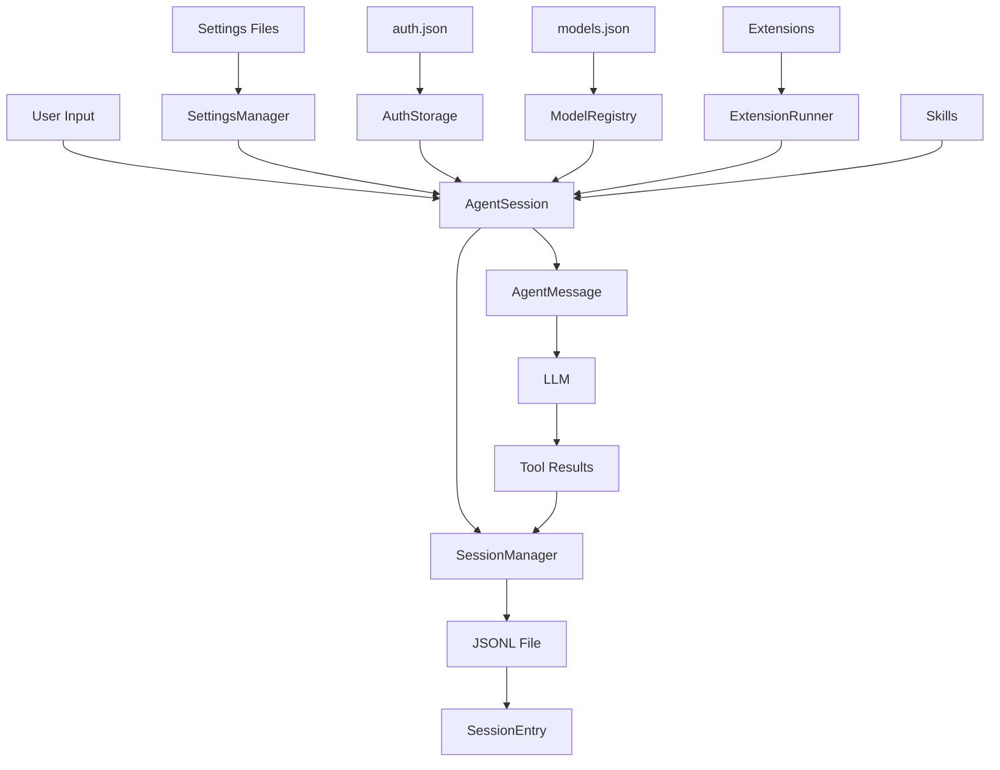

# Data Models and Type Definitions

This document describes the core data structures, configuration formats, and type definitions used throughout pi-coding-agent.

## Table of Contents

- [Settings Schema](#settings-schema)
- [Session Data Models](#session-data-models)
- [Message Types](#message-types)
- [Configuration Files](#configuration-files)
- [Extension and Skill Types](#extension-and-skill-types)
- [RPC Types](#rpc-types)
- [Tool Result Types](#tool-result-types)

---

## Settings Schema

Settings are stored in JSON format at `~/.pi/agent/settings.json` (global) and `<cwd>/.pi/settings.json` (project-level). Project settings override global settings.

### Settings Interface

```typescript
interface Settings {
  // Version tracking
  lastChangelogVersion?: string;

  // Model configuration
  defaultProvider?: string;
  defaultModel?: string;
  defaultThinkingLevel?: "off" | "minimal" | "low" | "medium" | "high" | "xhigh";
  enabledModels?: string[];  // Glob patterns for model cycling

  // Message delivery modes
  steeringMode?: "all" | "one-at-a-time";
  followUpMode?: "all" | "one-at-a-time";

  // UI preferences
  theme?: string;
  hideThinkingBlock?: boolean;
  quietStartup?: boolean;
  collapseChangelog?: boolean;
  doubleEscapeAction?: "fork" | "tree";
  editorPaddingX?: number;
  showHardwareCursor?: boolean;

  // Shell configuration
  shellPath?: string;  // Custom bash path (Windows)
  shellCommandPrefix?: string;  // Prefix for bash commands

  // Nested settings objects
  compaction?: CompactionSettings;
  branchSummary?: BranchSummarySettings;
  retry?: RetrySettings;
  skills?: SkillsSettings;
  terminal?: TerminalSettings;
  images?: ImageSettings;
  thinkingBudgets?: ThinkingBudgetsSettings;
  markdown?: MarkdownSettings;

  // Extension paths
  extensions?: string[];
}
```

### Nested Settings Types

```typescript
interface CompactionSettings {
  enabled?: boolean;           // Default: true
  reserveTokens?: number;      // Default: 16384
  keepRecentTokens?: number;   // Default: 20000
}

interface BranchSummarySettings {
  reserveTokens?: number;      // Default: 16384
}

interface RetrySettings {
  enabled?: boolean;           // Default: true
  maxRetries?: number;         // Default: 3
  baseDelayMs?: number;        // Default: 2000
}

interface SkillsSettings {
  enabled?: boolean;                  // Default: true
  enableCodexUser?: boolean;          // Default: true
  enableClaudeUser?: boolean;         // Default: true
  enableClaudeProject?: boolean;      // Default: true
  enablePiUser?: boolean;             // Default: true
  enablePiProject?: boolean;          // Default: true
  enableSkillCommands?: boolean;      // Default: true
  customDirectories?: string[];       // Additional skill directories
  ignoredSkills?: string[];           // Glob patterns to ignore
  includeSkills?: string[];           // Only load matching patterns
}

interface TerminalSettings {
  showImages?: boolean;        // Default: true
}

interface ImageSettings {
  autoResize?: boolean;        // Default: true
  blockImages?: boolean;       // Default: false
}

interface ThinkingBudgetsSettings {
  minimal?: number;
  low?: number;
  medium?: number;
  high?: number;
}

interface MarkdownSettings {
  codeBlockIndent?: string;    // Default: "  "
}
```

### Settings Merging

Settings are loaded and merged in this order:
1. Global settings (`~/.pi/agent/settings.json`)
2. Project settings (`<cwd>/.pi/settings.json`)

For nested objects, keys are merged individually, allowing project settings to override specific nested fields while preserving others from global settings.

---

## Session Data Models

Sessions are stored as JSONL (JSON Lines) files where each line is a JSON object representing a file entry. The first line is always a session header.

### JSONL File Format

```jsonl
{"type":"session","version":3,"id":"a8ec1c2a","timestamp":"2025-01-20T12:00:00.000Z","cwd":"/path/to/project"}
{"type":"message","id":"abc123","parentId":null,"timestamp":"2025-01-20T12:00:01.000Z","message":{...}}
{"type":"message","id":"def456","parentId":"abc123","timestamp":"2025-01-20T12:00:02.000Z","message":{...}}
```

Each entry (except the header) has a tree structure with `id` and `parentId` fields, enabling branching.

### Session Header

```typescript
interface SessionHeader {
  type: "session";
  version?: number;              // Current version: 3
  id: string;                    // Session UUID
  timestamp: string;             // ISO 8601 timestamp
  cwd: string;                   // Working directory
  parentSession?: string;        // Parent session file (for forks)
}
```

**Example:**
```json
{
  "type": "session",
  "version": 3,
  "id": "a8ec1c2a-4f3b-4d7e-8c9a-1234567890ab",
  "timestamp": "2026-01-20T15:30:00.000Z",
  "cwd": "/Users/example/projects/myapp",
  "parentSession": "../previous-session/2026-01-19.jsonl"
}
```

### Session Entry Types

```typescript
type SessionEntry =
  | SessionMessageEntry
  | ThinkingLevelChangeEntry
  | ModelChangeEntry
  | CompactionEntry
  | BranchSummaryEntry
  | CustomEntry
  | CustomMessageEntry
  | LabelEntry
  | SessionInfoEntry;
```

#### Base Entry Structure

```typescript
interface SessionEntryBase {
  type: string;
  id: string;                    // Unique entry ID
  parentId: string | null;       // Parent entry ID (null for first entry)
  timestamp: string;             // ISO 8601 timestamp
}
```

#### Session Message Entry

```typescript
interface SessionMessageEntry extends SessionEntryBase {
  type: "message";
  message: AgentMessage;         // User or assistant message
}
```

**Example:**
```json
{
  "type": "message",
  "id": "msg-001",
  "parentId": null,
  "timestamp": "2026-01-20T15:30:05.000Z",
  "message": {
    "role": "user",
    "content": "Create a function to calculate fibonacci numbers",
    "timestamp": 1737389405000
  }
}
```

#### Model and Thinking Level Changes

```typescript
interface ThinkingLevelChangeEntry extends SessionEntryBase {
  type: "thinking_level_change";
  thinkingLevel: string;         // "off" | "minimal" | "low" | "medium" | "high" | "xhigh"
}

interface ModelChangeEntry extends SessionEntryBase {
  type: "model_change";
  provider: string;              // Provider ID
  modelId: string;               // Model ID
}
```

#### Compaction Entry

```typescript
interface CompactionEntry<T = unknown> extends SessionEntryBase {
  type: "compaction";
  summary: string;                  // AI-generated summary
  firstKeptEntryId: string;         // First entry kept after compaction
  tokensBefore: number;             // Token count before compaction
  details?: T;                      // Optional custom details
  fromHook?: boolean;               // True if from extension hook
}
```

**Example:**
```json
{
  "type": "compaction",
  "id": "compact-001",
  "parentId": "msg-050",
  "timestamp": "2026-01-20T16:45:30.000Z",
  "summary": "The conversation covered implementing a REST API with Express.js, including route handlers for user authentication, database schema design with PostgreSQL, and error handling middleware. Key decisions: using JWT for auth tokens, bcrypt for password hashing, and implementing rate limiting.",
  "firstKeptEntryId": "msg-040",
  "tokensBefore": 45000,
  "fromHook": false
}
```

#### Branch Summary Entry

```typescript
interface BranchSummaryEntry<T = unknown> extends SessionEntryBase {
  type: "branch_summary";
  fromId: string;                   // Entry ID where branch diverged
  summary: string;                  // AI-generated branch summary
  details?: T;                      // Optional custom details
  fromHook?: boolean;               // True if from extension hook
}
```

#### Custom Entry

```typescript
interface CustomEntry<T = unknown> extends SessionEntryBase {
  type: "custom";
  customType: string;               // Extension-defined type
  data?: T;                         // Extension-defined data
}
```

#### Custom Message Entry

```typescript
interface CustomMessageEntry<T = unknown> extends SessionEntryBase {
  type: "custom_message";
  customType: string;                                    // Extension-defined type
  content: string | (TextContent | ImageContent)[];     // Message content
  details?: T;                                           // Optional custom details
  display: boolean;                                      // Whether to display in UI
}
```

#### Label and Session Info Entries

```typescript
interface LabelEntry extends SessionEntryBase {
  type: "label";
  targetId: string;                 // Entry to label
  label: string | undefined;        // Label text (undefined to remove)
}

interface SessionInfoEntry extends SessionEntryBase {
  type: "session_info";
  name?: string;                    // Session display name
}
```

### Session Context

When loading a session, entries are processed to build the context:

```typescript
interface SessionContext {
  messages: AgentMessage[];         // Message history for this branch
  thinkingLevel: string;            // Current thinking level
  model: {                          // Current model
    provider: string;
    modelId: string;
  } | null;
}
```

### Session Tree Structure

```typescript
interface SessionTreeNode {
  entry: SessionEntry;
  children: SessionTreeNode[];
  label?: string;
}
```

---

## Message Types

### Core Message Types

Pi extends the base `AgentMessage` type from `@mariozechner/pi-agent-core` with custom message types:

```typescript
// Base types from @mariozechner/pi-ai
type Message = UserMessage | AssistantMessage | ToolResultMessage;

interface UserMessage {
  role: "user";
  content: string | (TextContent | ImageContent)[];
  timestamp: number;
}

interface AssistantMessage {
  role: "assistant";
  content: string | (TextContent | ToolUseContent)[];
  provider: string;
  model: string;
  thinking?: string;
  timestamp: number;
  usage?: Usage;
}

interface ToolResultMessage {
  role: "toolResult";
  toolResults: ToolResult[];
  timestamp: number;
}
```

### Custom Agent Messages

Pi adds these custom message types through module augmentation:

```typescript
interface BashExecutionMessage {
  role: "bashExecution";
  command: string;
  output: string;
  exitCode: number | undefined;
  cancelled: boolean;
  truncated: boolean;
  fullOutputPath?: string;
  timestamp: number;
  excludeFromContext?: boolean;
}

interface CustomMessage<T = unknown> {
  role: "custom";
  customType: string;                                    // Extension-defined type
  content: string | (TextContent | ImageContent)[];     // Message content
  display: boolean;                                      // Whether to display in UI
  details?: T;                                           // Optional custom data
  timestamp: number;
}

interface BranchSummaryMessage {
  role: "branchSummary";
  summary: string;                  // AI-generated summary
  fromId: string;                   // Entry ID where branch started
  timestamp: number;
}

interface CompactionSummaryMessage {
  role: "compactionSummary";
  summary: string;                  // AI-generated summary
  tokensBefore: number;             // Tokens before compaction
  timestamp: number;
}
```

These custom messages are converted to standard `UserMessage` format when sent to LLMs, with appropriate XML wrapping for summaries.

---

## Configuration Files

### auth.json

API keys and OAuth credentials are stored in `~/.pi/agent/auth.json`:

```typescript
// Type definitions
type ApiKeyCredential = {
  type: "api_key";
  key: string;
};

type OAuthCredential = {
  type: "oauth";
} & OAuthCredentials;  // From @mariozechner/pi-ai

type AuthCredential = ApiKeyCredential | OAuthCredential;
type AuthStorageData = Record<string, AuthCredential>;
```

**Example:**

```json
{
  "anthropic": {
    "type": "api_key",
    "key": "sk-ant-..."
  },
  "openai": {
    "type": "api_key",
    "key": "sk-..."
  },
  "github-copilot": {
    "type": "oauth",
    "accessToken": "...",
    "refreshToken": "...",
    "expiresAt": 1234567890
  }
}
```

### models.json

Custom models and providers are defined in `~/.pi/agent/models.json`:

```typescript
interface ModelDefinition {
  id: string;                       // Model identifier
  name: string;                     // Display name
  reasoning: boolean;               // Supports reasoning/thinking
  input: string[];                  // Supported input types: ["text", "image"]
  cost: {
    input: number;                  // Cost per 1M input tokens
    output: number;                 // Cost per 1M output tokens
    cacheRead: number;              // Cost per 1M cache read tokens
    cacheWrite: number;             // Cost per 1M cache write tokens
  };
  contextWindow: number;            // Max context window size
  maxTokens: number;                // Max output tokens
  headers?: Record<string, string>; // Custom HTTP headers
  compat?: OpenAICompatSchema;      // OpenAI compatibility options
}

interface ProviderConfig {
  baseUrl?: string;                                     // API endpoint
  apiKey?: string;                                      // API key (literal, env var, or !command)
  api?: "openai-completions" | "openai-responses" |     // API type
        "openai-codex-responses" | "anthropic-messages" |
        "google-generative-ai" | "bedrock-converse-stream";
  headers?: Record<string, string>;                     // Custom headers
  authHeader?: boolean;                                 // Add Authorization header
  models?: ModelDefinition[];                           // Custom models
}

interface ModelsConfig {
  providers: Record<string, ProviderConfig>;
}
```

**Example:**

```json
{
  "providers": {
    "ollama": {
      "baseUrl": "http://localhost:11434/v1",
      "apiKey": "OLLAMA_API_KEY",
      "api": "openai-completions",
      "models": [
        {
          "id": "llama-3.1-8b",
          "name": "Llama 3.1 8B (Local)",
          "reasoning": false,
          "input": ["text"],
          "cost": {"input": 0, "output": 0, "cacheRead": 0, "cacheWrite": 0},
          "contextWindow": 128000,
          "maxTokens": 32000
        }
      ]
    }
  }
}
```

### theme.json

Custom themes are stored in `~/.pi/agent/themes/*.json`. The schema requires all color fields to be defined:

```json
{
  "$schema": "http://json-schema.org/draft-07/schema#",
  "name": "my-theme",
  "vars": {
    "bg": "#1e1e1e",
    "fg": "#d4d4d4"
  },
  "colors": {
    "accent": "#007acc",
    "border": "#3c3c3c",
    "borderAccent": "#007acc",
    "borderMuted": "#2d2d2d",
    "success": "#4ec9b0",
    "error": "#f48771",
    "warning": "#dcdcaa",
    "muted": "#808080",
    "dim": "#5a5a5a",
    "text": "",
    "thinkingText": "#808080",
    "selectedBg": "#264f78",
    "userMessageBg": "#1a1a1a",
    "userMessageText": "",
    "customMessageBg": "#2a2a2a",
    "customMessageText": "",
    "customMessageLabel": "#569cd6",
    "toolPendingBg": "#3c3c3c",
    "toolSuccessBg": "#1a3a1a",
    "toolErrorBg": "#3a1a1a",
    "toolTitle": "",
    "toolOutput": "#d4d4d4",
    "mdHeading": "#569cd6",
    "mdLink": "#4ec9b0",
    "mdLinkUrl": "#808080",
    "mdCode": "#ce9178",
    "mdCodeBlock": "#d4d4d4",
    "mdCodeBlockBorder": "#3c3c3c",
    "mdQuote": "#808080",
    "mdQuoteBorder": "#3c3c3c",
    "mdHr": "#3c3c3c",
    "mdListBullet": "#6796e6",
    "toolDiffAdded": "#4ec9b0",
    "toolDiffRemoved": "#f48771",
    "toolDiffContext": "#808080",
    "syntaxComment": "#6a9955",
    "syntaxKeyword": "#569cd6",
    "syntaxFunction": "#dcdcaa",
    "syntaxVariable": "#9cdcfe",
    "syntaxString": "#ce9178",
    "syntaxNumber": "#b5cea8",
    "syntaxType": "#4ec9b0",
    "syntaxOperator": "#d4d4d4",
    "syntaxPunctuation": "#808080"
  }
}
```

Color values can be:
- Hex color: `"#RRGGBB"`
- Variable reference: `"$varName"`
- 256-color palette index: `0-255`
- Empty string: `""` (uses terminal default)

---

## Extension and Skill Types

### Extension Type

Extensions are TypeScript modules that export a default function:

```typescript
interface Extension {
  (api: ExtensionAPI): void;
}

// Extensions receive the ExtensionAPI
interface ExtensionAPI {
  // Tool registration
  registerTool(tool: ToolDefinition): void;

  // Command registration
  registerCommand(name: string, command: RegisteredCommand): void;

  // Keyboard shortcut registration
  registerShortcut(key: string, shortcut: ShortcutDefinition): void;

  // CLI flag registration
  registerFlag(name: string, flag: FlagDefinition): void;

  // Event subscription
  on<E extends ExtensionEvent>(
    event: E["type"],
    handler: ExtensionEventHandler<E>
  ): void;

  // Flag access
  getFlag(name: string): unknown;
}
```

Extensions are discovered from:
- `~/.pi/agent/extensions/*.ts`
- `~/.pi/agent/extensions/*/index.ts`
- `.pi/extensions/*.ts`
- `.pi/extensions/*/index.ts`
- CLI: `--extension <path>`

### Skill Type

Skills follow the Agent Skills standard:

```typescript
interface Skill {
  name: string;                   // Lowercase, hyphens only, max 64 chars
  description: string;            // Max 1024 chars
  filePath: string;               // Absolute path to SKILL.md
  baseDir: string;                // Skill directory
  source: string;                 // Discovery source
}

interface SkillFrontmatter {
  name?: string;                  // Must match parent directory
  description?: string;           // Required
  license?: string;
  compatibility?: unknown;
  metadata?: unknown;
  "allowed-tools"?: string[];
  [key: string]: unknown;
}
```

**SKILL.md format:**

```markdown
---
name: skill-name
description: Brief description of what this skill does
---

# Skill Name

Documentation, setup instructions, and usage examples...
```

Skills are discovered from:
- `~/.pi/agent/skills/**/SKILL.md` (recursive)
- `.pi/skills/**/SKILL.md` (recursive)
- `~/.claude/skills/*/SKILL.md` (Claude Code compatibility)
- `~/.codex/skills/**/SKILL.md` (Codex CLI compatibility)

---

## RPC Types

### RPC Session State

```typescript
interface RpcSessionState {
  model?: Model<any>;                         // Current model
  thinkingLevel: ThinkingLevel;               // Thinking level
  isStreaming: boolean;                       // Is response streaming
  isCompacting: boolean;                      // Is compaction in progress
  steeringMode: "all" | "one-at-a-time";     // Steering message delivery
  followUpMode: "all" | "one-at-a-time";     // Follow-up message delivery
  sessionFile?: string;                       // Session file path
  sessionId: string;                          // Session UUID
  autoCompactionEnabled: boolean;             // Auto-compaction setting
  messageCount: number;                       // Total messages in session
  pendingMessageCount: number;                // Queued messages
}
```

### RPC Commands

RPC commands are sent as JSON objects over stdin:

```typescript
type RpcCommand =
  | { id?: string; type: "prompt"; message: string }
  | { id?: string; type: "steer"; message: string }
  | { id?: string; type: "follow_up"; message: string }
  | { id?: string; type: "abort" }
  | { id?: string; type: "get_state" }
  | { id?: string; type: "set_model"; provider: string; modelId: string }
  | { id?: string; type: "cycle_model"; direction: "forward" | "backward" }
  | { id?: string; type: "get_available_models" }
  | { id?: string; type: "set_thinking_level"; level: ThinkingLevel }
  | { id?: string; type: "cycle_thinking_level" }
  | { id?: string; type: "compact"; customInstructions?: string }
  | { id?: string; type: "new_session" }
  // ... and more
```

---

## Tool Result Types

Each tool has an associated details type for structured metadata:

### BashToolDetails

```typescript
interface BashToolDetails {
  command: string;
  exitCode: number | undefined;
  cancelled: boolean;
  truncated: boolean;
  fullOutputPath?: string;
}
```

**Example:**
```typescript
{
  command: "npm test",
  exitCode: 0,
  cancelled: false,
  truncated: false
}
```

### ReadToolDetails

```typescript
interface ReadToolDetails {
  path: string;
  totalLines: number;
  readLines: number;
  startLine: number;
  endLine: number;
  truncated: boolean;
  isImage: boolean;
  imageFormat?: string;
}
```

**Example:**
```typescript
{
  path: "src/index.ts",
  totalLines: 150,
  readLines: 150,
  startLine: 1,
  endLine: 150,
  truncated: false,
  isImage: false
}
```

### EditToolDetails

```typescript
interface EditToolDetails {
  path: string;
  oldString: string;
  newString: string;
  occurrences: number;
  linesChanged: number;
  diff: string;
}
```

**Example:**
```typescript
{
  path: "src/config.ts",
  oldString: "const PORT = 3000;",
  newString: "const PORT = process.env.PORT || 3000;",
  occurrences: 1,
  linesChanged: 1,
  diff: "- const PORT = 3000;\n+ const PORT = process.env.PORT || 3000;"
}
```

### GrepToolDetails

```typescript
interface GrepToolDetails {
  pattern: string;
  path: string;
  matchCount: number;
  fileCount: number;
  truncated: boolean;
}
```

### FindToolDetails

```typescript
interface FindToolDetails {
  pattern: string;
  path: string;
  matchCount: number;
  truncated: boolean;
}
```

### LsToolDetails

```typescript
interface LsToolDetails {
  path: string;
  entryCount: number;
  dirCount: number;
  fileCount: number;
  truncated: boolean;
}
```

---

## Compaction Result

When compaction occurs, the result includes:

```typescript
interface CompactionResult<T = unknown> {
  summary: string;                 // AI-generated summary
  firstKeptEntryId: string;        // First entry kept after compaction
  tokensBefore: number;            // Context tokens before compaction
  details?: T;                     // Optional custom details from extensions
}
```

---

## Data Flow Diagram



---

## Type Safety

Pi uses TypeScript with strict type checking and runtime validation:

- **TypeScript interfaces** define compile-time types
- **@sinclair/typebox** provides runtime schema validation for tool parameters
- **Zod-like validation** for configuration files
- **Type guards** for discriminated unions (SessionEntry types)

This ensures both compile-time safety and runtime correctness for all data structures.
