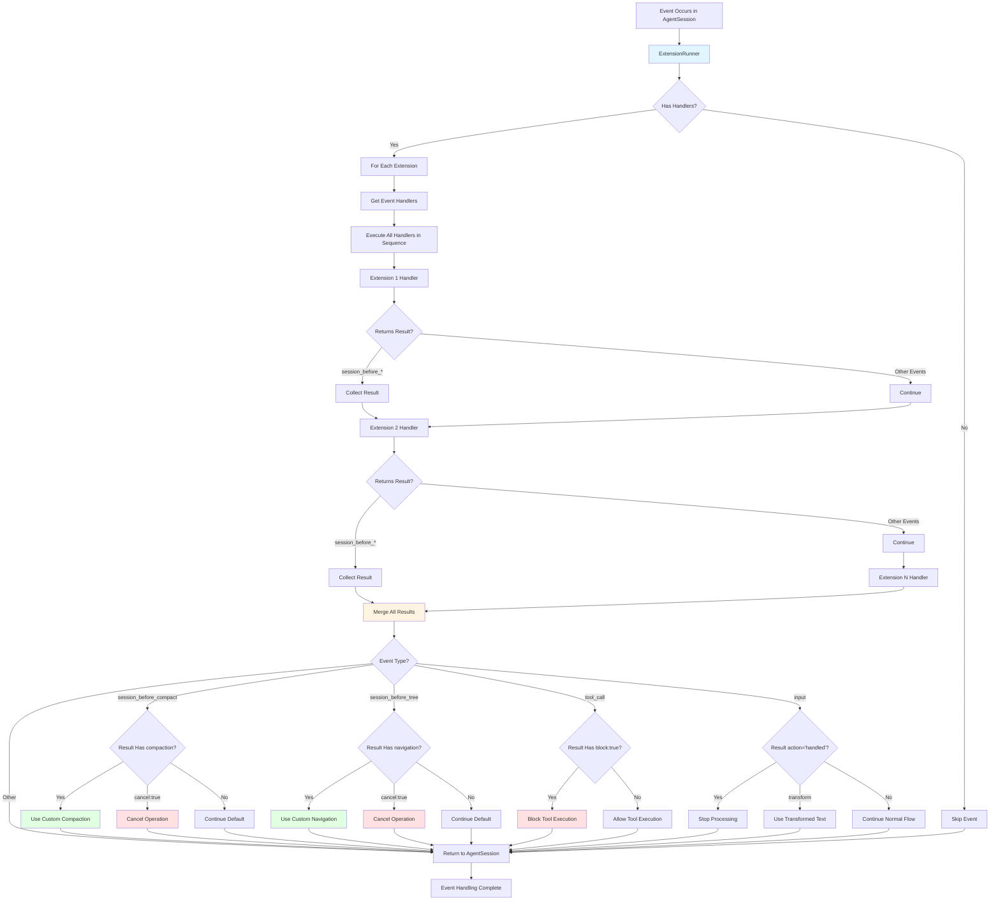
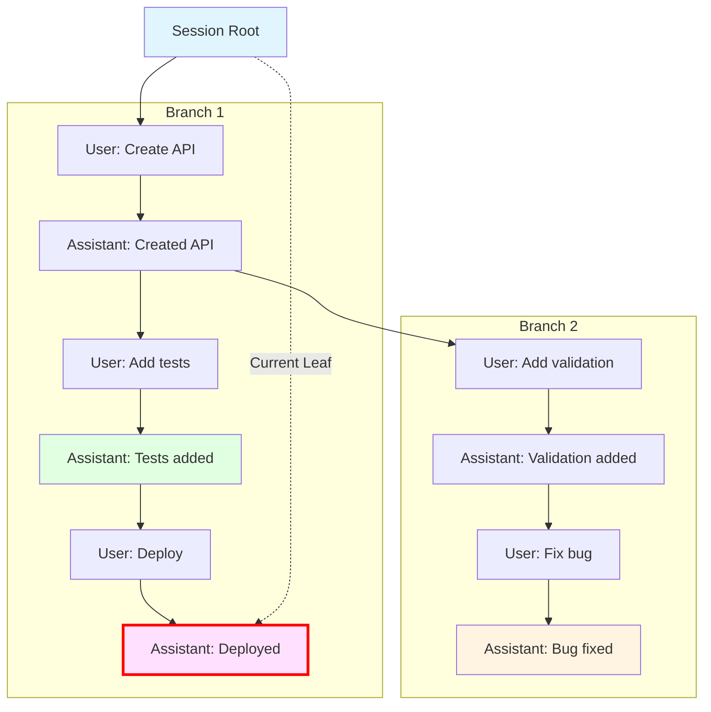

# Design Decisions

This document explains the key architectural and design decisions made in pi-coding-agent, along with their rationale and trade-offs.

## Table of Contents

- [Language Choice: TypeScript](#language-choice-typescript)
- [Session Format: JSONL with Tree Structure](#session-format-jsonl-with-tree-structure)
- [Compaction: AI Summarization vs Simple Truncation](#compaction-ai-summarization-vs-simple-truncation)
- [Multi-Provider Support](#multi-provider-support)
- [Extension System](#extension-system)
- [Interactive TUI + Headless Modes](#interactive-tui--headless-modes)
- [Tree-Based Session Branching](#tree-based-session-branching)
- [Bash Requirement (Even on Windows)](#bash-requirement-even-on-windows)
- [Dynamic TypeScript Loading (jiti)](#dynamic-typescript-loading-jiti)
- [Runtime Schema Validation (@sinclair/typebox)](#runtime-schema-validation-sinclairTypebox)
- [Philosophy: What Pi Won't Do](#philosophy-what-pi-wont-do)
- [Monorepo Structure](#monorepo-structure)
- [ES Modules Throughout](#es-modules-throughout)

## Language Choice: TypeScript

**Decision:** Build pi entirely in TypeScript.

**Rationale:**
- **Type safety** - Catch errors at compile time, reducing runtime bugs
- **Developer experience** - Excellent IDE support with autocomplete and inline documentation
- **Ecosystem** - Rich npm ecosystem with packages for all needed functionality
- **Maintainability** - Self-documenting code through types
- **Node.js integration** - Native access to file system, process spawning, and system APIs
- **Cross-platform** - Works on Linux, macOS, Windows, and even Android/Termux

**Trade-offs:**
- Build step required (TypeScript → JavaScript)
- Slightly larger distribution size compared to compiled languages
- Runtime performance not as fast as Rust/Go (acceptable for I/O-bound workload)

## Session Format: JSONL with Tree Structure

**Decision:** Store sessions as JSON Lines (JSONL) files with tree structure using `id` and `parentId`.

**Rationale:**
- **Human-readable** - Easy to inspect and debug with text editors
- **Append-only** - Efficient writes, no file rewriting needed
- **Streamable** - Can process line-by-line without loading entire file
- **Version control friendly** - Git diffs show actual changes
- **Tree structure** - Supports branching without creating new files
- **Simple format** - No database required, portable across systems
- **Crash-resistant** - Incomplete writes only corrupt last line

**Trade-offs:**
- Not as compact as binary formats
- No indexing - must scan file to find entries
- Not suitable for extremely large sessions (thousands of messages)

**Alternatives considered:**
- **SQLite** - More powerful queries but requires database management, not human-readable
- **JSON** - Would require rewriting entire file on each change
- **Binary** - More compact but not human-readable or version-control friendly

See `docs/session.md` for format details.

## Compaction: AI Summarization vs Simple Truncation

**Decision:** Use AI to generate intelligent summaries of old context rather than simple truncation.

**Rationale:**
- **Preserves intent** - Summary captures key decisions and outcomes
- **Context continuity** - Agent understands what happened earlier
- **Better results** - Agent can reference compacted information
- **Configurable** - Can provide custom instructions for summarization

**Trade-offs:**
- Uses additional API calls (costs tokens/money)
- Adds latency during compaction
- Summary quality depends on model
- Still lossy - some details inevitably lost

**Alternatives considered:**
- **Simple truncation** - Loses all context abruptly
- **No compaction** - Would hit context limits frequently

### Compaction Decision Flow

The system automatically monitors context usage and triggers compaction when needed:

```mermaid
flowchart TD
    Start[Agent Turn Completes] --> Check{Auto-compaction Enabled?}

    Check -->|No| End[Continue]
    Check -->|Yes| GetContext[Calculate Context Token Usage]

    GetContext --> CheckOverflow{Context Overflow?}

    CheckOverflow -->|Yes| TriggerOverflow[Trigger: Overflow]
    CheckOverflow -->|No| CheckThreshold{Above Threshold?}

    CheckThreshold -->|No| End
    CheckThreshold -->|Yes| TriggerThreshold[Trigger: Threshold]

    TriggerOverflow --> EmitBefore[Emit session_before_compact]
    TriggerThreshold --> EmitBefore

    EmitBefore --> ExtCheck{Extension Result?}

    ExtCheck -->|cancel: true| Cancelled[Abort Compaction]
    ExtCheck -->|compaction: {...}| UseCustom[Use Custom Compaction]
    ExtCheck -->|No result| Prepare[Prepare Compaction]

    Prepare --> CollectEntries[Collect Entries to Compact]
    CollectEntries --> CalcCutPoint[Calculate Cut Point]

    CalcCutPoint --> Tokens{Enough Tokens<br/>to Compact?}

    Tokens -->|No| TooShort[Skip: Insufficient Context]
    Tokens -->|Yes| BuildPrompt[Build Summarization Prompt]

    BuildPrompt --> CallAI[Call AI Model for Summary]
    CallAI --> ReceiveSummary[Receive Summary]

    ReceiveSummary --> CreateEntry[Create CompactionEntry]
    CreateEntry --> UpdateSession[Update Session with Summary]

    UpdateSession --> RemoveOld[Remove Compacted Messages]
    RemoveOld --> Success[Compaction Complete]

    UseCustom --> UpdateSession

    Success --> EmitAfter[Emit session_compact]
    TooShort --> EmitAfter
    Cancelled --> EmitAfter

    EmitAfter --> Retry{Should Retry Turn?}

    Retry -->|Overflow: Yes| RetryTurn[Retry Agent Turn]
    Retry -->|Threshold: No| End

    RetryTurn --> End

    style TriggerOverflow fill:#ffe1e1
    style TriggerThreshold fill:#fff4e1
    style Success fill:#e1ffe1
    style Cancelled fill:#ffe1e1
    style UseCustom fill:#e1f5ff
```

**Key decision points:**
- **Threshold compaction**: Triggered when context usage exceeds `reserveTokens` setting (default: continues current turn)
- **Overflow compaction**: Triggered when model returns context overflow error (retries turn after compaction)
- **Extension override**: Extensions can provide custom compaction logic or cancel operation
- **Insufficient context**: Skips compaction if there aren't enough old messages to meaningfully summarize

See `docs/compaction.md` for implementation details.

## Multi-Provider Support

**Decision:** Support multiple AI providers rather than focusing on one.

**Rationale:**
- **No vendor lock-in** - Users can switch providers anytime
- **Model diversity** - Different models excel at different tasks
- **Cost optimization** - Use cheaper models for simple tasks
- **Availability** - Fall back to alternatives if primary provider is down
- **Access options** - Both API keys and OAuth for flexibility
- **Future-proof** - Easy to add new providers as they emerge

**Trade-offs:**
- More complex code to handle provider differences
- Must maintain compatibility with multiple APIs
- Some features may not work uniformly across providers

**Implementation:** Abstracted via `@mariozechner/pi-ai` package.

## Extension System

**Decision:** Provide TypeScript-based extension system with lifecycle hooks.

**Rationale:**
- **Extensibility without bloat** - Core stays lean, users add what they need
- **Community contributions** - Anyone can build and share extensions
- **Use-case flexibility** - Support diverse workflows without forcing opinions
- **Type safety** - Extensions benefit from TypeScript
- **No rebuild required** - Extensions loaded dynamically via jiti
- **Sandboxed** - Extensions can't crash core (event-driven architecture)

**Trade-offs:**
- Extensions can conflict with each other
- Documentation burden for extension API
- Performance overhead from dynamic loading

**Alternatives considered:**
- **Plugin binaries** - More complex to build and distribute
- **Configuration-only** - Too limited for complex customizations
- **Monolithic features** - Would bloat core and force opinions

### Extension Event Propagation Flow

The extension system uses an event-driven architecture where multiple extensions can listen to the same events:



Key characteristics:
- **Sequential execution**: Handlers execute in the order extensions were loaded
- **Result merging**: For `session_before_*` events, results from all handlers are merged
- **Blocking capability**: Extensions can cancel operations or provide custom implementations
- **Event-specific behavior**: Different event types have different result handling logic

See `docs/extensions.md` for API details.

## Interactive TUI + Headless Modes

**Decision:** Implement both interactive terminal UI and headless modes (print, RPC).

**Rationale:**
- **Interactive for humans** - Rich UI with streaming, syntax highlighting, keyboard shortcuts
- **Headless for automation** - Scriptable, embeddable, CI/CD friendly
- **RPC for integrations** - Enable building custom UIs in any language
- **Same core** - All modes share AgentSession, ensuring consistency

**Trade-offs:**
- More code to maintain (three different interfaces)
- Testing complexity increases
- Must ensure feature parity across modes

**Architecture:** Shared `AgentSession` core with mode-specific I/O layers.

## Tree-Based Session Branching

**Decision:** Implement in-place tree navigation rather than creating separate session files for each branch.

**Rationale:**
- **Single source of truth** - All branches in one file
- **Easy navigation** - Switch between branches instantly
- **Preserves full history** - Nothing is lost when branching
- **Git-like UX** - Familiar mental model for developers
- **Space efficient** - No duplicated shared history

**Trade-offs:**
- More complex implementation than linear history
- File can grow large with many branches
- Slightly harder to understand than simple linear sessions

**Implementation:** `/tree` command for navigation, `id`/`parentId` for structure.

### Session Tree Structure Visualization

Sessions are stored as trees where each entry has an `id` and `parentId`:



**Navigation behavior:**
- Each entry points to its parent via `parentId`
- Multiple entries can share the same parent (branches)
- "Current leaf" tracks the active conversation path
- `/tree` command allows switching between branches without losing history

See `docs/tree.md` for usage details.

## Bash Requirement (Even on Windows)

**Decision:** Require bash shell on all platforms including Windows.

**Rationale:**
- **Consistency** - Same shell behavior across platforms
- **AI compatibility** - Models trained primarily on Unix-style commands
- **Feature completeness** - Bash provides full shell capabilities
- **Simplifies implementation** - Don't need to handle cmd.exe vs PowerShell vs bash

**Trade-offs:**
- Windows users must install Git Bash, Cygwin, or WSL
- Extra setup step on Windows
- Potential confusion for Windows-only developers

**Mitigation:** Clear documentation and automatic detection of common bash installations.

## Dynamic TypeScript Loading (jiti)

**Decision:** Use jiti for dynamic TypeScript extension loading.

**Rationale:**
- **No build step for extensions** - Write TypeScript, run immediately
- **Better DX** - Extensions get type checking and autocomplete
- **Dependency support** - Extensions can have their own package.json
- **Modern syntax** - Full ES module support

**Trade-offs:**
- Slightly slower startup when loading extensions
- More complex dependency resolution
- Potential version conflicts between extension dependencies

**Alternatives considered:**
- **JavaScript only** - Worse DX, no type safety
- **Precompiled extensions** - Requires build step, worse DX
- **Plugin binaries** - Too complex for most use cases

## Runtime Schema Validation (@sinclair/typebox)

**Decision:** Use TypeBox for runtime schema validation of tool parameters.

**Rationale:**
- **Runtime safety** - Catch invalid inputs before execution
- **Type inference** - TypeScript types derived from schemas
- **JSON Schema compatible** - Standard format understood by LLMs
- **Compact syntax** - More readable than raw JSON Schema
- **Validation errors** - Clear error messages for debugging

**Trade-offs:**
- Runtime overhead for validation
- Learning curve for schema definition
- Another dependency to maintain

**Alternatives considered:**
- **Zod** - Larger bundle size, different mental model
- **JSON Schema** - More verbose, less TypeScript integration
- **No validation** - Would allow invalid inputs to tools

## Philosophy: What Pi Won't Do

Pi is intentionally opinionated about avoiding certain features:

### No MCP (Model Context Protocol)

**Decision:** Use Skills (CLI tools with READMEs) instead of MCP servers.

**Rationale:**
- **Simpler** - CLI tools are easier to build and debug
- **Transparent** - Full observability of what tools do
- **Portable** - Tools work outside of pi
- **Minimal context** - Load documentation only when needed
- **Proven approach** - CLI tools are battle-tested

See [blog post](https://mariozechner.at/posts/2025-11-02-what-if-you-dont-need-mcp/) for full rationale.

### No Sub-Agents

**Decision:** Don't build sub-agent orchestration into core.

**Rationale:**
- **Observability** - Hard to debug nested agent interactions
- **Complexity** - Adds significant implementation complexity
- **Alternative exists** - Use tmux to spawn multiple pi instances
- **Build your own** - Extensions can implement if needed

### No Permission Popups

**Decision:** Don't ask for permission before tool execution.

**Rationale:**
- **Security theater** - Doesn't actually improve security
- **Workflow disruption** - Constant interruptions
- **Trust model** - If you don't trust the agent, use containers or extensions to block

### No Plan Mode

**Decision:** Don't implement separate planning phase.

**Rationale:**
- **Context bloat** - Plans take up valuable context
- **Model confusion** - Can confuse planning with execution
- **Better approach** - Write plans to files, start fresh for implementation
- **Flexibility** - Users can implement planning patterns as needed

### No Built-in To-Dos

**Decision:** Don't include task management in core.

**Rationale:**
- **Model confusion** - Todos can confuse agent about what's done
- **Simple alternative** - Use TODO.md files
- **Extensible** - Build custom todo extension if desired

### No Background Bash

**Decision:** Don't support background command execution.

**Rationale:**
- **Observability** - Can't see what's happening
- **Control** - Hard to manage running processes
- **Alternative exists** - Use tmux for long-running commands

See [blog post](https://mariozechner.at/posts/2025-11-30-pi-coding-agent/) for complete philosophy.

## Monorepo Structure

**Decision:** Develop pi as part of pi-mono monorepo alongside pi-ai, pi-agent-core, and pi-tui.

**Rationale:**
- **Code sharing** - Core functionality reusable across packages
- **Coordinated releases** - Ensure version compatibility
- **Simplified development** - Changes across packages in single PR
- **Package independence** - Each package still published separately

**Trade-offs:**
- More complex repository structure
- Larger clone size for contributors
- Must coordinate breaking changes

## ES Modules Throughout

**Decision:** Use ES modules exclusively, no CommonJS.

**Rationale:**
- **Modern standard** - ES modules are the JavaScript standard
- **Better tree-shaking** - Smaller bundle sizes
- **Static analysis** - Better tooling support
- **Future-proof** - Node.js moving toward ESM

**Trade-offs:**
- Can't easily consume CommonJS-only packages
- Some tooling still better for CommonJS
- Migration effort for any CommonJS code
