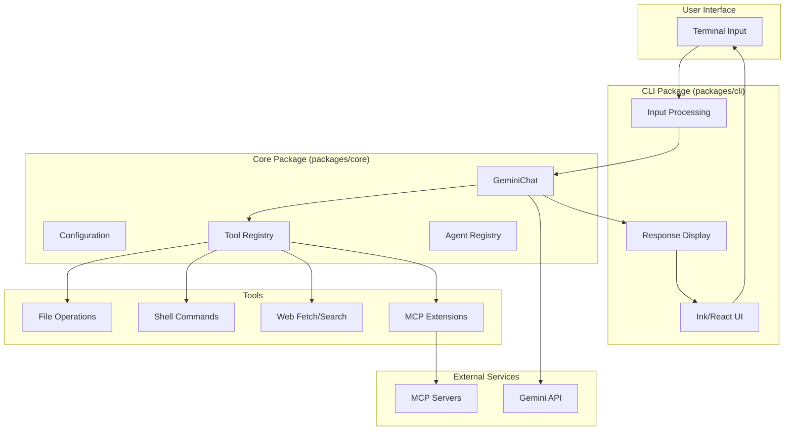

# Gemini CLI - Project Overview

## Introduction

Gemini CLI is an open-source AI agent that brings the power of Google's Gemini directly into your terminal. It provides lightweight access to Gemini models, giving developers the most direct path from prompt to model output.

As a terminal-first AI assistant, Gemini CLI enables developers to:
- Query and edit large codebases using natural language
- Generate new applications from PDFs, images, or sketches
- Automate operational tasks like handling complex git operations
- Ground queries with real-time information via Google Search

## Key Features

### Free Tier Access
- **60 requests/minute** and **1,000 requests/day** with a personal Google account
- No credit card required for basic usage
- Automatic access to Gemini 3 models

### Powerful AI Capabilities
- **Gemini 3 Models**: Access to improved reasoning and 1M token context window
- **Multimodal Support**: Generate from PDFs, images, and sketches
- **Google Search Grounding**: Real-time information integration

### Extensibility
- **Built-in Tools**: File operations, shell commands, web fetching
- **MCP Support**: Model Context Protocol for custom integrations
- **Custom Extensions**: Build and share your own commands

### Developer Experience
- **Terminal-First**: Designed for developers who live in the command line
- **Conversation Checkpointing**: Save and resume complex sessions
- **Context Files (GEMINI.md)**: Tailor behavior for your projects

## Target Audience

Gemini CLI is designed for:
- **Software Developers**: Who prefer command-line tools and want AI assistance during coding
- **DevOps Engineers**: Who need to automate operational tasks and troubleshoot systems
- **Technical Writers**: Who want AI help with documentation
- **Open Source Contributors**: Who want a customizable, Apache 2.0 licensed AI assistant

## Architecture Overview

Gemini CLI follows a layered monorepo architecture with clear separation of concerns:



### Package Structure

| Package | Purpose | Key Responsibilities |
|---------|---------|---------------------|
| `packages/cli` | User-facing application | Input processing, UI rendering, themes, user experience |
| `packages/core` | Backend library | API communication, tool execution, agent orchestration, configuration |
| `packages/a2a-server` | Agent-to-Agent server | Multi-agent communication protocol |
| `packages/test-utils` | Testing utilities | Shared test helpers and mocks |
| `packages/vscode-ide-companion` | VS Code extension | IDE integration |

## System Requirements

### Prerequisites

- **Node.js**: Version 20 or higher
- **Operating System**: macOS, Linux, or Windows
- **Authentication**: Google account (for free tier) or API key

### Installation Methods

#### Quick Install with npx
```bash
npx @google/gemini-cli
```

#### Global Install with npm
```bash
npm install -g @google/gemini-cli
```

#### Install with Homebrew (macOS/Linux)
```bash
brew install gemini-cli
```

## Unique Features and Differentiators

### Compared to Other AI CLI Tools

| Feature | Gemini CLI | Alternatives |
|---------|------------|--------------|
| Free Tier | 60 req/min, 1000 req/day | Often limited or paid-only |
| Context Window | 1M tokens | Typically 8K-128K |
| Google Search | Built-in grounding | Often separate plugin |
| MCP Support | Native | Varies |
| License | Apache 2.0 | Often proprietary |

### Key Advantages

1. **Direct Google Integration**: Native access to Gemini models with Google account auth
2. **Massive Context Window**: 1M tokens enables working with entire codebases
3. **Open Source**: Apache 2.0 license allows modification and redistribution
4. **Safety Features**: Tool confirmation system for dangerous operations
5. **Extensibility**: MCP protocol support and custom commands

## Quick Start

### Basic Usage

```bash
# Start in current directory
gemini

# Include multiple directories
gemini --include-directories ../lib,../docs

# Use specific model
gemini -m gemini-2.5-flash

# Non-interactive mode for scripts
gemini -p "Explain the architecture of this codebase"
```

### Example Workflows

#### Code Analysis
```bash
cd your-project
gemini
> Give me a summary of all changes from yesterday
```

#### Project Generation
```bash
cd new-project/
gemini
> Write me a Discord bot that answers questions using a FAQ.md file
```

## Project Links

- **Repository**: https://github.com/google-gemini/gemini-cli
- **Documentation**: https://geminicli.com/docs/
- **npm Package**: https://www.npmjs.com/package/@google/gemini-cli
- **License**: Apache 2.0
