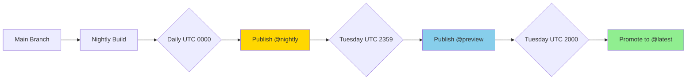
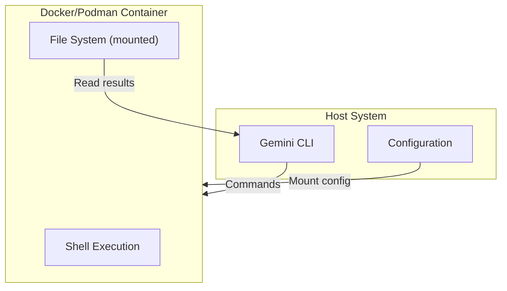

# Deployment Guide

## Overview

This document covers how Gemini CLI is distributed to end users, the release process, CI/CD pipelines, and deployment configurations including sandboxing.

## Installation Methods

### npm (Primary)

The primary distribution channel is npm:

```bash
# Install globally (stable)
npm install -g @google/gemini-cli@latest

# Install preview version
npm install -g @google/gemini-cli@preview

# Install nightly
npm install -g @google/gemini-cli@nightly

# Run without installation
npx @google/gemini-cli
```

### Homebrew (macOS/Linux)

```bash
brew install gemini-cli
```

### Docker

```bash
# Using official image
docker run -it us-docker.pkg.dev/gemini-code-dev/gemini-cli/sandbox:latest

# Or build locally
docker build -t gemini-cli .
docker run -it gemini-cli
```

## Release Process

### Release Cadence

| Tag | Cadence | Description |
|-----|---------|-------------|
| `nightly` | Daily (UTC 0000) | All main branch changes |
| `preview` | Weekly (Tuesday UTC 2359) | Weekly preview, may have issues |
| `latest` | Weekly (Tuesday UTC 2000) | Stable, promoted from preview |

### Version Format

```
{major}.{minor}.{patch}[-{prerelease}]

Examples:
- 0.26.0 (stable)
- 0.26.0-nightly.20260115.6cb3ae4e0 (nightly)
- 0.27.0-preview.1 (preview)
```

### Release Workflow



### Version Script

The `scripts/version.js` handles version management:

```bash
# Bump version
npm run release:version -- patch
npm run release:version -- minor
npm run release:version -- major

# Set specific version
npm run release:version -- 1.0.0
```

## CI/CD Pipelines

### GitHub Actions Workflows

Located in `.github/workflows/`:

| Workflow | Trigger | Purpose |
|----------|---------|---------|
| `ci.yml` | PR, Push | Main CI pipeline |
| `chained_e2e.yml` | Schedule, Manual | End-to-end tests |
| `release-nightly.yml` | Daily schedule | Nightly releases |
| `release-preview.yml` | Weekly schedule | Preview releases |
| `release-stable.yml` | Weekly schedule | Stable releases |

### CI Pipeline (`ci.yml`)

```yaml
name: CI
on: [push, pull_request]

jobs:
  build:
    runs-on: ubuntu-latest
    steps:
      - uses: actions/checkout@v4
      - uses: actions/setup-node@v4
        with:
          node-version: '20'
      - run: npm ci
      - run: npm run build
      
  lint:
    runs-on: ubuntu-latest
    steps:
      - run: npm run lint:ci
      
  typecheck:
    runs-on: ubuntu-latest
    steps:
      - run: npm run typecheck
      
  test:
    runs-on: ubuntu-latest
    steps:
      - run: npm run test:ci
```

### Release Pipeline

```yaml
name: Release
on:
  schedule:
    - cron: '0 0 * * *'  # Daily for nightly

jobs:
  release:
    runs-on: ubuntu-latest
    steps:
      - uses: actions/checkout@v4
      - uses: actions/setup-node@v4
      - run: npm ci
      - run: npm run preflight
      - run: npm run bundle
      - run: npm publish --tag nightly
        env:
          NODE_AUTH_TOKEN: ${{ secrets.NPM_TOKEN }}
```

## Sandbox Architecture

### Overview

Sandboxing provides safe execution of shell commands and file operations:



### Configuration

Enable sandboxing via environment or config:

```bash
# Environment variable
export GEMINI_SANDBOX=docker  # or podman, false

# Command line
gemini --sandbox docker
```

### Docker Image

The sandbox Docker image is defined in `Dockerfile`:

```dockerfile
FROM node:20-slim

# Install common development tools
RUN apt-get update && apt-get install -y \
    git \
    curl \
    ripgrep \
    && rm -rf /var/lib/apt/lists/*

# Set up non-root user
RUN useradd -m -s /bin/bash gemini
USER gemini

WORKDIR /workspace

# Copy CLI bundle
COPY --chown=gemini:gemini bundle/ /app/bundle/

ENTRYPOINT ["node", "/app/bundle/gemini.js"]
```

### Building Sandbox Image

```bash
# Build locally
npm run build:sandbox

# Push to registry
npm run auth:docker
docker push us-docker.pkg.dev/gemini-code-dev/gemini-cli/sandbox:latest
```

### Mount Points

By default, the sandbox mounts:

| Host Path | Container Path | Mode |
|-----------|----------------|------|
| Current directory | `/workspace` | Read-Write |
| `~/.gemini` | `/home/gemini/.gemini` | Read-Only |

## VS Code Extension Deployment

### Building

```bash
npm run build:vscode
```

### Package Structure

```
packages/vscode-ide-companion/
├── package.json        # Extension manifest
├── src/
│   └── extension.ts    # Extension entry
├── out/                # Compiled output
└── *.vsix              # Packaged extension
```

### Publishing

The extension is published to:
- VS Code Marketplace
- Open VSX Registry

## A2A Server Deployment

### Purpose

The Agent-to-Agent (A2A) server enables multi-agent communication:

```bash
# Start A2A server
npm run start:a2a-server

# With custom port
CODER_AGENT_PORT=41242 npm run start:a2a-server
```

### Configuration

```yaml
# A2A server configuration
a2a:
  enabled: true
  port: 41242
  maxAgents: 10
```

## Environment-Specific Configuration

### Development

```bash
# Development mode with hot reload
NODE_ENV=development npm run start
```

### Production

```bash
# Production bundle
npm run bundle

# Run production
NODE_ENV=production node bundle/gemini.js
```

### Enterprise

For enterprise deployments, additional configuration:

```yaml
# ~/.gemini/settings.json
{
  "enterprise": {
    "proxyUrl": "http://proxy.corp.com:8080",
    "caCertPath": "/etc/ssl/corp-ca.crt",
    "telemetryEndpoint": "https://telemetry.corp.com"
  }
}
```

## Distribution Files

The npm package includes:

```
@google/gemini-cli/
├── bundle/
│   ├── gemini.js       # Main entry
│   ├── *.wasm          # WASM modules
│   └── assets/         # Static assets
├── README.md
└── LICENSE
```

### Package Configuration

```json
{
  "bin": {
    "gemini": "bundle/gemini.js"
  },
  "files": [
    "bundle/",
    "README.md",
    "LICENSE"
  ]
}
```

## Health Checks and Monitoring

### CLI Health Check

```bash
# Verify installation
gemini --version

# Check authentication
gemini -p "echo test"
```

### Telemetry Endpoints

Telemetry can be configured to send to:
- Google Cloud Monitoring (default)
- Custom OTLP endpoint
- Local file (development)

## Rollback Procedures

### npm Rollback

```bash
# Install specific version
npm install -g @google/gemini-cli@0.25.0

# Or use previous stable
npm install -g @google/gemini-cli@latest
```

### Docker Rollback

```bash
# Use specific tag
docker pull us-docker.pkg.dev/gemini-code-dev/gemini-cli/sandbox:0.25.0
```

## Security Considerations

### npm Package Signing

Packages are published with npm provenance:

```bash
npm publish --provenance
```

### Docker Image Signing

Images are signed using cosign:

```bash
cosign sign us-docker.pkg.dev/gemini-code-dev/gemini-cli/sandbox:latest
```

### Vulnerability Scanning

- Dependabot for dependency updates
- npm audit in CI
- Container scanning for Docker images

## Troubleshooting Deployment

### Common Issues

| Issue | Solution |
|-------|----------|
| Permission denied | Check npm global prefix permissions |
| Network error | Configure proxy settings |
| Version conflict | Clear npm cache: `npm cache clean --force` |
| Sandbox fails | Verify Docker/Podman installation |

### Logs

```bash
# Enable verbose logging
DEBUG=1 gemini

# Check npm logs
npm config get cache
cat ~/.npm/_logs/*.log
```
