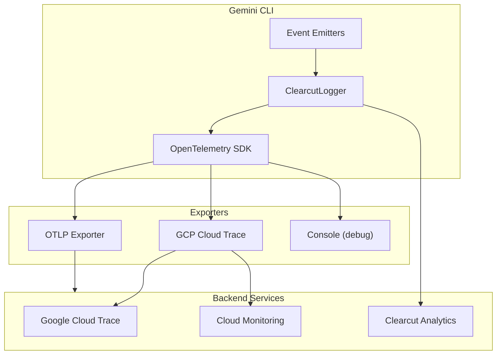

# Monitoring and Logging

## Overview

Gemini CLI includes comprehensive telemetry, logging, and monitoring capabilities built on OpenTelemetry. This document covers the telemetry architecture, tracked events, privacy controls, and integration options.

## Telemetry Architecture

### Components



### OpenTelemetry Integration

The project uses the OpenTelemetry Node.js SDK:

```typescript
import { NodeSDK } from '@opentelemetry/sdk-node';
import { OTLPTraceExporter } from '@opentelemetry/exporter-trace-otlp-http';

const sdk = new NodeSDK({
  traceExporter: new OTLPTraceExporter({
    url: 'https://telemetry.endpoint.com/v1/traces',
  }),
  instrumentations: [
    // HTTP instrumentation for API calls
  ],
});

sdk.start();
```

## Tracked Events

### Session Events

| Event | Description | Properties |
|-------|-------------|------------|
| `session_start` | Session begins | `sessionId`, `model`, `authType` |
| `session_end` | Session ends | `sessionId`, `duration`, `turnCount` |
| `checkpoint_save` | Checkpoint created | `checkpointId`, `historyLength` |
| `checkpoint_restore` | Checkpoint restored | `checkpointId` |

### Agent Events

```typescript
class AgentStartEvent {
  eventName = 'agent_start';
  properties: {
    sessionId: string;
    model: string;
    toolCount: number;
    hasSystemInstruction: boolean;
  };
}

class AgentFinishEvent {
  eventName = 'agent_finish';
  properties: {
    sessionId: string;
    success: boolean;
    duration: number;
    inputTokens: number;
    outputTokens: number;
    turnCount: number;
  };
}
```

### Tool Events

| Event | Description | Properties |
|-------|-------------|------------|
| `tool_call` | Tool invoked | `tool`, `duration`, `success` |
| `tool_confirmation` | User confirmation | `tool`, `outcome` |
| `tool_error` | Tool failed | `tool`, `errorType` |

### Model Events

| Event | Description | Properties |
|-------|-------------|------------|
| `model_request` | API request sent | `model`, `tokenCount` |
| `model_response` | Response received | `model`, `latency`, `tokenCount` |
| `model_error` | API error | `model`, `errorType`, `statusCode` |
| `model_fallback` | Fallback triggered | `fromModel`, `toModel`, `reason` |

### Authentication Events

| Event | Description | Properties |
|-------|-------------|------------|
| `auth_start` | Auth flow begins | `authType` |
| `auth_success` | Auth completed | `authType`, `duration` |
| `auth_failure` | Auth failed | `authType`, `reason` |

### Extension Events

```typescript
class ExtensionInstallEvent {
  eventName = 'extension_install';
  properties: {
    extensionName: string;
    version: string;
    source: string;
  };
}

class ExtensionEnableEvent {
  eventName = 'extension_enable';
  properties: {
    extensionName: string;
  };
}
```

### IDE Connection Events

```typescript
class IdeConnectionEvent {
  eventName = 'ide_connection';
  properties: {
    ideType: IdeConnectionType;
    connected: boolean;
    version?: string;
  };
}

type IdeConnectionType = 'vscode' | 'cursor' | 'zed' | 'unknown';
```

## Metrics

### Performance Metrics

| Metric | Type | Description |
|--------|------|-------------|
| `request_latency` | Histogram | API request latency |
| `token_count` | Counter | Total tokens processed |
| `tool_duration` | Histogram | Tool execution time |
| `session_duration` | Histogram | Session length |

### Resource Metrics

| Metric | Type | Description |
|--------|------|-------------|
| `memory_usage` | Gauge | Process memory |
| `active_sessions` | Gauge | Concurrent sessions |
| `mcp_connections` | Gauge | Active MCP servers |

## Clearcut Logger

Clearcut is Google's analytics system used for aggregated metrics:

```typescript
import { ClearcutLogger } from '@google/gemini-cli-core';

const logger = new ClearcutLogger({
  endpoint: 'https://clearcut.endpoint.com',
  batchSize: 100,
  flushInterval: 30000,
});

// Log an event
logger.log({
  eventName: 'feature_used',
  properties: {
    feature: 'web_search',
    success: true,
  },
});
```

### Batching and Flushing

Events are batched for efficiency:
- Default batch size: 100 events
- Flush interval: 30 seconds
- Flush on process exit

## Privacy Controls

### User Settings

Telemetry is controlled via settings:

```json
// ~/.gemini/settings.json
{
  "telemetry": {
    "enabled": true,
    "usageStatistics": true,
    "crashReports": true,
    "analyticsId": "anonymous-uuid"
  }
}
```

### Disabling Telemetry

```bash
# Environment variable
export GEMINI_TELEMETRY_DISABLED=true

# Or in settings.json
{
  "telemetry": {
    "enabled": false
  }
}
```

### Data Collected

**Collected (anonymous):**
- Feature usage statistics
- Error types (not content)
- Performance metrics
- Model/tool usage patterns

**NOT Collected:**
- Prompt content
- File contents
- Personal identifiers
- API keys/credentials

### Data Retention

- Aggregated metrics: 90 days
- Detailed traces: 30 days
- Crash reports: 90 days

## Error Handling and Classification

### Error Categories

```typescript
type ErrorCategory = 
  | 'authentication'    // Auth failures
  | 'rate_limit'        // API throttling
  | 'network'           // Connection issues
  | 'validation'        // Invalid input
  | 'execution'         // Tool/agent failures
  | 'internal';         // Unexpected errors
```

### Error Classification

```typescript
interface ClassifiedError {
  category: ErrorCategory;
  severity: 'warning' | 'error' | 'fatal';
  recoverable: boolean;
  userMessage: string;
  technicalDetails?: string;
  suggestedAction?: string;
}

function classifyError(error: unknown): ClassifiedError {
  if (error instanceof RateLimitError) {
    return {
      category: 'rate_limit',
      severity: 'warning',
      recoverable: true,
      userMessage: 'Rate limit exceeded. Please wait and try again.',
      suggestedAction: 'wait_and_retry',
    };
  }
  // ... more classifications
}
```

### Error Logging

```typescript
// Errors are logged with context
logger.error({
  eventName: 'error',
  properties: {
    category: classified.category,
    severity: classified.severity,
    errorType: error.constructor.name,
    // No sensitive content logged
  },
});
```

## Debug Logging

### Enabling Debug Mode

```bash
# Environment variable
DEBUG=1 gemini

# Or verbose flag
gemini --verbose
```

### Log Levels

| Level | Environment | Output |
|-------|-------------|--------|
| `error` | All | Errors only |
| `warn` | All | Warnings and errors |
| `info` | Production | General info |
| `debug` | Development | Detailed debugging |
| `trace` | Development | Very verbose |

### Console Output

In debug mode, events are logged to console:

```typescript
// Debug output format
[2026-01-20T10:30:45.123Z] DEBUG tool_call {
  tool: "shell",
  command: "ls",
  duration: 45
}
```

## Custom Telemetry Endpoints

### OTLP Configuration

Configure custom endpoints:

```json
// settings.json
{
  "telemetry": {
    "otlpEndpoint": "https://your-collector.com/v1/traces",
    "otlpHeaders": {
      "Authorization": "Bearer ${OTLP_TOKEN}"
    }
  }
}
```

### Supported Protocols

| Protocol | Port | Use Case |
|----------|------|----------|
| OTLP/HTTP | 4318 | General purpose |
| OTLP/gRPC | 4317 | High throughput |

## Integration Examples

### DataDog Integration

```json
{
  "telemetry": {
    "otlpEndpoint": "https://otlp.datadoghq.com/v1/traces",
    "otlpHeaders": {
      "DD-API-KEY": "${DD_API_KEY}"
    }
  }
}
```

### Grafana Cloud

```json
{
  "telemetry": {
    "otlpEndpoint": "https://otlp-gateway.grafana.net/otlp",
    "otlpHeaders": {
      "Authorization": "Basic ${GRAFANA_TOKEN}"
    }
  }
}
```

## Monitoring Dashboard

### Key Metrics to Monitor

1. **Usage Metrics**
   - Sessions per day
   - Average session duration
   - Tool usage distribution

2. **Performance Metrics**
   - API latency percentiles
   - Tool execution times
   - Token throughput

3. **Error Metrics**
   - Error rate by category
   - Authentication failures
   - Rate limit hits

### Sample Queries

```sql
-- Daily active users (sessions)
SELECT DATE(timestamp), COUNT(DISTINCT session_id)
FROM events
WHERE event_name = 'session_start'
GROUP BY DATE(timestamp);

-- Tool usage breakdown
SELECT tool_name, COUNT(*) as calls
FROM events
WHERE event_name = 'tool_call'
GROUP BY tool_name
ORDER BY calls DESC;

-- Error rate
SELECT 
  DATE(timestamp),
  COUNT(CASE WHEN success = false THEN 1 END) / COUNT(*) as error_rate
FROM events
WHERE event_name = 'model_request'
GROUP BY DATE(timestamp);
```

## Troubleshooting

### Missing Telemetry

1. Check telemetry is enabled:
   ```bash
   gemini --show-config | grep telemetry
   ```

2. Verify network connectivity to endpoints

3. Check for proxy configuration

### High Latency

1. Review batch settings
2. Check endpoint health
3. Consider local sampling

### Debug Telemetry Pipeline

```bash
# Enable telemetry debugging
DEBUG=otel* gemini
```
