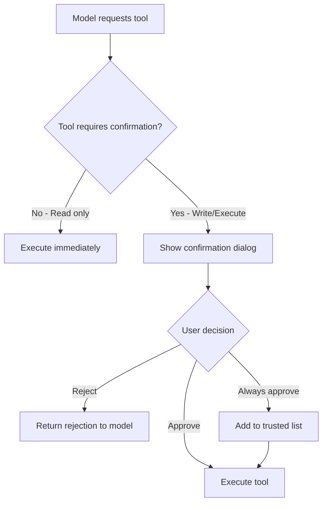
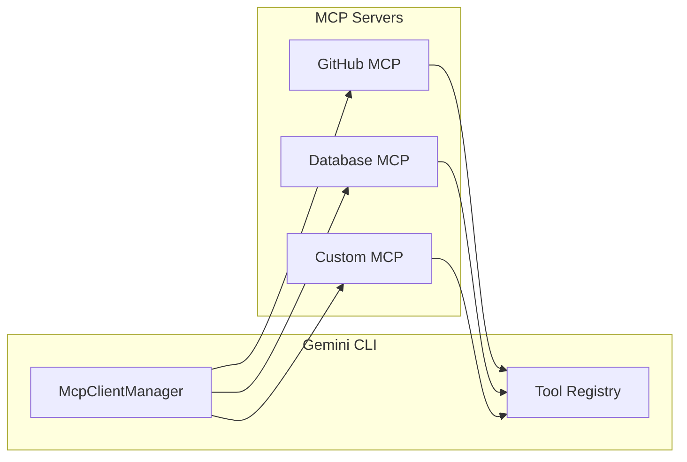

# Design Decisions

## Overview

This document explains the key architectural and design decisions made in Gemini CLI, including the rationale, trade-offs, and alternatives considered.

## Architecture: CLI/Core Separation

### Decision

Separate the project into two main packages:
- `packages/cli` - User interface and experience
- `packages/core` - Business logic and API communication

### Rationale

1. **Separation of Concerns**: UI logic is distinct from business logic
2. **Testability**: Core can be tested without UI dependencies
3. **Reusability**: Core can be used by other frontends (IDE extensions, web)
4. **Independent Development**: Teams can work on UI vs. backend separately

### Trade-offs

| Pros | Cons |
|------|------|
| Clear boundaries | Additional complexity |
| Easier testing | More inter-package communication |
| Reusable core | Version coordination needed |
| Focused codebases | Larger bundle if used separately |

### Alternatives Considered

- **Monolithic package**: Simpler but less flexible
- **Microservices**: Over-engineered for CLI
- **Plugin architecture**: Considered for future extensibility

## UI Framework: Ink (React for CLI)

### Decision

Use Ink (`@jrichman/ink`) for building the terminal user interface.

### Rationale

1. **React Paradigm**: Familiar component model for web developers
2. **Declarative UI**: Describe what to render, not how
3. **State Management**: React's state model works well for interactive CLIs
4. **Rich Ecosystem**: Spinners, gradients, and other components available

### Trade-offs

| Pros | Cons |
|------|------|
| Familiar to React devs | Learning curve for non-React devs |
| Component reusability | Heavier than raw terminal output |
| Hot reloading | React overhead in bundle |
| Testing with ink-testing-library | Debugging can be tricky |

### Alternatives Considered

- **Blessed**: More traditional, less React-like
- **Inquirer.js**: Good for prompts, less flexible for complex UI
- **Raw ANSI**: Maximum control, more code to maintain

## Coding Style: Plain Objects Over Classes

### Decision

Prefer plain JavaScript objects with TypeScript interfaces over ES6 classes.

### Rationale

From `GEMINI.md`:

1. **React Integration**: Plain objects work better with React's props/state model
2. **Reduced Boilerplate**: No constructors, this binding, getters/setters
3. **Enhanced Readability**: Properties directly accessible, no hidden state
4. **Simplified Immutability**: Easier to create new objects vs. mutate
5. **Better Serialization**: Direct JSON compatibility

### Example

```typescript
// Preferred: Plain object with interface
interface User {
  name: string;
  email: string;
}

function createUser(name: string, email: string): User {
  return { name, email };
}

// Avoided: Class
class User {
  constructor(public name: string, public email: string) {}
}
```

### When Classes Are Used

Classes are still used for:
- Tool implementations (extending `BaseDeclarativeTool`)
- Error types (extending `Error`)
- Service singletons (`McpClientManager`)

## Type Safety: Prefer `unknown` Over `any`

### Decision

Avoid `any` type; use `unknown` with type narrowing instead.

### Rationale

1. **Type Safety**: `unknown` requires explicit type checking
2. **Bug Prevention**: Catches type errors at compile time
3. **Documentation**: Code is self-documenting about unknown data
4. **Maintainability**: Easier to understand data flow

### Example

```typescript
// Preferred
function processValue(value: unknown): string {
  if (typeof value === 'string') {
    return value.toUpperCase();
  }
  throw new Error('Expected string');
}

// Avoided
function processValue(value: any): string {
  return value.toUpperCase(); // Runtime error if not string
}
```

## Tool Confirmation System

### Decision

Require user confirmation for potentially dangerous tool operations.

### Rationale

1. **Safety**: Prevents accidental file modifications or command execution
2. **Transparency**: Users see exactly what will be executed
3. **Trust**: Builds confidence in AI-assisted operations
4. **Compliance**: Meets enterprise security requirements

### Implementation



### Risk Levels

| Level | Examples | Behavior |
|-------|----------|----------|
| None | ReadFile, Glob | Auto-execute |
| Low | WebFetch | Show brief confirmation |
| Medium | Edit, Shell (safe) | Show detailed confirmation |
| High | Shell (destructive) | Require explicit approval |

## Model Routing System

### Decision

Implement automatic model selection based on context and requirements.

### Rationale

1. **Cost Optimization**: Use cheaper models for simple tasks
2. **Performance**: Fast models for quick interactions
3. **Quality**: Powerful models for complex reasoning
4. **User Experience**: Seamless transitions without manual selection

### Routing Strategy

```typescript
interface RoutingDecision {
  selectedModel: string;
  reason: string;
}

function selectModel(context: RoutingContext): RoutingDecision {
  // Complex reasoning → Pro model
  if (context.requiresReasoning) {
    return { selectedModel: 'gemini-2.5-pro', reason: 'complex_reasoning' };
  }
  
  // Large context → Flash model
  if (context.promptLength > 50000) {
    return { selectedModel: 'gemini-2.5-flash', reason: 'large_context' };
  }
  
  // Default → Flash for speed
  return { selectedModel: 'gemini-2.5-flash', reason: 'default' };
}
```

## Fallback and Error Recovery

### Decision

Implement automatic fallback to alternative models on failure.

### Rationale

1. **Reliability**: Service continues despite individual model issues
2. **User Experience**: Transparent recovery without manual intervention
3. **Rate Limit Handling**: Graceful degradation under load

### Fallback Chain

```
gemini-2.5-pro → gemini-2.5-flash → gemini-2.5-flash-lite
```

### Implementation

```typescript
async function executeWithFallback(request: Request): Promise<Response> {
  for (const model of fallbackChain) {
    try {
      return await execute(request, model);
    } catch (error) {
      if (isRecoverable(error) && hasNextModel()) {
        continue; // Try next model
      }
      throw error;
    }
  }
}
```

## MCP Protocol Support

### Decision

Implement Model Context Protocol (MCP) for extensibility.

### Rationale

1. **Standardization**: Industry-standard protocol for AI tools
2. **Ecosystem**: Access to growing library of MCP servers
3. **Flexibility**: Users can add custom capabilities
4. **Security**: OAuth support for authenticated services

### Architecture



## Schema Validation: Zod

### Decision

Use Zod for runtime schema validation throughout the codebase.

### Rationale

1. **TypeScript-First**: Designed for TypeScript with full type inference
2. **Runtime Validation**: Catches invalid data at runtime
3. **Composability**: Schemas compose well for complex types
4. **Tool Integration**: Works naturally with Gemini's function calling

### Example

```typescript
import { z } from 'zod';

// Define schema
const ToolParamsSchema = z.object({
  command: z.string().min(1),
  timeout: z.number().positive().optional(),
});

// Infer type
type ToolParams = z.infer<typeof ToolParamsSchema>;

// Validate at runtime
const params = ToolParamsSchema.parse(userInput);
```

## Feature Flags and Experiments

### Decision

Implement experiment system for gradual feature rollout.

### Rationale

1. **Safe Rollout**: Test features with subset of users
2. **A/B Testing**: Compare feature variants
3. **Quick Rollback**: Disable problematic features instantly
4. **Enterprise Control**: Allow organizations to opt-in/out

### Implementation

```typescript
enum ExperimentFlags {
  ENABLE_NEW_UI = 'enable_new_ui',
  USE_BETA_MODEL = 'use_beta_model',
  ADVANCED_ROUTING = 'advanced_routing',
}

function isEnabled(flag: ExperimentFlags): boolean {
  return experiments.get(flag) ?? false;
}

// Usage
if (isEnabled(ExperimentFlags.ADVANCED_ROUTING)) {
  return advancedRouting(context);
}
return defaultRouting(context);
```

## Monorepo Structure

### Decision

Use npm workspaces for monorepo management.

### Rationale

1. **Native npm Support**: No additional tools required
2. **Simple Configuration**: workspaces field in package.json
3. **Dependency Hoisting**: Efficient node_modules
4. **Cross-Package Scripts**: Run commands across all packages

### Alternatives Considered

| Tool | Pros | Cons |
|------|------|------|
| Lerna | Feature-rich | Additional dependency |
| Nx | Powerful caching | Complex setup |
| Turborepo | Fast builds | Learning curve |
| pnpm | Efficient storage | Different ecosystem |

## Sandbox Execution

### Decision

Support Docker/Podman sandboxing for shell commands.

### Rationale

1. **Security**: Isolate potentially dangerous operations
2. **Reproducibility**: Consistent execution environment
3. **Enterprise Requirements**: Meet security compliance needs
4. **Rollback**: Easy cleanup of sandbox changes

### Trade-offs

| Pros | Cons |
|------|------|
| Isolated execution | Requires Docker/Podman |
| Consistent environment | Startup overhead |
| Safe experimentation | Limited host access |
| Easy cleanup | Some tools may not work |

## Future Considerations

### Planned Architectural Changes

1. **Plugin System**: More extensible command and tool system
2. **Web Interface**: Browser-based alternative to CLI
3. **Multi-Agent Orchestration**: Enhanced A2A capabilities
4. **Offline Mode**: Local model support

### Open Questions

- Should we support more MCP transports (WebSocket, IPC)?
- How to handle very long-running operations?
- Should there be a persistent daemon mode?
