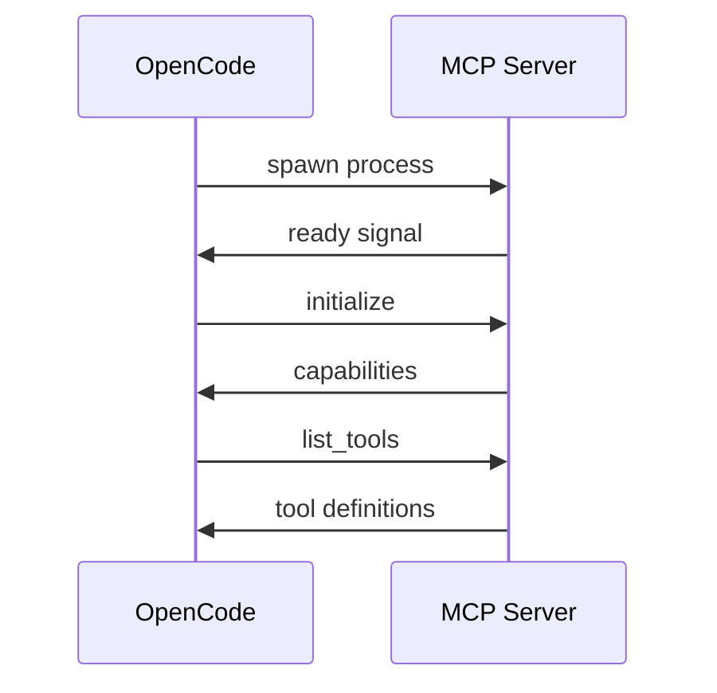

# OpenCode - LSP Integration

> **Language Server Protocol integration for real-time code intelligence**

---

## Overview

OpenCode integrates Language Server Protocol (LSP) to provide:
- **Real-time diagnostics** - Errors and warnings as you code
- **Hover information** - Type info and documentation
- **Auto-configuration** - Automatic language detection and LSP server management
- **Multi-language** - TypeScript, Python, Rust, Go, and more

**Files**:
- `lsp/server.ts` (964 lines, 30KB) - LSP server management
- `lsp/client.ts` - LSP client implementation
- `lsp/language.ts` - Language detection

---

## Architecture

### LSP Manager

```typescript
export namespace LSPServer {
  // Start LSP server for a language
  export function start(language: string, workspaceDir: string): Promise<void>
  
  // Get diagnostics for a file
  export function diagnostics(filePath: string): Promise<Diagnostic[]>
  
  // Get hover information
  export function hover(filePath: string, line: number, column: number): Promise<Hover>
  
  // Shutdown server
  export function shutdown(language: string): Promise<void>
}
```

### Supported Languages

| Language | LSP Server | Auto-Download | Status |
|----------|-----------|---------------|--------|
| TypeScript/JavaScript | typescript-language-server | Yes | Stable |
| Python | pyright | Yes | Stable |
| Go | gopls | Yes | Stable |
| Rust | rust-analyzer | Yes | Stable |
| C/C++ | clangd | No | Manual |
| Java | jdtls | No | Manual |
| Ruby | solargraph | No | Manual |
| PHP | intelephense | No | Manual |
| JSON | vscode-json-languageserver | Yes | Stable |
| HTML/CSS | Built-in | N/A | Stable |

### Auto-Download Behavior

When `OPENCODE_DISABLE_LSP_DOWNLOAD` is not set:
1. OpenCode detects project languages from file extensions
2. Checks for existing LSP server installations
3. Downloads missing servers to `~/.opencode/lsp/`
4. Starts servers on demand

**Disable Auto-Download**:
```bash
export OPENCODE_DISABLE_LSP_DOWNLOAD=true
```

**Manual LSP Server Installation**:
```bash
# TypeScript
npm install -g typescript-language-server typescript

# Python  
pip install pyright

# Go
go install golang.org/x/tools/gopls@latest

# Rust
rustup component add rust-analyzer
```

### LSP Capabilities

| Capability | Tool | Description |
|------------|------|-------------|
| Diagnostics | `lsp-diagnostics` | Errors, warnings, hints |
| Hover | `lsp-hover` | Type info, documentation |
| Go to Definition | Internal | Jump to symbol definition |
| Find References | Internal | Find all symbol usages |
| Code Actions | Internal | Quick fixes, refactors |
| Document Symbols | Internal | Code structure analysis |
| Workspace Symbols | Internal | Project-wide symbol search |

---

## Tool Integration

### lsp-diagnostics Tool

```typescript
{
  tool: "lsp-diagnostics",
  parameters: {
    filePath: "src/auth.ts"
  }
}
```

**Output**:
```
Diagnostics for src/auth.ts:

Line 23: Error - Type 'string | undefined' is not assignable to type 'string'
Line 45: Warning - Unused variable 'result'
```

### lsp-hover Tool

```typescript
{
  tool: "lsp-hover",
  parameters: {
    filePath: "src/auth.ts",
    line: 23,
    column: 10
  }
}
```

**Output**:
```
function authenticate(token: string): Promise<User>

Authenticates a user with the provided token.

Returns:
  Promise<User> - The authenticated user object
```

---

## Auto-Configuration

OpenCode automatically:
1. **Detects language** from file extension
2. **Installs LSP server** if not present
3. **Starts server** on first file access
4. **Caches results** for performance
5. **Restarts on crash** with exponential backoff

**Example Flow**:
```
User edits TypeScript file
    ↓
OpenCode detects .ts extension
    ↓
Checks for typescript-language-server
    ↓
Starts LSP server (if needed)
    ↓
Opens file in LSP
    ↓
Returns diagnostics to AI
```

---

## Configuration

**.opencode/config.json**:
```json
{
  "lsp": {
    "typescript": {
      "command": "typescript-language-server",
      "args": ["--stdio"],
      "enabled": true
    },
    "python": {
      "command": "pyright-langserver",
      "args": ["--stdio"],
      "enabled": true
    }
  }
}
```

---

## Best Practices

**For AI Agents**:
- Check diagnostics after edits
- Use hover for type information
- Validate changes with LSP

**For Users**:
- Install language servers globally
- Configure per-language settings
- Enable/disable per project

---

For implementation details, see `packages/opencode/src/lsp/`.


---

# Enhanced LSP & Protocol Documentation

---

## LSP Integration - Complete Capabilities

### Supported Languages

| Language | LSP Server | Auto-Download | Status |
|----------|-----------|---------------|--------|
| TypeScript/JavaScript | typescript-language-server | Yes | Stable |
| Python | pyright | Yes | Stable |
| Go | gopls | Yes | Stable |
| Rust | rust-analyzer | Yes | Stable |
| C/C++ | clangd | No | Manual |
| Java | jdtls | No | Manual |
| Ruby | solargraph | No | Manual |
| PHP | intelephense | No | Manual |

### Auto-Download Behavior

When `OPENCODE_DISABLE_LSP_DOWNLOAD` is not set:
1. OpenCode detects project languages from file extensions
2. Checks for existing LSP server installations
3. Downloads missing servers to `~/.opencode/lsp/`
4. Starts servers on demand

### LSP Capabilities

| Capability | Tool | Description |
|------------|------|-------------|
| Diagnostics | `lsp-diagnostics` | Errors, warnings, hints |
| Hover | `lsp-hover` | Type info, documentation |
| Go to Definition | Internal | Jump to symbol definition |
| Find References | Internal | Find all symbol usages |
| Code Actions | Internal | Quick fixes, refactors |

### Configuration

```json
{
  "lsp": {
    "enabled": true,
    "servers": {
      "typescript": {
        "command": "typescript-language-server",
        "args": ["--stdio"]
      },
      "python": {
        "command": "pyright-langserver",
        "args": ["--stdio"]
      }
    }
  }
}
```

---

## Provider System - Model Configurations

### Anthropic Models

| Model | ID | Context | Output Max |
|-------|-----|---------|------------|
| Claude 3.5 Sonnet | `claude-3-5-sonnet-20241022` | 200K | 8K |
| Claude 3 Opus | `claude-3-opus-20240229` | 200K | 4K |
| Claude 3 Haiku | `claude-3-haiku-20240307` | 200K | 4K |

**Configuration**:
```json
{
  "provider": "anthropic",
  "model": "claude-3-5-sonnet-20241022",
  "apiKey": "${ANTHROPIC_API_KEY}"
}
```

### OpenAI Models

| Model | ID | Context | Output Max |
|-------|-----|---------|------------|
| GPT-4 Turbo | `gpt-4-turbo` | 128K | 4K |
| GPT-4o | `gpt-4o` | 128K | 16K |
| GPT-4o Mini | `gpt-4o-mini` | 128K | 16K |

**Configuration**:
```json
{
  "provider": "openai",
  "model": "gpt-4o",
  "apiKey": "${OPENAI_API_KEY}"
}
```

### Google Models (Vertex AI)

| Model | ID | Context | Output Max |
|-------|-----|---------|------------|
| Gemini 1.5 Pro | `gemini-1.5-pro` | 2M | 8K |
| Gemini 1.5 Flash | `gemini-1.5-flash` | 1M | 8K |

**Configuration**:
```json
{
  "provider": "google-vertex",
  "model": "gemini-1.5-pro",
  "projectId": "your-gcp-project",
  "location": "us-central1"
}
```

### Amazon Bedrock Models

| Model | ID | Context | Output Max |
|-------|-----|---------|------------|
| Claude 3.5 Sonnet | `anthropic.claude-3-5-sonnet-20241022-v2:0` | 200K | 8K |
| Claude 3 Haiku | `anthropic.claude-3-haiku-20240307-v1:0` | 200K | 4K |

**Configuration**:
```json
{
  "provider": "amazon-bedrock",
  "model": "anthropic.claude-3-5-sonnet-20241022-v2:0",
  "region": "us-east-1"
}
```

### Local Models

Compatible with any OpenAI-compatible API:

```json
{
  "provider": "openai-compatible",
  "model": "llama-3.1-70b",
  "baseUrl": "http://localhost:11434/v1",
  "apiKey": "optional"
}
```

---

## LLM Integration - Token Management

### Token Counting

OpenCode uses provider-specific tokenizers:
- **Anthropic**: Claude tokenizer
- **OpenAI**: tiktoken (cl100k_base)
- **Google**: Gemini tokenizer
- **Bedrock**: Provider-specific

### Context Window Management

```typescript
// Pseudo-code for context management
const contextBudget = modelContextLimit - reservedForOutput
const systemPromptTokens = countTokens(systemPrompt)
const messageTokens = countTokens(messages)
const availableForFiles = contextBudget - systemPromptTokens - messageTokens
```

### Truncation Strategy

1. **Never truncate**: System prompt, recent messages
2. **Summarize**: Older messages, tool outputs
3. **Truncate**: File contents, search results
4. **Drop**: Background context when necessary

### Optimization Tips

- Use specific file reads instead of full files
- Enable compaction for long sessions
- Set `OPENCODE_EXPERIMENTAL_OUTPUT_TOKEN_MAX` appropriately
- Use smaller models for simple tasks

---

## ACP Protocol - Complete Specification

### Protocol Messages

| Message Type | Direction | Description |
|--------------|-----------|-------------|
| `initialize` | Client→Server | Start session |
| `initialized` | Server→Client | Session ready |
| `message` | Bidirectional | Chat message |
| `tool_call` | Server→Client | Tool execution request |
| `tool_result` | Client→Server | Tool execution result |
| `cancel` | Client→Server | Cancel operation |
| `shutdown` | Client→Server | End session |

### Session Management

```typescript
// Initialize session
{
  type: 'initialize',
  capabilities: {
    tools: true,
    streaming: true
  },
  project: {
    path: '/path/to/project',
    name: 'my-project'
  }
}

// Server response
{
  type: 'initialized',
  sessionId: 'session-123',
  capabilities: {
    tools: ['read', 'write', 'bash', ...],
    streaming: true
  }
}
```

### Tool Invocation

```typescript
// Server requests tool execution
{
  type: 'tool_call',
  id: 'call-456',
  tool: 'read',
  parameters: {
    filePath: 'src/index.ts'
  }
}

// Client returns result
{
  type: 'tool_result',
  id: 'call-456',
  result: {
    content: '...',
    success: true
  }
}
```

---

## MCP Integration - Server Lifecycle

### Discovery

MCP servers are discovered from:
1. `~/.opencode/mcp.json` - Global servers
2. `.opencode/mcp.json` - Project servers
3. CLI: `opencode mcp add <package>`

### Startup Sequence



### Shutdown

1. Send `shutdown` message
2. Wait for acknowledgment (timeout: 5s)
3. Force kill if unresponsive
4. Cleanup resources

### Reconnection

On server crash:
1. Detect disconnection
2. Wait backoff period (exponential)
3. Attempt restart
4. Re-initialize capabilities
5. Resume operations

### Error Handling

| Error | Handling |
|-------|----------|
| Startup failure | Retry 3 times, then disable |
| Runtime crash | Auto-restart with backoff |
| Tool error | Return error to LLM |
| Timeout | Cancel and report |

---

## Authentication - Provider Details

### Anthropic Auth

```bash
export ANTHROPIC_API_KEY=sk-ant-...
```

Or via config:
```json
{
  "providers": {
    "anthropic": {
      "apiKey": "sk-ant-..."
    }
  }
}
```

### OpenAI Auth

```bash
export OPENAI_API_KEY=sk-...
```

Or via config with organization:
```json
{
  "providers": {
    "openai": {
      "apiKey": "sk-...",
      "organization": "org-..."
    }
  }
}
```

### Google Auth

Uses Application Default Credentials:
```bash
gcloud auth application-default login
```

Or service account:
```json
{
  "providers": {
    "google-vertex": {
      "projectId": "my-project",
      "credentials": "/path/to/service-account.json"
    }
  }
}
```

### Bedrock Auth

Uses AWS credentials:
```bash
export AWS_ACCESS_KEY_ID=...
export AWS_SECRET_ACCESS_KEY=...
export AWS_REGION=us-east-1
```

Or IAM role (on EC2/ECS/Lambda).

### Token Management

- Tokens stored in `~/.opencode/credentials.json`
- Encrypted at rest (when system keychain available)
- Auto-refresh for OAuth providers
- CLI: `opencode auth login <provider>`

---

## Related Documentation

- [09-provider-system.md](./09-provider-system.md) - Provider architecture
- [10-llm-integration.md](./10-llm-integration.md) - LLM details
- [11-acp-protocol.md](./11-acp-protocol.md) - ACP specification
- [12-mcp-integration.md](./12-mcp-integration.md) - MCP guide
- [22-authentication.md](./22-authentication.md) - Auth flows
