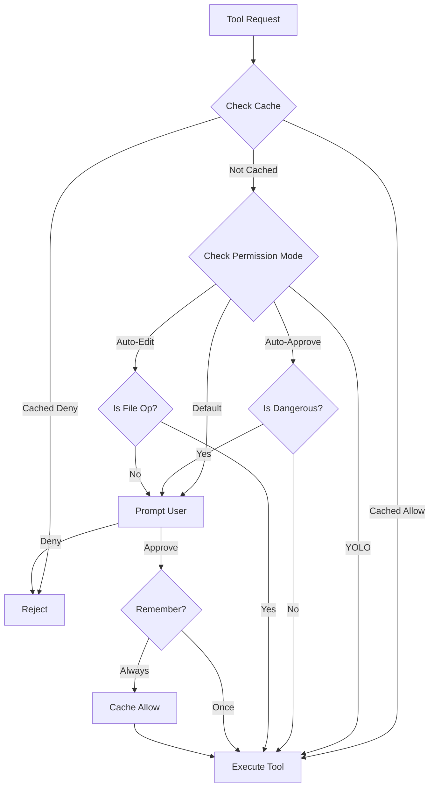

# OpenCode - Security & Permissions

> **Permission system and security model for safe AI agent operations**

---

## Overview

OpenCode's permission system ensures AI agents can't perform dangerous operations without approval:
- **Permission levels**: allow, deny, ask
- **Granular control**: Per-tool, per-command
- **Approval workflow**: Interactive confirmation
- **Audit trail**: All operations logged

**Files**:
- `permission/index.ts` - Permission system
- Agent configs define default permissions

---

## Permission Model

### Permission Levels

```typescript
type PermissionLevel = "allow" | "deny" | "ask"
```

- **allow** - Execute without asking
- **deny** - Reject automatically
- **ask** - Require user approval

### Permission Types

```typescript
interface Permissions {
  edit: PermissionLevel                    // File editing (edit, write, patch)
  bash: Record<string, PermissionLevel>    // Shell commands
  webfetch: PermissionLevel               // Web access
}
```

---

## Permission Modes

OpenCode uses a permission system to control tool execution, balancing productivity with safety.

### Available Modes

| Mode | Description | Safety | Productivity |
|------|-------------|--------|--------------|
| `default` | Ask for each tool | High | Low |
| `auto-edit` | Auto-approve edits | Medium | Medium |
| `auto-approve` | Auto-approve most | Low | High |
| `yolo` | Approve everything | None | Maximum |

### Default Mode

Every tool execution requires explicit approval:

```
🔧 Tool: bash
📝 Command: npm install express

[y] Approve  [n] Deny  [a] Always approve  [e] Edit
```

**Best for**: Sensitive projects, learning OpenCode, security-critical work.

### Auto-Edit Mode

Automatically approves file operations, asks for others:

**Auto-approved**:
- `read`, `write`, `edit`, `multiedit`, `patch`
- `grep`, `glob`, `ls`
- `lsp-*` tools

**Requires approval**:
- `bash` (command execution)
- Web tools (`webfetch`, `websearch`)
- External integrations

**Best for**: Active development with trusted codebase.

### Auto-Approve Mode

Approves most operations, only asks for dangerous commands:

**Auto-approved**: All tools except:
- `bash` with dangerous patterns
- Destructive file operations
- System-level commands

**Best for**: Experienced users, trusted environments.

### YOLO Mode

Approves everything without prompting:

```bash
opencode --permission yolo
# or
export OPENCODE_PERMISSION=yolo
```

**Warning**: Use only in:
- Isolated development environments
- CI/CD pipelines with safeguards
- When you fully understand the risks

**Never use in**:
- Production systems
- Shared machines
- Projects with sensitive data

---

## Tool Security Details

### Bash Tool Security

**Dangerous Command Detection**:

```typescript
const DANGEROUS_PATTERNS = [
  /rm\s+-rf\s+\/(?!\w)/,           // rm -rf /
  /mkfs/,                           // Format filesystem
  /dd\s+if=/,                       // Direct disk write
  />\s*\/dev\/sd[a-z]/,            // Overwrite disk
  /chmod\s+-R\s+777\s+\//,         // Recursive chmod root
  /curl.*\|\s*(?:bash|sh)/,        // Pipe curl to shell
  /wget.*\|\s*(?:bash|sh)/,        // Pipe wget to shell
]
```

**Blocked by Default**:
- Commands starting with `sudo` (unless allowed)
- Commands modifying system directories
- Network commands with shell pipes

**Timeout Enforcement**:
- Default: 30 seconds
- Configurable per-call
- Hard limit: 10 minutes

### File Operation Security

**Working Directory Validation**:
- All file paths validated against project root
- Symlink resolution to prevent escapes
- Absolute paths converted to relative

**Path Traversal Prevention**:
```typescript
// Blocked patterns
'../../etc/passwd'
'/etc/passwd'
'~/.ssh/id_rsa'
```

### Web Tool Security

**URL Validation**:
- Only HTTP/HTTPS allowed
- Private IP ranges blocked (unless configured)
- Localhost blocked (unless configured)

**Content Limits**:
- Max response size: 10MB
- Timeout: 30 seconds
- Blocked file types: executables, archives

---

## Custom Tool Permissions

### Defining Permissions

```typescript
import { defineTool } from 'opencode'

export default defineTool({
  name: 'my-tool',
  permissions: ['custom-permission'],
  // ...
})
```

### Per-Tool Settings

```json
{
  "tools": {
    "bash": {
      "permission": "default",
      "timeout": 60000,
      "allowSudo": false
    },
    "write": {
      "permission": "auto-approve"
    }
  }
}
```

---

## Permission System Architecture



---

## Security Best Practices

### For Users

1. **Start with default mode** - Understand what tools do
2. **Review bash commands** - Even auto-approved ones
3. **Use project-specific configs** - Different settings per project
4. **Monitor tool outputs** - Watch for unexpected behavior
5. **Keep OpenCode updated** - Security fixes in updates

### For Tool Developers

1. **Validate all inputs** - Never trust parameters
2. **Use minimal permissions** - Request only what's needed
3. **Sanitize outputs** - Don't leak sensitive data
4. **Handle errors gracefully** - No sensitive info in errors
5. **Document security implications** - Users should know risks

### For Administrators

1. **Set appropriate defaults** - Match organizational policy
2. **Audit tool usage** - Monitor for abuse
3. **Restrict dangerous tools** - Disable if unnecessary
4. **Use network isolation** - Limit API access
5. **Regular security reviews** - Check configurations

---

## Configuration

### Agent Permissions

**.opencode/config.json**:
```json
{
  "agents": {
    "default": {
      "permission": {
        "edit": "ask",
        "bash": {
          "*": "ask",
          "npm test": "allow",
          "npm run build": "allow",
          "rm -rf": "deny"
        },
        "webfetch": "allow"
      }
    },
    "readonly": {
      "permission": {
        "edit": "deny",
        "bash": { "*": "deny" },
        "webfetch": "allow"
      }
    },
    "trusted": {
      "permission": {
        "edit": "allow",
        "bash": { "*": "allow" },
        "webfetch": "allow"
      }
    }
  }
}
```

### Using Agents

```bash
# Default agent (asks for permissions)
opencode "Make changes"

# Readonly agent (no edits)
opencode --agent readonly "Analyze code"

# Trusted agent (no prompts)
opencode --agent trusted "Refactor quickly"
```

---

## Permission Workflow

### File Editing

```
AI requests edit
    │
    ▼
Check agent permission.edit
    │
    ├─"allow"──▶ Execute immediately
    │
    ├─"deny"───▶ Return error: "Edit permission denied"
    │
    └─"ask"────┐
               ▼
          Show prompt:
          ╔══════════════════════════╗
          ║ Allow edit to auth.ts?   ║
          ║                          ║
          ║ Old: password            ║
          ║ New: hashedPassword      ║
          ║                          ║
          ║ [Yes] [No] [Always]      ║
          ╚══════════════════════════╝
               │
               ├─Yes──────▶ Execute once
               ├─No───────▶ Cancel
               └─Always───▶ Update config to "allow"
```

### Shell Commands

```
AI requests: bash("npm install axios")
    │
    ▼
Check agent permission.bash
    │
    ├─ Exact match ("npm install axios"): "allow"
    │     └─▶ Execute immediately
    │
    ├─ Pattern match ("npm *"): "ask"
    │     └─▶ Prompt user
    │
    ├─ Wildcard ("*"): "ask"
    │     └─▶ Prompt user
    │
    └─ Default: "deny"
          └─▶ Return error
```

**Examples**:
```json
{
  "bash": {
    "npm test": "allow",           // Exact command
    "npm run *": "allow",          // Pattern
    "git status": "allow",
    "git push": "ask",             // Require approval
    "rm -rf": "deny",              // Never allow
    "*": "ask"                     // Default for others
  }
}
```

---

## Dangerous Commands

OpenCode detects and warns about dangerous commands:

**Patterns Detected**:
- `rm -rf` - Recursive deletion
- `sudo` - Elevated privileges
- `chmod 777` - Dangerous permissions
- `:(){:|:&};:` - Fork bomb
- `dd if=/dev/zero` - Disk wipe
- `mkfs` - Format filesystem

**Handling**:
```typescript
function isDangerous(command: string): boolean {
  const patterns = [
    /rm\s+-rf\s+[\/~]/,
    /sudo\s+rm/,
    /chmod\s+777/,
    // ... more patterns
  ]
  
  return patterns.some(p => p.test(command))
}

if (isDangerous(command)) {
  log.warn("Dangerous command detected", { command })
  
  // Require explicit approval
  const approved = await Permission.confirm({
    type: "dangerous",
    command,
    warning: "This command is potentially dangerous!"
  })
  
  if (!approved) {
    throw new Error("Dangerous command rejected")
  }
}
```

---

## Approval UI

### Interactive Prompt

**Terminal**:
```
┌─────────────────────────────────────────┐
│ Permission Request                      │
├─────────────────────────────────────────┤
│                                         │
│ Tool: bash                              │
│ Command: npm install axios              │
│                                         │
│ This will:                              │
│ - Download and install package          │
│ - Modify package.json                   │
│ - Update node_modules                   │
│                                         │
│ Allow? [y/n/a]                          │
│   y - Yes (this time)                   │
│   n - No (cancel)                       │
│   a - Always (update config)            │
│                                         │
└─────────────────────────────────────────┘
```

### Batch Approval

For multiple operations:
```
┌─────────────────────────────────────────┐
│ Multiple Permissions Requested          │
├─────────────────────────────────────────┤
│                                         │
│ 1. Edit src/auth.ts                     │
│ 2. Edit src/user.ts                     │
│ 3. Run: npm test                        │
│                                         │
│ Allow all? [y/n/r]                      │
│   y - Yes (all)                         │
│   n - No (cancel all)                   │
│   r - Review (one by one)               │
│                                         │
└─────────────────────────────────────────┘
```

---

## Audit Trail

### Logging

All operations are logged:

```typescript
log.info("Tool execution", {
  tool: "bash",
  args: { command: "npm install axios" },
  permission: "ask",
  approved: true,
  user: "alice",
  timestamp: Date.now()
})
```

### Session History

View permission decisions:
```bash
opencode debug session --show-permissions
```

Output:
```
Session: session_abc123

Permissions:
  12:34:56 - bash "npm test" - ALLOWED (config)
  12:35:12 - edit auth.ts - ASKED → APPROVED
  12:36:03 - bash "rm file.txt" - ASKED → DENIED
  12:37:45 - webfetch https://api.example.com - ALLOWED (config)
```

---

## Security Best Practices

### Configuration

**Development**:
```json
{
  "agents": {
    "default": {
      "permission": {
        "edit": "ask",
        "bash": {
          "npm test": "allow",
          "npm run dev": "allow",
          "*": "ask"
        }
      }
    }
  }
}
```

**Production**:
```json
{
  "agents": {
    "default": {
      "permission": {
        "edit": "deny",
        "bash": {
          "*": "deny"
        },
        "webfetch": "allow"
      }
    }
  }
}
```

### Guidelines

1. **Start restrictive** - Use "ask" or "deny" by default
2. **Whitelist commands** - Allow specific safe commands
3. **Never auto-allow dangerous commands**
4. **Review periodically** - Audit permission logs
5. **Use agents** - Different agents for different trust levels
6. **Document decisions** - Comment permission rules

---

## Bypassing Permissions (Development)

For development/testing ONLY:

```bash
# Trust all operations (DANGEROUS)
opencode --agent trusted "Do anything"

# Or via environment
export OPENCODE_TRUST_ALL=true
opencode "Dangerous operations"
```

⚠️ **WARNING**: Never use in production!

---

## Implementation Details

### Permission Check

```typescript
export async function check(ctx: {
  sessionID: string
  type: "edit" | "bash" | "webfetch"
  details: Record<string, any>
}): Promise<boolean> {
  const agent = await Agent.get(ctx.sessionID)
  const level = getPermissionLevel(agent.permission, ctx.type, ctx.details)
  
  if (level === "allow") return true
  if (level === "deny") return false
  
  // level === "ask"
  const approved = await promptUser({
    type: ctx.type,
    details: ctx.details,
  })
  
  return approved
}
```

### Permission Storage

```typescript
// Store approval for session
const approvals = new Map<string, Set<string>>()

function rememberApproval(sessionID: string, key: string) {
  if (!approvals.has(sessionID)) {
    approvals.set(sessionID, new Set())
  }
  approvals.get(sessionID)!.add(key)
}

function wasApproved(sessionID: string, key: string): boolean {
  return approvals.get(sessionID)?.has(key) ?? false
}
```

---

## Summary

OpenCode's security model:
- **Permission levels** prevent unauthorized actions
- **Approval workflow** for sensitive operations
- **Dangerous command detection** warns users
- **Audit trail** tracks all operations
- **Configurable per-agent** for flexibility

Always start with restrictive permissions and gradually allow safe operations as needed.

---

For implementation, see `packages/opencode/src/permission/`.


---

# Enhanced Security Documentation

---

## Permission Modes

### Overview

OpenCode uses a permission system to control tool execution, balancing productivity with safety.

### Available Modes

| Mode | Description | Safety | Productivity |
|------|-------------|--------|--------------|
| `default` | Ask for each tool | High | Low |
| `auto-edit` | Auto-approve edits | Medium | Medium |
| `auto-approve` | Auto-approve most | Low | High |
| `yolo` | Approve everything | None | Maximum |

### Default Mode

Every tool execution requires explicit approval:

```
🔧 Tool: bash
📝 Command: npm install express

[y] Approve  [n] Deny  [a] Always approve  [e] Edit
```

**Best for**: Sensitive projects, learning OpenCode, security-critical work.

### Auto-Edit Mode

Automatically approves file operations, asks for others:

**Auto-approved**:
- `read`, `write`, `edit`, `multiedit`, `patch`
- `grep`, `glob`, `ls`
- `lsp-*` tools

**Requires approval**:
- `bash` (command execution)
- Web tools (`webfetch`, `websearch`)
- External integrations

**Best for**: Active development with trusted codebase.

### Auto-Approve Mode

Approves most operations, only asks for dangerous commands:

**Auto-approved**: All tools except:
- `bash` with dangerous patterns
- Destructive file operations
- System-level commands

**Best for**: Experienced users, trusted environments.

### YOLO Mode

Approves everything without prompting:

```bash
opencode --permission yolo
# or
export OPENCODE_PERMISSION=yolo
```

**Warning**: Use only in:
- Isolated development environments
- CI/CD pipelines with safeguards
- When you fully understand the risks

**Never use in**:
- Production systems
- Shared machines
- Projects with sensitive data

---

## Tool Security Details

### Bash Tool Security

**Dangerous Command Detection**:

```typescript
const DANGEROUS_PATTERNS = [
  /rm\s+-rf\s+\/(?!\w)/,           // rm -rf /
  /mkfs/,                           // Format filesystem
  /dd\s+if=/,                       // Direct disk write
  />\s*\/dev\/sd[a-z]/,            // Overwrite disk
  /chmod\s+-R\s+777\s+\//,         // Recursive chmod root
  /curl.*\|\s*(?:bash|sh)/,        // Pipe curl to shell
  /wget.*\|\s*(?:bash|sh)/,        // Pipe wget to shell
]
```

**Blocked by Default**:
- Commands starting with `sudo` (unless allowed)
- Commands modifying system directories
- Network commands with shell pipes

**Timeout Enforcement**:
- Default: 30 seconds
- Configurable per-call
- Hard limit: 10 minutes

### File Operation Security

**Working Directory Validation**:
- All file paths validated against project root
- Symlink resolution to prevent escapes
- Absolute paths converted to relative

**Path Traversal Prevention**:
```typescript
// Blocked patterns
'../../etc/passwd'
'/etc/passwd'
'~/.ssh/id_rsa'
```

### Web Tool Security

**URL Validation**:
- Only HTTP/HTTPS allowed
- Private IP ranges blocked (unless configured)
- Localhost blocked (unless configured)

**Content Limits**:
- Max response size: 10MB
- Timeout: 30 seconds
- Blocked file types: executables, archives

---

## Custom Tool Permissions

### Defining Permissions

```typescript
import { defineTool } from 'opencode'

export default defineTool({
  name: 'my-tool',
  permissions: ['custom-permission'],
  // ...
})
```

### Permission Configuration

```json
{
  "permissions": {
    "custom-permission": "auto-approve"
  }
}
```

### Per-Tool Settings

```json
{
  "tools": {
    "bash": {
      "permission": "default",
      "timeout": 60000,
      "allowSudo": false
    },
    "write": {
      "permission": "auto-approve"
    }
  }
}
```

---

## Security Best Practices

### For Users

1. **Start with default mode** - Understand what tools do
2. **Review bash commands** - Even auto-approved ones
3. **Use project-specific configs** - Different settings per project
4. **Monitor tool outputs** - Watch for unexpected behavior
5. **Keep OpenCode updated** - Security fixes in updates

### For Tool Developers

1. **Validate all inputs** - Never trust parameters
2. **Use minimal permissions** - Request only what's needed
3. **Sanitize outputs** - Don't leak sensitive data
4. **Handle errors gracefully** - No sensitive info in errors
5. **Document security implications** - Users should know risks

### For Administrators

1. **Set appropriate defaults** - Match organizational policy
2. **Audit tool usage** - Monitor for abuse
3. **Restrict dangerous tools** - Disable if unnecessary
4. **Use network isolation** - Limit API access
5. **Regular security reviews** - Check configurations

---

## Permission System Architecture


---

## Related Documentation

- [06-tool-system.md](./06-tool-system.md) - Tool architecture
- [07-tool-implementations.md](./07-tool-implementations.md) - Tool details
- [13-configuration.md](./13-configuration.md) - Configuration
